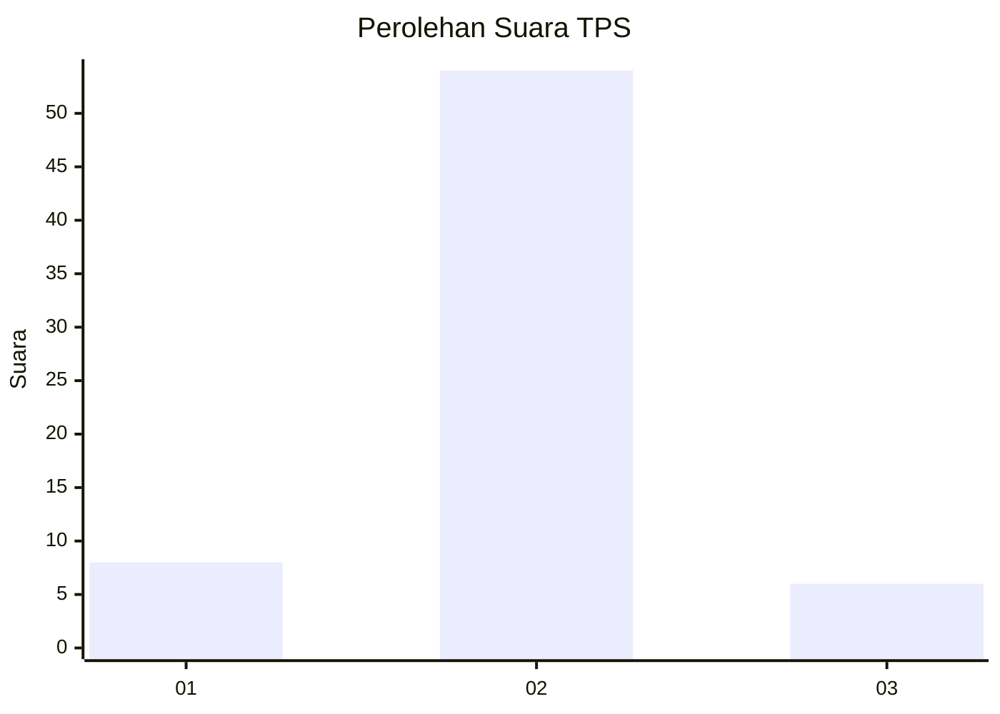
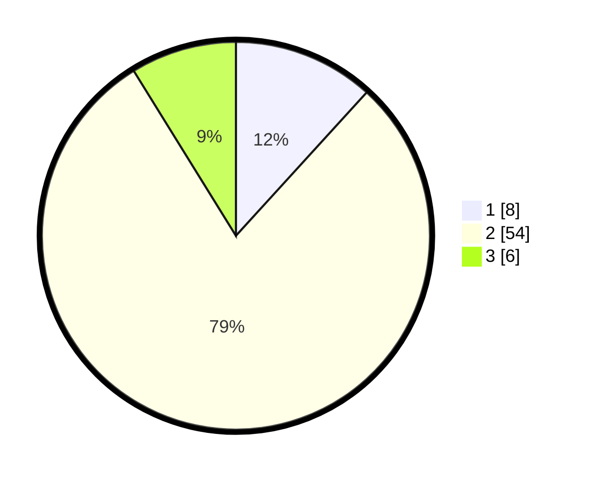

# Hasil

## Grafik

## Tabel

| No. | Nama Paslon    | Suara | Suara (raw) | Persentase |
|:--- |:-------------- | -----:| -----------:| ----------:|
| 1   | ANIES MUHAIMIN | 8     | [8][p-1]    | 11,76      |
| 2   | PRABOWO GIBRAN | 54    | [54][p-2]   | 79,41      |
| 3   | GANJAR MAHFUD  | 6     | [6][p-3]    | 8,82       |

[p-1]: https://github.com/gigit-pemilu/pemilu-2024-13-sumatera-barat/blob/main/pilpres/hitung-suara/sub/13-sumatera-barat/sub/11-solok-selatan/sub/07-sangir-balai-janggo/sub/2001-sungai-kunyit/sub/006-tps/sub/paslon-1.txt
[p-2]: https://github.com/gigit-pemilu/pemilu-2024-13-sumatera-barat/blob/main/pilpres/hitung-suara/sub/13-sumatera-barat/sub/11-solok-selatan/sub/07-sangir-balai-janggo/sub/2001-sungai-kunyit/sub/006-tps/sub/paslon-2.txt
[p-3]: https://github.com/gigit-pemilu/pemilu-2024-13-sumatera-barat/blob/main/pilpres/hitung-suara/sub/13-sumatera-barat/sub/11-solok-selatan/sub/07-sangir-balai-janggo/sub/2001-sungai-kunyit/sub/006-tps/sub/paslon-3.txt

## Foto C Plano

https://sirekap-obj-formc.kpu.go.id/3be2/pemilu/ppwp/13/11/07/20/01/1311072001006-20240220-195413--0046f61d-aed0-4334-96e6-3d13c696ce21.jpg

https://sirekap-obj-formc.kpu.go.id/3be2/pemilu/ppwp/13/11/07/20/01/1311072001006-20240220-195749--1bf1a312-3de8-4a75-9d82-f70ab0fd6012.jpg

https://sirekap-obj-formc.kpu.go.id/3be2/pemilu/ppwp/13/11/07/20/01/1311072001006-20240220-195913--fb1ca46f-9de5-4433-ad10-ab1ebaf70db3.jpg

## Metadata

| Key        | Value               |
| ---------- | ------------------- |
| Time Stamp | 2024-02-20 20:00:00 |

## DATA PEMILIH TETAP

Jumlah pemilih dalam DPT: **210**.
 * L: **113**.
 * P: **97**.

## DATA PENGGUNA HAK PILIH

Jumlah pengguna hak pilih dalam DPT: **54**.
 * L: **29**.
 * P: **25**.

Jumlah pengguna hak pilih dalam DPTb: **773**.
 * L: **777**.
 * P: **777**.

Jumlah pengguna hak pilih dalam DPK: **5**.
 * L: **3**.
 * P: **72**.

Jumlah pengguna hak pilih: **68**.
 * L: **38**.
 * P: **30**.

## JUMLAH SUARA SAH DAN TIDAK SAH

JUMLAH SELURUH SUARA SAH: **68**.

JUMLAH SUARA TIDAK SAH: **0**.

JUMLAH SELURUH SUARA SAH DAN SUARA TIDAK SAH: **68**.

