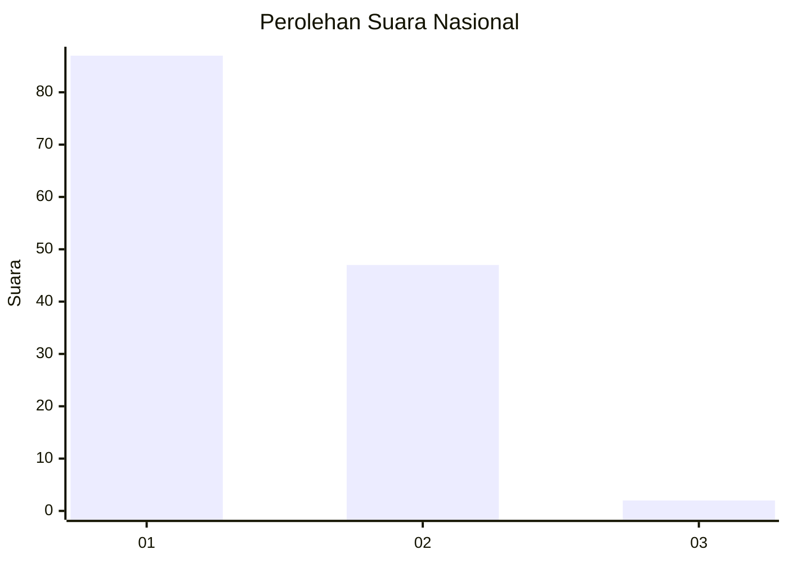
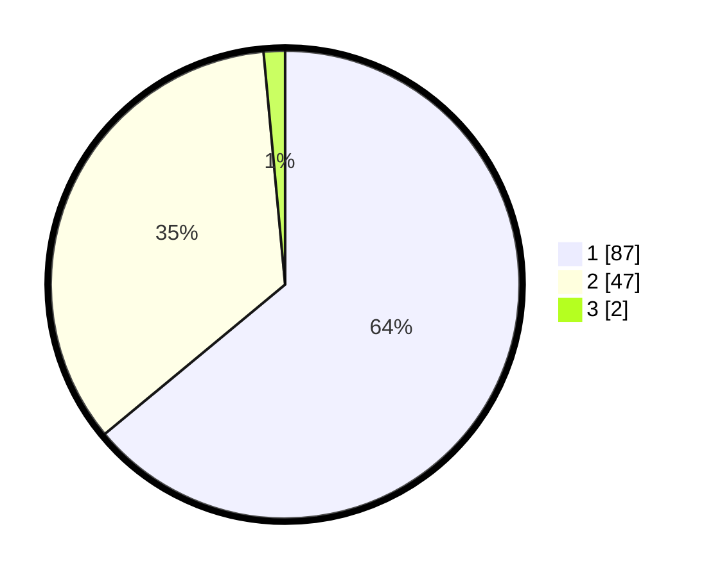

# Hasil

## Grafik

## Tabel

| No. | Nama Paslon    | Suara | Suara (raw) | Persentase |
|:--- |:-------------- | -----:| -----------:| ----------:|
| 1   | ANIES MUHAIMIN | 87    | [87][p-1]   | 63,97      |
| 2   | PRABOWO GIBRAN | 47    | [47][p-2]   | 34,56      |
| 3   | GANJAR MAHFUD  | 2     | [2][p-3]    | 1,47       |

[p-1]: https://github.com/gigit-pemilu/pemilu-2024/blob/main/pilpres/hitung-suara/sub/13-sumatera-barat/sub/11-solok-selatan/sub/07-sangir-balai-janggo/sub/2001-sungai-kunyit/sub/012-tps/sub/paslon-1.txt
[p-2]: https://github.com/gigit-pemilu/pemilu-2024/blob/main/pilpres/hitung-suara/sub/13-sumatera-barat/sub/11-solok-selatan/sub/07-sangir-balai-janggo/sub/2001-sungai-kunyit/sub/012-tps/sub/paslon-2.txt
[p-3]: https://github.com/gigit-pemilu/pemilu-2024/blob/main/pilpres/hitung-suara/sub/13-sumatera-barat/sub/11-solok-selatan/sub/07-sangir-balai-janggo/sub/2001-sungai-kunyit/sub/012-tps/sub/paslon-3.txt

## Foto C Plano

https://sirekap-obj-formc.kpu.go.id/d9ae/pemilu/ppwp/13/11/07/20/01/1311072001012-20240221-150053--75899762-e5a9-4fdf-ac3f-385278ff596b.jpg

https://sirekap-obj-formc.kpu.go.id/d9ae/pemilu/ppwp/13/11/07/20/01/1311072001012-20240221-150010--e6fd2d4b-7ae7-4a8d-ac82-6fed590ce99e.jpg

https://sirekap-obj-formc.kpu.go.id/d9ae/pemilu/ppwp/13/11/07/20/01/1311072001012-20240221-145930--cd1e26c2-5ead-4b45-b99f-169185718ea8.jpg

## Metadata

| Key        | Value               |
| ---------- | ------------------- |
| Time Stamp | 2024-02-21 16:00:00 |

## DATA PEMILIH TETAP

Jumlah pemilih dalam DPT: **433**.
 * L: **458**.
 * P: **71**.

## DATA PENGGUNA HAK PILIH

Jumlah pengguna hak pilih dalam DPT: **842**.
 * L: **6**.
 * P: **74**.

Jumlah pengguna hak pilih dalam DPTb: **550**.
 * L: **87**.
 * P: **557**.

Jumlah pengguna hak pilih dalam DPK: **7**.
 * L: **800**.
 * P: **2**.

Jumlah pengguna hak pilih: **55**.
 * L: **32**.
 * P: **23**.

## JUMLAH SUARA SAH DAN TIDAK SAH

JUMLAH SELURUH SUARA SAH: **55**.

JUMLAH SUARA TIDAK SAH: **0**.

JUMLAH SELURUH SUARA SAH DAN SUARA TIDAK SAH: **55**.

