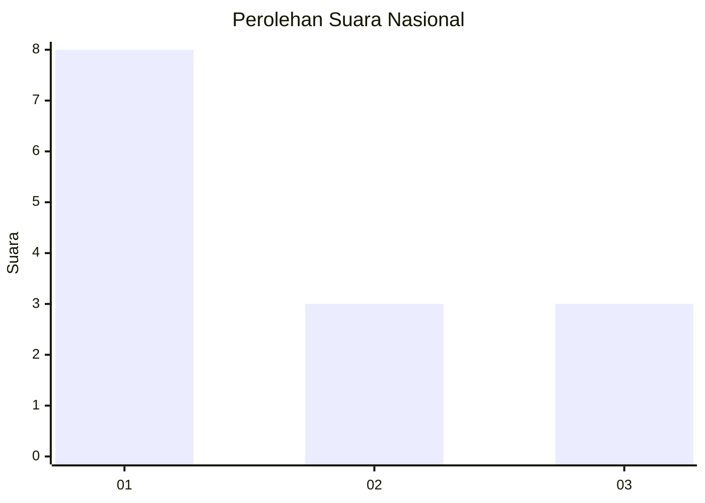
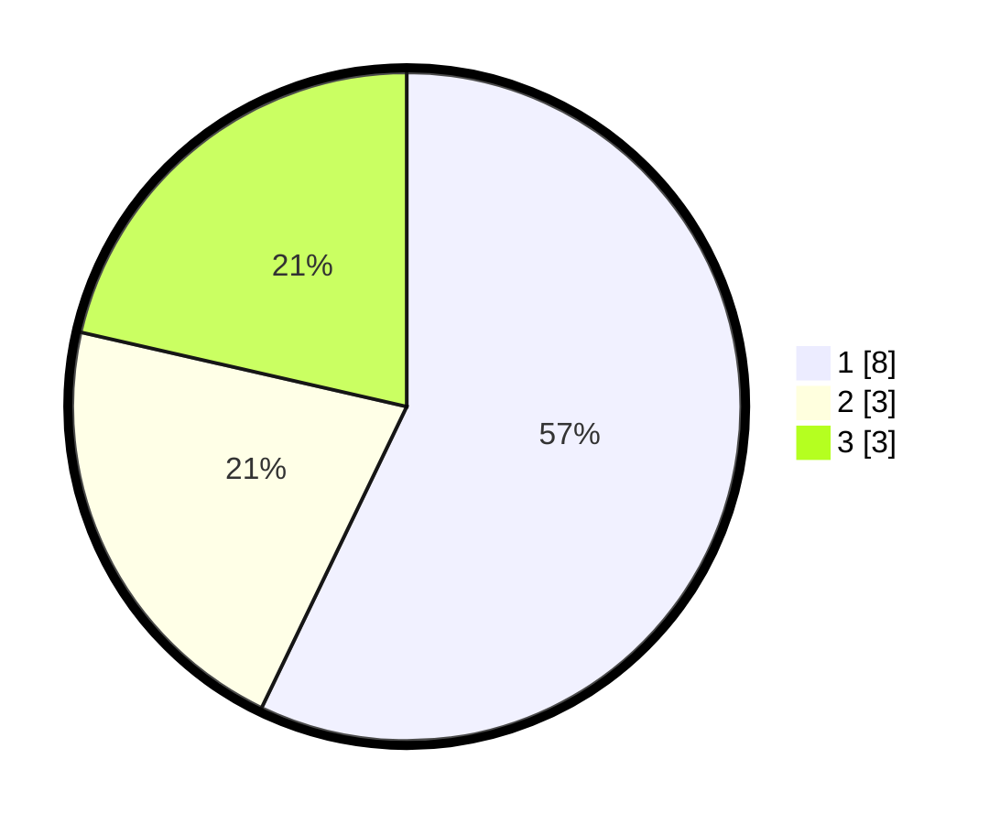

# Hasil

## Grafik

## Tabel

| No. | Nama Paslon    | Suara | Suara (raw) | Persentase |
|:--- |:-------------- | -----:| -----------:| ----------:|
| 1   | ANIES MUHAIMIN | 8     | [8][p-1]    | 57,14      |
| 2   | PRABOWO GIBRAN | 3     | [3][p-2]    | 21,43      |
| 3   | GANJAR MAHFUD  | 3     | [3][p-3]    | 21,43      |

[p-1]: https://github.com/gigit-pemilu/pemilu-2024/blob/main/pilpres/hitung-suara/sub/13-sumatera-barat/sub/11-solok-selatan/sub/07-sangir-balai-janggo/sub/2001-sungai-kunyit/sub/013-tps/sub/paslon-1.txt
[p-2]: https://github.com/gigit-pemilu/pemilu-2024/blob/main/pilpres/hitung-suara/sub/13-sumatera-barat/sub/11-solok-selatan/sub/07-sangir-balai-janggo/sub/2001-sungai-kunyit/sub/013-tps/sub/paslon-2.txt
[p-3]: https://github.com/gigit-pemilu/pemilu-2024/blob/main/pilpres/hitung-suara/sub/13-sumatera-barat/sub/11-solok-selatan/sub/07-sangir-balai-janggo/sub/2001-sungai-kunyit/sub/013-tps/sub/paslon-3.txt

## Foto C Plano

https://sirekap-obj-formc.kpu.go.id/6b10/pemilu/ppwp/13/11/07/20/01/1311072001013-20240221-153149--7ec8d5b9-9153-4533-bd9e-65ec170fad2f.jpg

https://sirekap-obj-formc.kpu.go.id/6b10/pemilu/ppwp/13/11/07/20/01/1311072001013-20240221-153325--31443687-7498-4ade-9b98-8615bae57317.jpg

https://sirekap-obj-formc.kpu.go.id/6b10/pemilu/ppwp/13/11/07/20/01/1311072001013-20240221-153623--02a1c2b8-f6a9-4c64-bf01-8e4a97117cb0.jpg

## Metadata

| Key        | Value               |
| ---------- | ------------------- |
| Time Stamp | 2024-02-21 16:00:00 |

## DATA PEMILIH TETAP

Jumlah pemilih dalam DPT: **407**.
 * L: **5**.
 * P: **704**.

## DATA PENGGUNA HAK PILIH

Jumlah pengguna hak pilih dalam DPT: **400**.
 * L: **500**.
 * P: **440**.

Jumlah pengguna hak pilih dalam DPTb: **755**.
 * L: **337**.
 * P: **777**.

Jumlah pengguna hak pilih dalam DPK: **2**.
 * L: **1**.
 * P: **1**.

Jumlah pengguna hak pilih: **34**.
 * L: **44**.
 * P: **45**.

## JUMLAH SUARA SAH DAN TIDAK SAH

JUMLAH SELURUH SUARA SAH: **93**.

JUMLAH SUARA TIDAK SAH: **1**.

JUMLAH SELURUH SUARA SAH DAN SUARA TIDAK SAH: **94**.

