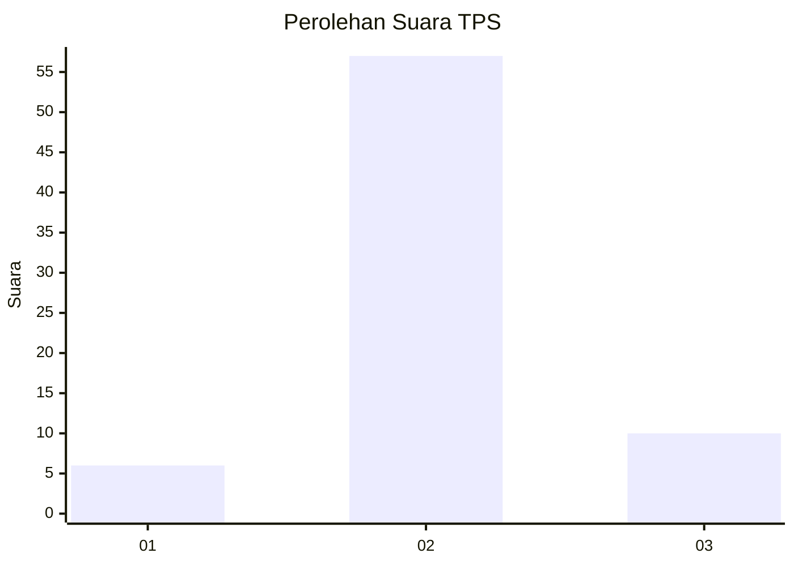
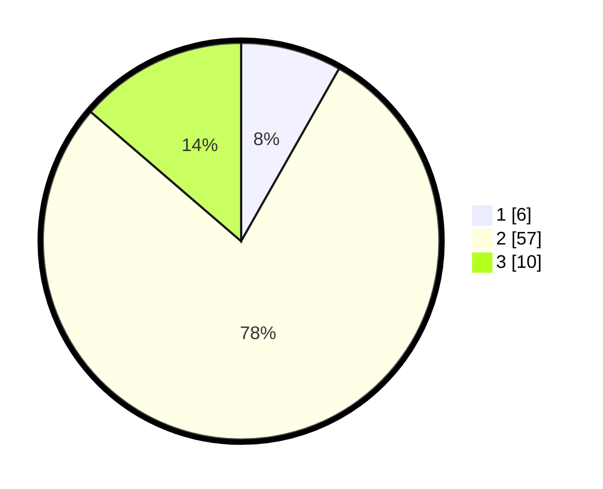

# Hasil

## Grafik

## Tabel

| No. | Nama Paslon    | Suara | Suara (raw) | Persentase |
|:--- |:-------------- | -----:| -----------:| ----------:|
| 1   | ANIES MUHAIMIN | 6     | [6][p-1]    | 8,22       |
| 2   | PRABOWO GIBRAN | 57    | [57][p-2]   | 78,08      |
| 3   | GANJAR MAHFUD  | 10    | [10][p-3]   | 13,70      |

[p-1]: https://github.com/gigit-pemilu/pemilu-2024-13-sumatera-barat/blob/main/pilpres/hitung-suara/sub/13-sumatera-barat/sub/11-solok-selatan/sub/07-sangir-balai-janggo/sub/2001-sungai-kunyit/sub/019-tps/sub/paslon-1.txt
[p-2]: https://github.com/gigit-pemilu/pemilu-2024-13-sumatera-barat/blob/main/pilpres/hitung-suara/sub/13-sumatera-barat/sub/11-solok-selatan/sub/07-sangir-balai-janggo/sub/2001-sungai-kunyit/sub/019-tps/sub/paslon-2.txt
[p-3]: https://github.com/gigit-pemilu/pemilu-2024-13-sumatera-barat/blob/main/pilpres/hitung-suara/sub/13-sumatera-barat/sub/11-solok-selatan/sub/07-sangir-balai-janggo/sub/2001-sungai-kunyit/sub/019-tps/sub/paslon-3.txt

## Foto C Plano

https://sirekap-obj-formc.kpu.go.id/3372/pemilu/ppwp/13/11/07/20/01/1311072001019-20240221-214811--53e67d4f-1dbe-4438-84ac-3f0eb633be31.jpg

https://sirekap-obj-formc.kpu.go.id/3372/pemilu/ppwp/13/11/07/20/01/1311072001019-20240221-214856--21308c40-fba2-4489-9569-66fe6c5c43da.jpg

https://sirekap-obj-formc.kpu.go.id/3372/pemilu/ppwp/13/11/07/20/01/1311072001019-20240221-214937--9aaa656e-deb3-47d8-87a0-d07bef150955.jpg

## Metadata

| Key        | Value               |
| ---------- | ------------------- |
| Time Stamp | 2024-02-22 17:00:00 |

## DATA PEMILIH TETAP

Jumlah pemilih dalam DPT: **70**.
 * L: **82**.
 * P: **220**.

## DATA PENGGUNA HAK PILIH

Jumlah pengguna hak pilih dalam DPT: **3**.
 * L: **54**.
 * P: **582**.

Jumlah pengguna hak pilih dalam DPTb: **830**.
 * L: **5**.
 * P: **506**.

Jumlah pengguna hak pilih dalam DPK: **300**.
 * L: **222**.
 * P: **274**.

Jumlah pengguna hak pilih: **5**.
 * L: **802**.
 * P: **500**.

## JUMLAH SUARA SAH DAN TIDAK SAH

JUMLAH SELURUH SUARA SAH: **73**.

JUMLAH SUARA TIDAK SAH: **1**.

JUMLAH SELURUH SUARA SAH DAN SUARA TIDAK SAH: **74**.

