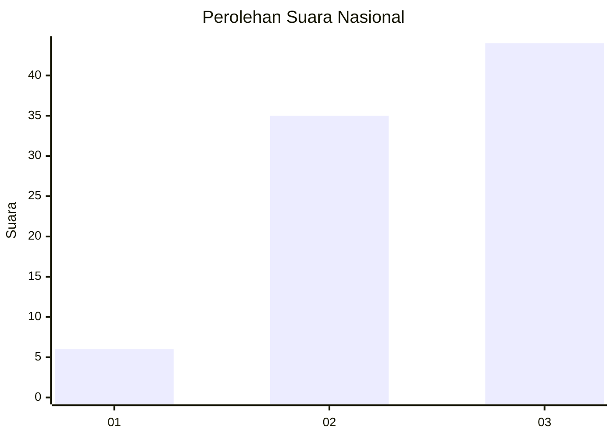
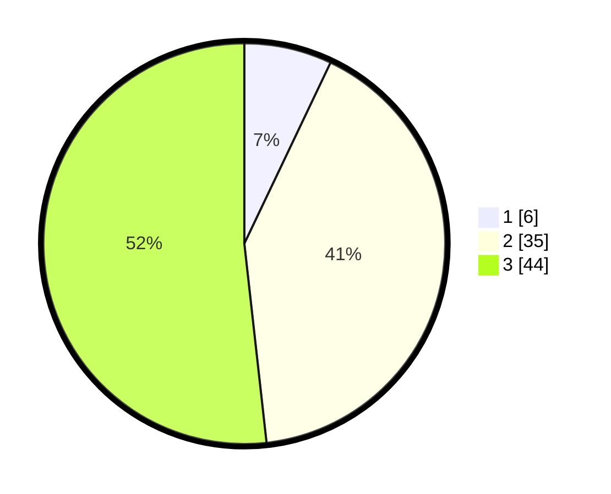

# Hasil

## Grafik

## Tabel

| No. | Nama Paslon    | Suara | Suara (raw) | Persentase |
|:--- |:-------------- | -----:| -----------:| ----------:|
| 1   | ANIES MUHAIMIN | 6     | [6][p-1]    | 7,06       |
| 2   | PRABOWO GIBRAN | 35    | [35][p-2]   | 41,18      |
| 3   | GANJAR MAHFUD  | 44    | [44][p-3]   | 51,76      |

[p-1]: https://github.com/gigit-pemilu/pemilu-2024/blob/main/pilpres/hitung-suara/sub/13-sumatera-barat/sub/11-solok-selatan/sub/07-sangir-balai-janggo/sub/2001-sungai-kunyit/sub/020-tps/sub/paslon-1.txt
[p-2]: https://github.com/gigit-pemilu/pemilu-2024/blob/main/pilpres/hitung-suara/sub/13-sumatera-barat/sub/11-solok-selatan/sub/07-sangir-balai-janggo/sub/2001-sungai-kunyit/sub/020-tps/sub/paslon-2.txt
[p-3]: https://github.com/gigit-pemilu/pemilu-2024/blob/main/pilpres/hitung-suara/sub/13-sumatera-barat/sub/11-solok-selatan/sub/07-sangir-balai-janggo/sub/2001-sungai-kunyit/sub/020-tps/sub/paslon-3.txt

## Foto C Plano

https://sirekap-obj-formc.kpu.go.id/703e/pemilu/ppwp/13/11/07/20/01/1311072001020-20240222-101529--49e07260-5b57-4e6e-abdb-72af7322789b.jpg

https://sirekap-obj-formc.kpu.go.id/703e/pemilu/ppwp/13/11/07/20/01/1311072001020-20240222-101723--669f32d8-5cb4-481f-8ed3-4c24facf8a93.jpg

https://sirekap-obj-formc.kpu.go.id/703e/pemilu/ppwp/13/11/07/20/01/1311072001020-20240222-101817--2912646b-5f60-41ca-bb09-d0cc82376095.jpg

## Metadata

| Key        | Value               |
| ---------- | ------------------- |
| Time Stamp | 2024-02-22 11:00:00 |

## DATA PEMILIH TETAP

Jumlah pemilih dalam DPT: **4**.
 * L: **0**.
 * P: **5**.

## DATA PENGGUNA HAK PILIH

Jumlah pengguna hak pilih dalam DPT: **7**.
 * L: **0**.
 * P: **550**.

Jumlah pengguna hak pilih dalam DPTb: **750**.
 * L: **225**.
 * P: **575**.

Jumlah pengguna hak pilih dalam DPK: **0**.
 * L: **0**.
 * P: **0**.

Jumlah pengguna hak pilih: **30**.
 * L: **16**.
 * P: **18**.

## JUMLAH SUARA SAH DAN TIDAK SAH

JUMLAH SELURUH SUARA SAH: **33**.

JUMLAH SUARA TIDAK SAH: **771**.

JUMLAH SELURUH SUARA SAH DAN SUARA TIDAK SAH: **737**.

