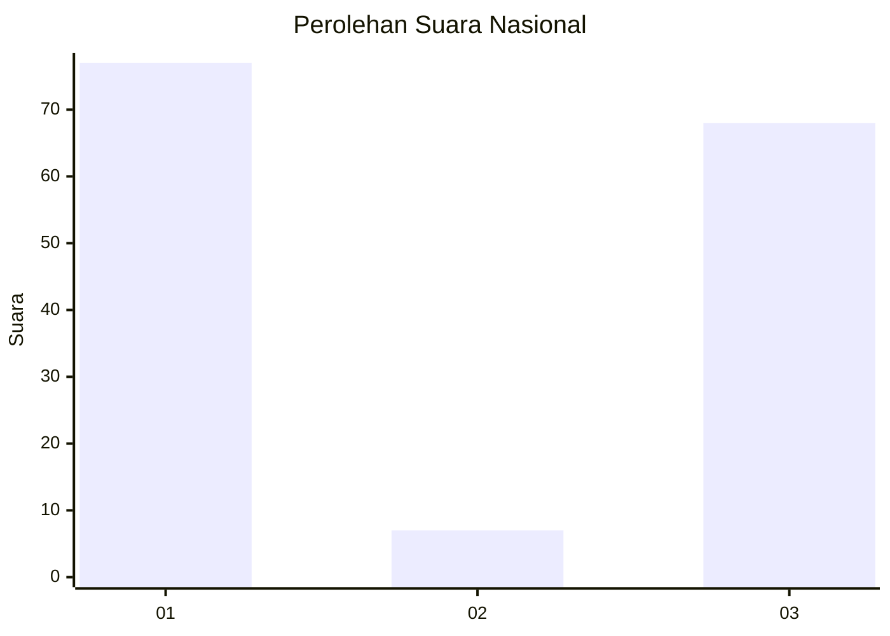
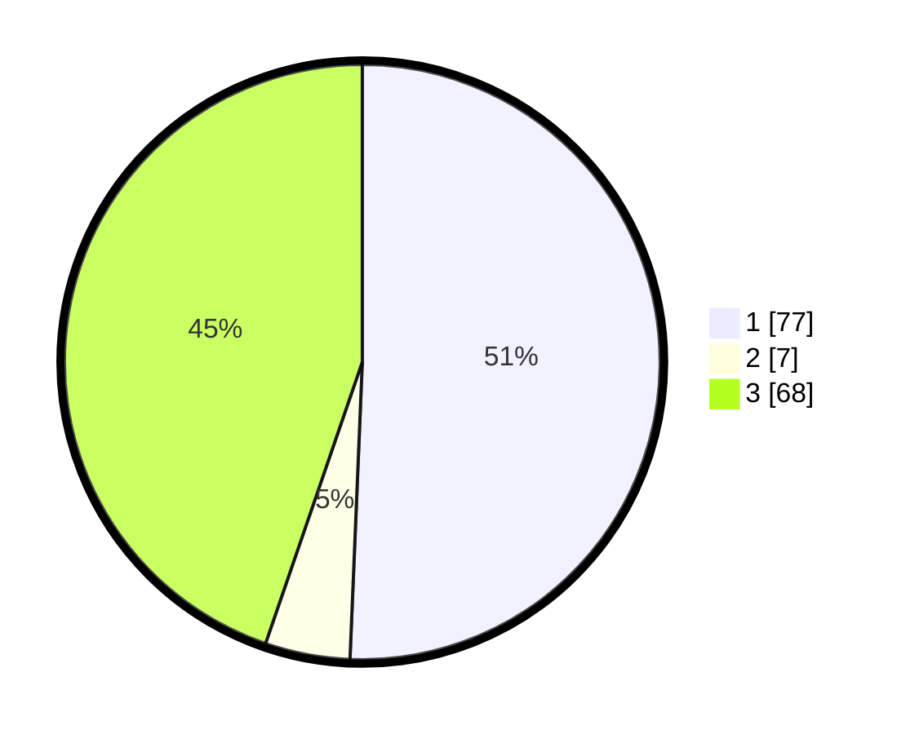

# Hasil

## Grafik

## Tabel

| No. | Nama Paslon    | Suara | Suara (raw) | Persentase |
|:--- |:-------------- | -----:| -----------:| ----------:|
| 1   | ANIES MUHAIMIN | 77    | [77][p-1]   | 50,66      |
| 2   | PRABOWO GIBRAN | 7     | [7][p-2]    | 4,61       |
| 3   | GANJAR MAHFUD  | 68    | [68][p-3]   | 44,74      |

[p-1]: https://github.com/gigit-pemilu/pemilu-2024/blob/main/pilpres/hitung-suara/sub/13-sumatera-barat/sub/11-solok-selatan/sub/07-sangir-balai-janggo/sub/2001-sungai-kunyit/sub/021-tps/sub/paslon-1.txt
[p-2]: https://github.com/gigit-pemilu/pemilu-2024/blob/main/pilpres/hitung-suara/sub/13-sumatera-barat/sub/11-solok-selatan/sub/07-sangir-balai-janggo/sub/2001-sungai-kunyit/sub/021-tps/sub/paslon-2.txt
[p-3]: https://github.com/gigit-pemilu/pemilu-2024/blob/main/pilpres/hitung-suara/sub/13-sumatera-barat/sub/11-solok-selatan/sub/07-sangir-balai-janggo/sub/2001-sungai-kunyit/sub/021-tps/sub/paslon-3.txt

## Foto C Plano

https://sirekap-obj-formc.kpu.go.id/3b65/pemilu/ppwp/13/11/07/20/01/1311072001021-20240222-104635--8914f8c1-5b26-406c-a71d-2a9f56dca63d.jpg

https://sirekap-obj-formc.kpu.go.id/3b65/pemilu/ppwp/13/11/07/20/01/1311072001021-20240222-104711--dac28387-5617-4ba5-bbed-fc3466473c15.jpg

https://sirekap-obj-formc.kpu.go.id/3b65/pemilu/ppwp/13/11/07/20/01/1311072001021-20240222-104724--7cb70a46-90c5-4395-aabd-7d067b3795ca.jpg

## Metadata

| Key        | Value               |
| ---------- | ------------------- |
| Time Stamp | 2024-02-22 11:00:00 |

## DATA PEMILIH TETAP

Jumlah pemilih dalam DPT: **194**.
 * L: **27**.
 * P: **873**.

## DATA PENGGUNA HAK PILIH

Jumlah pengguna hak pilih dalam DPT: **613**.
 * L: **707**.
 * P: **106**.

Jumlah pengguna hak pilih dalam DPTb: **345**.
 * L: **887**.
 * P: **882**.

Jumlah pengguna hak pilih dalam DPK: **2**.
 * L: **4**.
 * P: **4**.

Jumlah pengguna hak pilih: **14**.
 * L: **607**.
 * P: **607**.

## JUMLAH SUARA SAH DAN TIDAK SAH

JUMLAH SELURUH SUARA SAH: **142**.

JUMLAH SUARA TIDAK SAH: **4**.

JUMLAH SELURUH SUARA SAH DAN SUARA TIDAK SAH: **146**.

