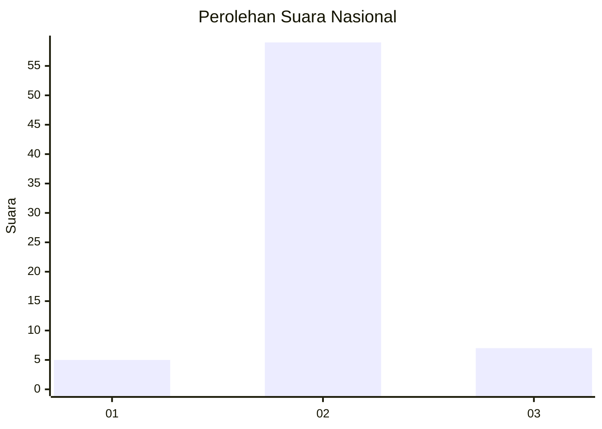
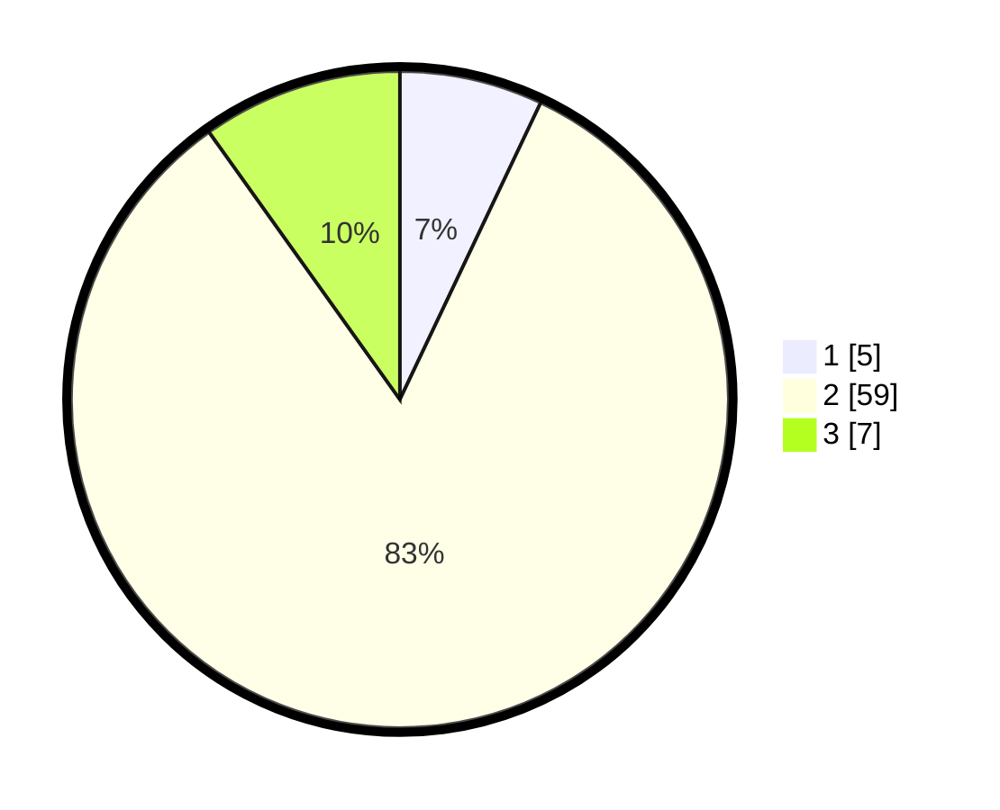

# Hasil

## Grafik

## Tabel

| No. | Nama Paslon    | Suara | Suara (raw) | Persentase |
|:--- |:-------------- | -----:| -----------:| ----------:|
| 1   | ANIES MUHAIMIN | 5     | [5][p-1]    | 7,04       |
| 2   | PRABOWO GIBRAN | 59    | [59][p-2]   | 83,10      |
| 3   | GANJAR MAHFUD  | 7     | [7][p-3]    | 9,86       |

[p-1]: https://github.com/gigit-pemilu/pemilu-2024/blob/main/pilpres/hitung-suara/sub/13-sumatera-barat/sub/11-solok-selatan/sub/07-sangir-balai-janggo/sub/2002-talao-sungai-kunyit/sub/004-tps/sub/paslon-1.txt
[p-2]: https://github.com/gigit-pemilu/pemilu-2024/blob/main/pilpres/hitung-suara/sub/13-sumatera-barat/sub/11-solok-selatan/sub/07-sangir-balai-janggo/sub/2002-talao-sungai-kunyit/sub/004-tps/sub/paslon-2.txt
[p-3]: https://github.com/gigit-pemilu/pemilu-2024/blob/main/pilpres/hitung-suara/sub/13-sumatera-barat/sub/11-solok-selatan/sub/07-sangir-balai-janggo/sub/2002-talao-sungai-kunyit/sub/004-tps/sub/paslon-3.txt

## Foto C Plano

https://sirekap-obj-formc.kpu.go.id/251b/pemilu/ppwp/13/11/07/20/02/1311072002004-20240221-095506--9523689a-b46a-4feb-8e2d-81f5b6ab7a65.jpg

https://sirekap-obj-formc.kpu.go.id/251b/pemilu/ppwp/13/11/07/20/02/1311072002004-20240221-095606--585bc719-2e94-42e7-a09f-f73c153d1b85.jpg

https://sirekap-obj-formc.kpu.go.id/251b/pemilu/ppwp/13/11/07/20/02/1311072002004-20240221-095821--e27396fd-f272-4642-9951-803822f52251.jpg

## Metadata

| Key        | Value               |
| ---------- | ------------------- |
| Time Stamp | 2024-02-21 10:00:00 |

## DATA PEMILIH TETAP

Jumlah pemilih dalam DPT: **127**.
 * L: **104**.
 * P: **70**.

## DATA PENGGUNA HAK PILIH

Jumlah pengguna hak pilih dalam DPT: **74**.
 * L: **20**.
 * P: **2**.

Jumlah pengguna hak pilih dalam DPTb: **15**.
 * L: **4**.
 * P: **0**.

Jumlah pengguna hak pilih dalam DPK: **7**.
 * L: **5**.
 * P: **0**.

Jumlah pengguna hak pilih: **7**.
 * L: **24**.
 * P: **70**.

## JUMLAH SUARA SAH DAN TIDAK SAH

JUMLAH SELURUH SUARA SAH: **77**.

JUMLAH SUARA TIDAK SAH: **0**.

JUMLAH SELURUH SUARA SAH DAN SUARA TIDAK SAH: **71**.

