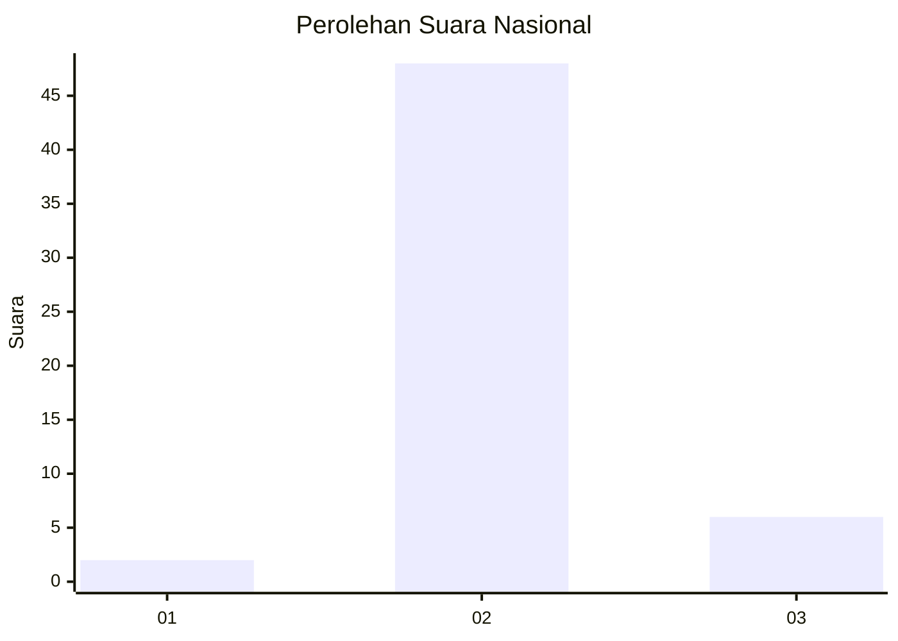
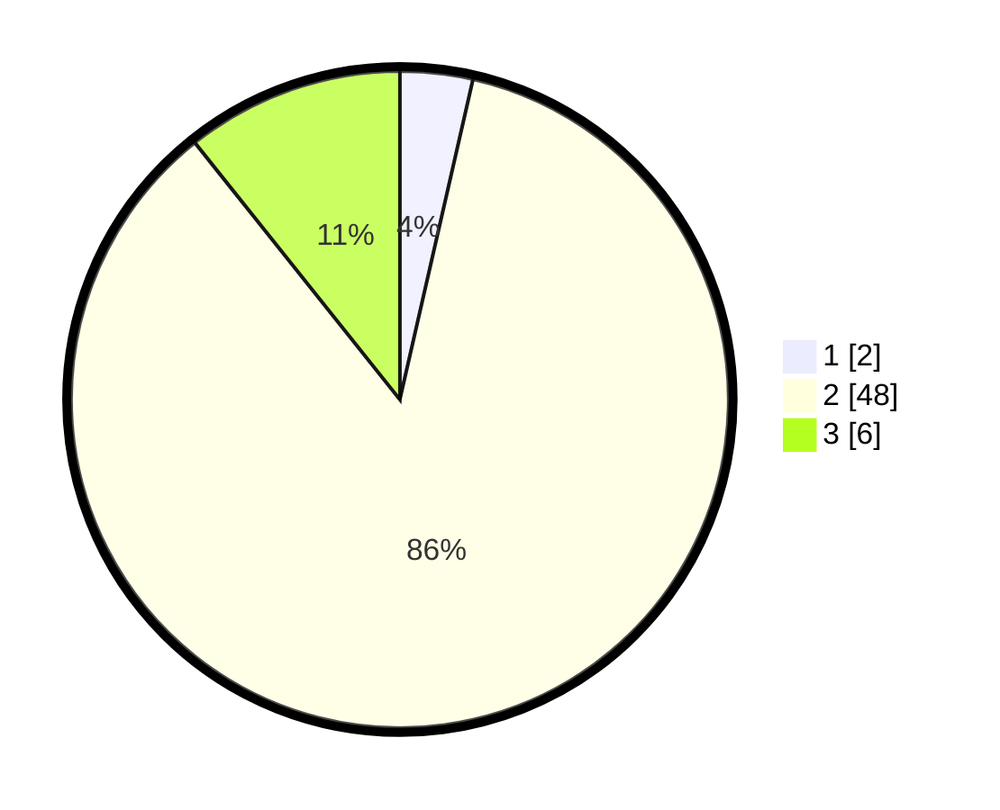

# Hasil

## Grafik

## Tabel

| No. | Nama Paslon    | Suara | Suara (raw) | Persentase |
|:--- |:-------------- | -----:| -----------:| ----------:|
| 1   | ANIES MUHAIMIN | 2     | [2][p-1]    | 3,57       |
| 2   | PRABOWO GIBRAN | 48    | [48][p-2]   | 85,71      |
| 3   | GANJAR MAHFUD  | 6     | [6][p-3]    | 10,71      |

[p-1]: https://github.com/gigit-pemilu/pemilu-2024/blob/main/pilpres/hitung-suara/sub/13-sumatera-barat/sub/11-solok-selatan/sub/07-sangir-balai-janggo/sub/2003-sungai-kunyit-barat/sub/005-tps/sub/paslon-1.txt
[p-2]: https://github.com/gigit-pemilu/pemilu-2024/blob/main/pilpres/hitung-suara/sub/13-sumatera-barat/sub/11-solok-selatan/sub/07-sangir-balai-janggo/sub/2003-sungai-kunyit-barat/sub/005-tps/sub/paslon-2.txt
[p-3]: https://github.com/gigit-pemilu/pemilu-2024/blob/main/pilpres/hitung-suara/sub/13-sumatera-barat/sub/11-solok-selatan/sub/07-sangir-balai-janggo/sub/2003-sungai-kunyit-barat/sub/005-tps/sub/paslon-3.txt

## Foto C Plano

https://sirekap-obj-formc.kpu.go.id/d888/pemilu/ppwp/13/11/07/20/03/1311072003005-20240218-182818--7e767c4d-e384-4780-849a-0137abca9d71.jpg

https://sirekap-obj-formc.kpu.go.id/d888/pemilu/ppwp/13/11/07/20/03/1311072003005-20240218-195216--fcb4f3cd-253b-490e-9e1c-860d96b5850a.jpg

https://sirekap-obj-formc.kpu.go.id/d888/pemilu/ppwp/13/11/07/20/03/1311072003005-20240218-195309--d598b350-9137-4342-b436-4a2ddfbd0e7b.jpg

## Metadata

| Key        | Value               |
| ---------- | ------------------- |
| Time Stamp | 2024-02-19 15:00:00 |

## DATA PEMILIH TETAP

Jumlah pemilih dalam DPT: **281**.
 * L: **44**.
 * P: **37**.

## DATA PENGGUNA HAK PILIH

Jumlah pengguna hak pilih dalam DPT: **850**.
 * L: **826**.
 * P: **24**.

Jumlah pengguna hak pilih dalam DPTb: **855**.
 * L: **84**.
 * P: **557**.

Jumlah pengguna hak pilih dalam DPK: **1**.
 * L: **81**.
 * P: **0**.

Jumlah pengguna hak pilih: **856**.
 * L: **831**.
 * P: **425**.

## JUMLAH SUARA SAH DAN TIDAK SAH

JUMLAH SELURUH SUARA SAH: **56**.

JUMLAH SUARA TIDAK SAH: **0**.

JUMLAH SELURUH SUARA SAH DAN SUARA TIDAK SAH: **56**.

