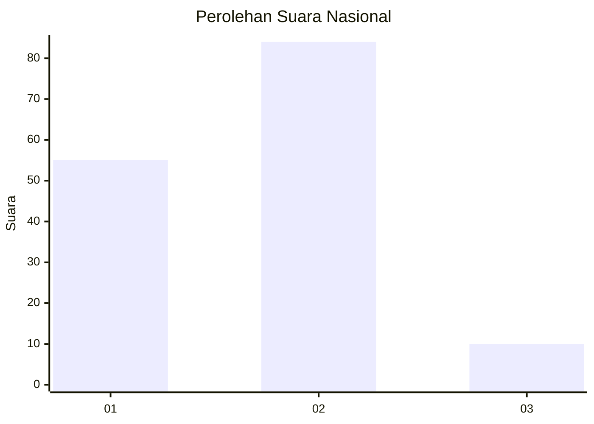
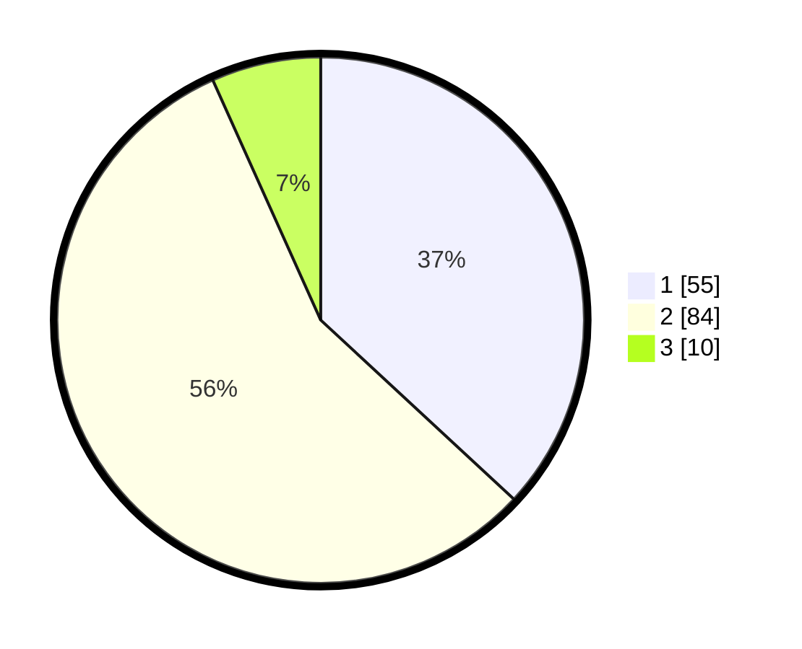

# Hasil

## Grafik

## Tabel

| No. | Nama Paslon    | Suara | Suara (raw) | Persentase |
|:--- |:-------------- | -----:| -----------:| ----------:|
| 1   | ANIES MUHAIMIN | 55    | [55][p-1]   | 36,91      |
| 2   | PRABOWO GIBRAN | 84    | [84][p-2]   | 56,38      |
| 3   | GANJAR MAHFUD  | 10    | [10][p-3]   | 6,71       |

[p-1]: https://github.com/gigit-pemilu/pemilu-2024/blob/main/pilpres/hitung-suara/sub/13-sumatera-barat/sub/12-pasaman-barat/sub/01-sungai-beremas/sub/2001-aia-bangih/sub/005-tps/sub/paslon-1.txt
[p-2]: https://github.com/gigit-pemilu/pemilu-2024/blob/main/pilpres/hitung-suara/sub/13-sumatera-barat/sub/12-pasaman-barat/sub/01-sungai-beremas/sub/2001-aia-bangih/sub/005-tps/sub/paslon-2.txt
[p-3]: https://github.com/gigit-pemilu/pemilu-2024/blob/main/pilpres/hitung-suara/sub/13-sumatera-barat/sub/12-pasaman-barat/sub/01-sungai-beremas/sub/2001-aia-bangih/sub/005-tps/sub/paslon-3.txt

## Foto C Plano

https://sirekap-obj-formc.kpu.go.id/8fe4/pemilu/ppwp/13/12/01/20/01/1312012001005-20240218-154854--ebdab30c-1eb1-44a9-a789-f65289ce9da4.jpg

https://sirekap-obj-formc.kpu.go.id/8fe4/pemilu/ppwp/13/12/01/20/01/1312012001005-20240218-172035--662fef3c-add9-4580-8dfd-9f5fdfe97224.jpg

https://sirekap-obj-formc.kpu.go.id/8fe4/pemilu/ppwp/13/12/01/20/01/1312012001005-20240218-154342--8daf0b0a-3806-48fc-914a-1ad5650a44df.jpg

## Metadata

| Key        | Value               |
| ---------- | ------------------- |
| Time Stamp | 2024-02-19 06:16:00 |

