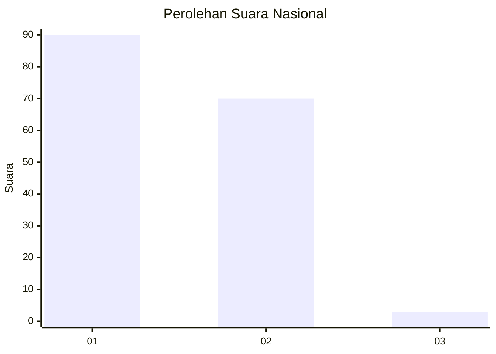
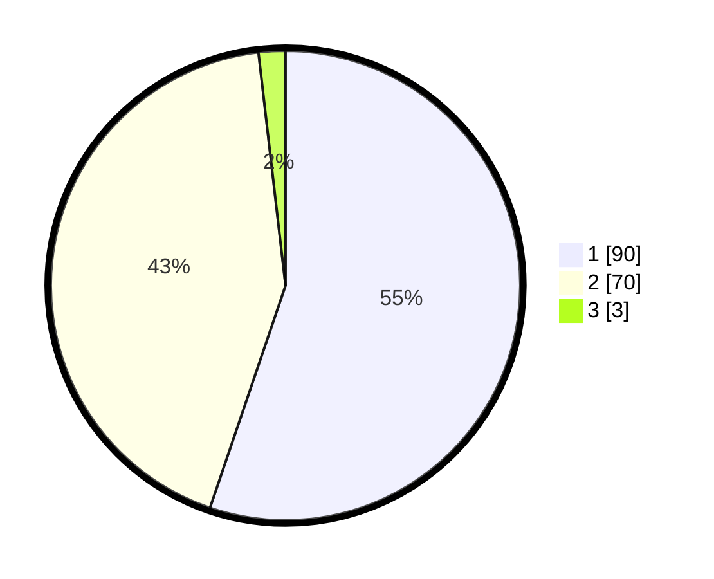

# Hasil

## Grafik

## Tabel

| No. | Nama Paslon    | Suara | Suara (raw) | Persentase |
|:--- |:-------------- | -----:| -----------:| ----------:|
| 1   | ANIES MUHAIMIN | 90    | [90][p-1]   | 55,21      |
| 2   | PRABOWO GIBRAN | 70    | [70][p-2]   | 42,94      |
| 3   | GANJAR MAHFUD  | 3     | [3][p-3]    | 1,84       |

[p-1]: https://github.com/gigit-pemilu/pemilu-2024/blob/main/pilpres/hitung-suara/sub/13-sumatera-barat/sub/12-pasaman-barat/sub/02-lembah-melintang/sub/2001-ujung-gading/sub/001-tps/sub/paslon-1.txt
[p-2]: https://github.com/gigit-pemilu/pemilu-2024/blob/main/pilpres/hitung-suara/sub/13-sumatera-barat/sub/12-pasaman-barat/sub/02-lembah-melintang/sub/2001-ujung-gading/sub/001-tps/sub/paslon-2.txt
[p-3]: https://github.com/gigit-pemilu/pemilu-2024/blob/main/pilpres/hitung-suara/sub/13-sumatera-barat/sub/12-pasaman-barat/sub/02-lembah-melintang/sub/2001-ujung-gading/sub/001-tps/sub/paslon-3.txt

## Foto C Plano

https://sirekap-obj-formc.kpu.go.id/9d27/pemilu/ppwp/13/12/02/20/01/1312022001001-20240219-154026--ae07d3bc-9fb1-4934-b5db-c8b6ccb65125.jpg

https://sirekap-obj-formc.kpu.go.id/9d27/pemilu/ppwp/13/12/02/20/01/1312022001001-20240219-154155--a627dc1a-cba7-4755-a775-1cddcb24c133.jpg

https://sirekap-obj-formc.kpu.go.id/9d27/pemilu/ppwp/13/12/02/20/01/1312022001001-20240219-154400--887bdc51-e824-47c7-b1a7-8725faac646d.jpg

## Metadata

| Key        | Value               |
| ---------- | ------------------- |
| Time Stamp | 2024-02-24 22:31:28 |

