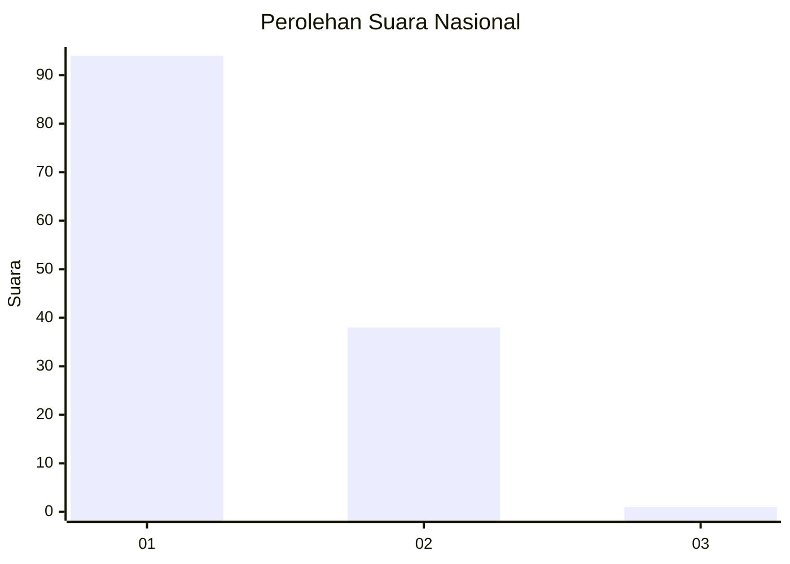
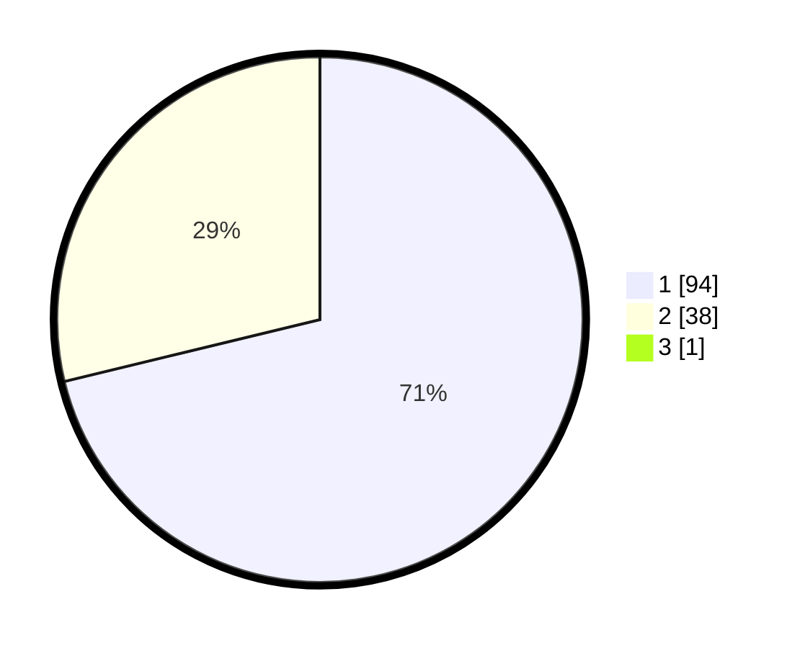

# Hasil

## Grafik

## Tabel

| No. | Nama Paslon    | Suara | Suara (raw) | Persentase |
|:--- |:-------------- | -----:| -----------:| ----------:|
| 1   | ANIES MUHAIMIN | 94    | [94][p-1]   | 70,68      |
| 2   | PRABOWO GIBRAN | 38    | [38][p-2]   | 28,57      |
| 3   | GANJAR MAHFUD  | 1     | [1][p-3]    | 0,75       |

[p-1]: https://github.com/gigit-pemilu/pemilu-2024/blob/main/pilpres/hitung-suara/sub/13-sumatera-barat/sub/12-pasaman-barat/sub/02-lembah-melintang/sub/2001-ujung-gading/sub/003-tps/sub/paslon-1.txt
[p-2]: https://github.com/gigit-pemilu/pemilu-2024/blob/main/pilpres/hitung-suara/sub/13-sumatera-barat/sub/12-pasaman-barat/sub/02-lembah-melintang/sub/2001-ujung-gading/sub/003-tps/sub/paslon-2.txt
[p-3]: https://github.com/gigit-pemilu/pemilu-2024/blob/main/pilpres/hitung-suara/sub/13-sumatera-barat/sub/12-pasaman-barat/sub/02-lembah-melintang/sub/2001-ujung-gading/sub/003-tps/sub/paslon-3.txt

## Foto C Plano

https://sirekap-obj-formc.kpu.go.id/ddba/pemilu/ppwp/13/12/02/20/01/1312022001003-20240217-224748--adf571f1-0811-4fd6-98bd-d3f0de4ac49e.jpg

https://sirekap-obj-formc.kpu.go.id/ddba/pemilu/ppwp/13/12/02/20/01/1312022001003-20240217-225607--c5f6065e-d757-4beb-9146-96325a1a323f.jpg

https://sirekap-obj-formc.kpu.go.id/ddba/pemilu/ppwp/13/12/02/20/01/1312022001003-20240217-225718--1549f5d9-8d66-4e51-9b93-6811b1711894.jpg

## Metadata

| Key        | Value               |
| ---------- | ------------------- |
| Time Stamp | 2024-02-25 17:00:00 |

