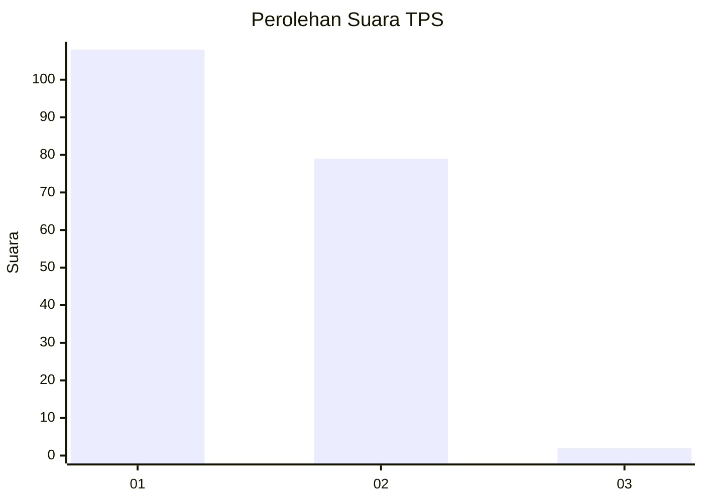
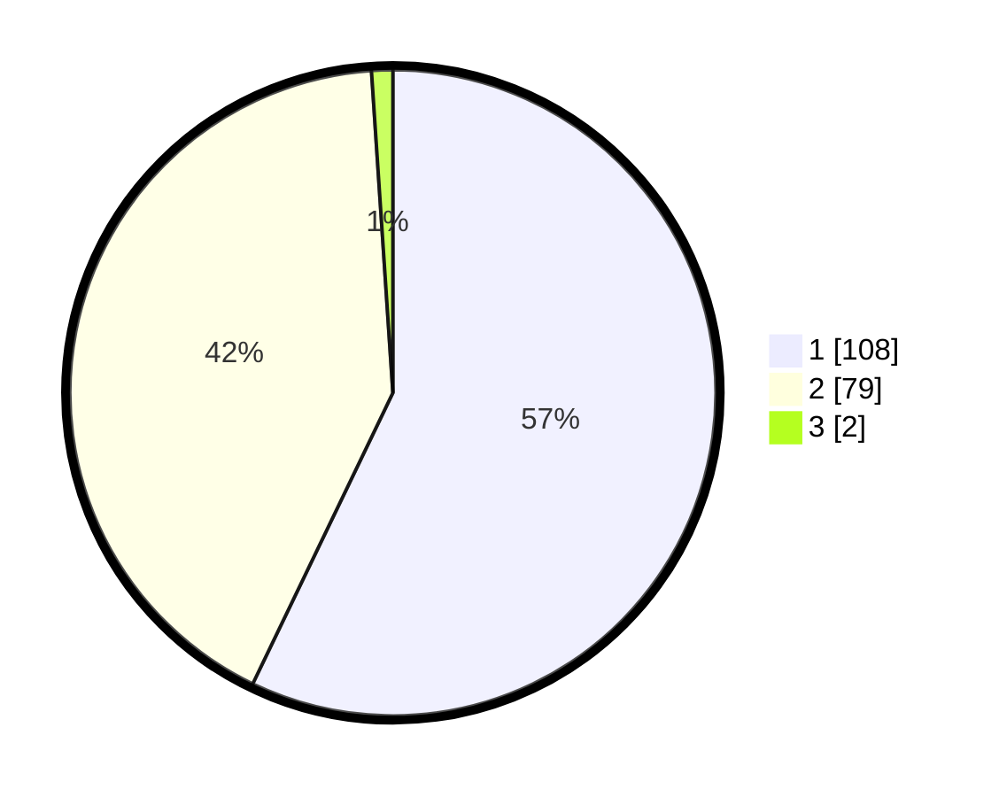

# Hasil

## Grafik

## Tabel

| No. | Nama Paslon    | Suara | Suara (raw) | Persentase |
|:--- |:-------------- | -----:| -----------:| ----------:|
| 1   | ANIES MUHAIMIN | 108   | [108][p-1]  | 57,14      |
| 2   | PRABOWO GIBRAN | 79    | [79][p-2]   | 41,80      |
| 3   | GANJAR MAHFUD  | 2     | [2][p-3]    | 1,06       |

[p-1]: https://github.com/gigit-pemilu/pemilu-2024-13-sumatera-barat/blob/main/pilpres/hitung-suara/sub/13-sumatera-barat/sub/12-pasaman-barat/sub/02-lembah-melintang/sub/2001-ujung-gading/sub/004-tps/sub/paslon-1.txt
[p-2]: https://github.com/gigit-pemilu/pemilu-2024-13-sumatera-barat/blob/main/pilpres/hitung-suara/sub/13-sumatera-barat/sub/12-pasaman-barat/sub/02-lembah-melintang/sub/2001-ujung-gading/sub/004-tps/sub/paslon-2.txt
[p-3]: https://github.com/gigit-pemilu/pemilu-2024-13-sumatera-barat/blob/main/pilpres/hitung-suara/sub/13-sumatera-barat/sub/12-pasaman-barat/sub/02-lembah-melintang/sub/2001-ujung-gading/sub/004-tps/sub/paslon-3.txt

## Foto C Plano

https://sirekap-obj-formc.kpu.go.id/f29c/pemilu/ppwp/13/12/02/20/01/1312022001004-20240219-192439--4caffb83-5070-4def-abc7-553ed714b1d6.jpg

https://sirekap-obj-formc.kpu.go.id/f29c/pemilu/ppwp/13/12/02/20/01/1312022001004-20240219-192600--8731c17d-8eae-493a-8fe9-36e6c1bd4093.jpg

https://sirekap-obj-formc.kpu.go.id/f29c/pemilu/ppwp/13/12/02/20/01/1312022001004-20240219-192710--65eaced0-75cb-4719-83b5-32b6ae93eb6d.jpg

## Metadata

| Key        | Value               |
| ---------- | ------------------- |
| Time Stamp | 2024-02-25 12:00:00 |

