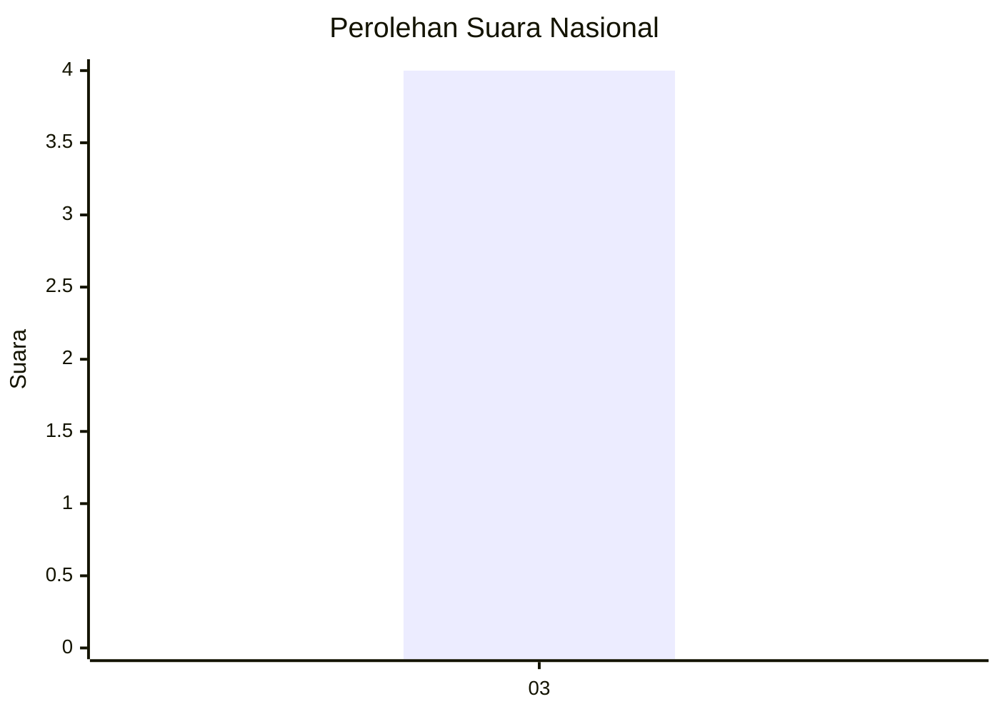
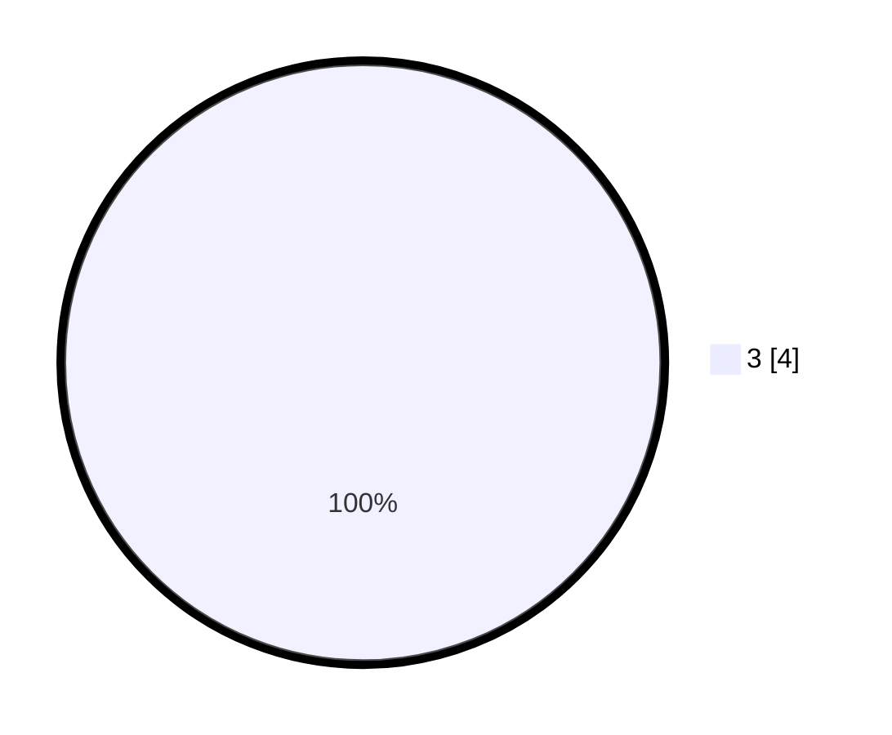

# Hasil

## Grafik

## Tabel

| No. | Nama Paslon   | Suara | Suara (raw) | Persentase |
|:--- |:------------- | -----:| -----------:| ----------:|
| 3   | GANJAR MAHFUD | 4     | [4][p-3]    | 100,00     |

[p-1]: https://github.com/gigit-pemilu/pemilu-2024/blob/main/pilpres/hitung-suara/sub/13-sumatera-barat/sub/12-pasaman-barat/sub/02-lembah-melintang/sub/2002-brastagi-ujung-gading/sub/005-tps/sub/paslon-1.txt
[p-2]: https://github.com/gigit-pemilu/pemilu-2024/blob/main/pilpres/hitung-suara/sub/13-sumatera-barat/sub/12-pasaman-barat/sub/02-lembah-melintang/sub/2002-brastagi-ujung-gading/sub/005-tps/sub/paslon-2.txt
[p-3]: https://github.com/gigit-pemilu/pemilu-2024/blob/main/pilpres/hitung-suara/sub/13-sumatera-barat/sub/12-pasaman-barat/sub/02-lembah-melintang/sub/2002-brastagi-ujung-gading/sub/005-tps/sub/paslon-3.txt

## Foto C Plano

https://sirekap-obj-formc.kpu.go.id/e3b9/pemilu/ppwp/13/12/02/20/02/1312022002005-20240217-231436--537ddb34-fa6b-484b-a324-8c157cfd5904.jpg

https://sirekap-obj-formc.kpu.go.id/e3b9/pemilu/ppwp/13/12/02/20/02/1312022002005-20240217-231722--a882c1a5-90d3-48ad-becb-1f7efd0c7adc.jpg

https://sirekap-obj-formc.kpu.go.id/e3b9/pemilu/ppwp/13/12/02/20/02/1312022002005-20240217-231815--ebcf30a9-815a-4b3d-a4c8-47a55ca26fa2.jpg

## Metadata

| Key        | Value               |
| ---------- | ------------------- |
| Time Stamp | 2024-02-25 12:00:00 |

