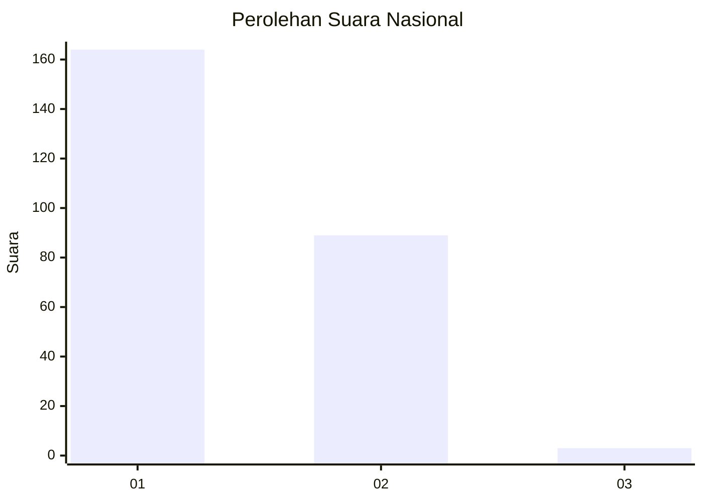
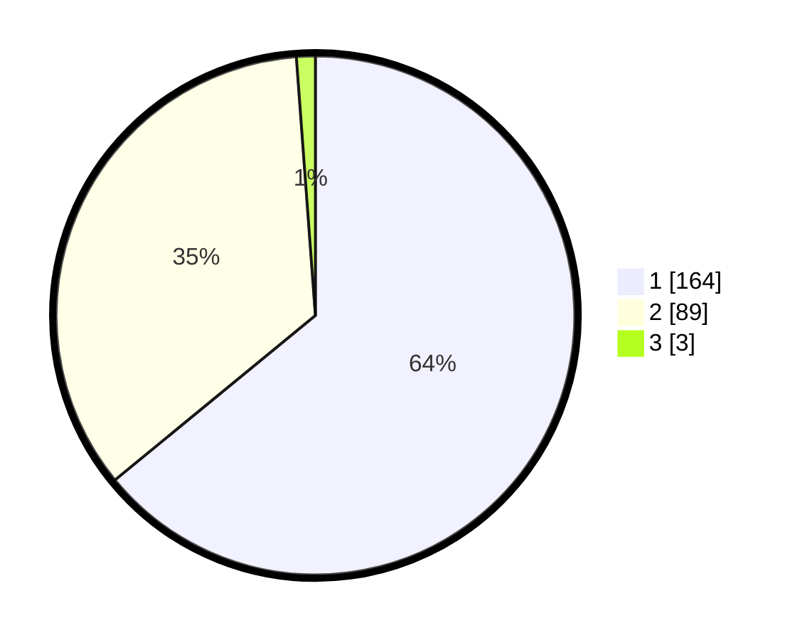

# Hasil

## Grafik

## Tabel

| No. | Nama Paslon    | Suara | Suara (raw) | Persentase |
|:--- |:-------------- | -----:| -----------:| ----------:|
| 1   | ANIES MUHAIMIN | 164   | [164][p-1]  | 64,06      |
| 2   | PRABOWO GIBRAN | 89    | [89][p-2]   | 34,77      |
| 3   | GANJAR MAHFUD  | 3     | [3][p-3]    | 1,17       |

[p-1]: https://github.com/gigit-pemilu/pemilu-2024/blob/main/pilpres/hitung-suara/sub/13-sumatera-barat/sub/12-pasaman-barat/sub/02-lembah-melintang/sub/2002-brastagi-ujung-gading/sub/012-tps/sub/paslon-1.txt
[p-2]: https://github.com/gigit-pemilu/pemilu-2024/blob/main/pilpres/hitung-suara/sub/13-sumatera-barat/sub/12-pasaman-barat/sub/02-lembah-melintang/sub/2002-brastagi-ujung-gading/sub/012-tps/sub/paslon-2.txt
[p-3]: https://github.com/gigit-pemilu/pemilu-2024/blob/main/pilpres/hitung-suara/sub/13-sumatera-barat/sub/12-pasaman-barat/sub/02-lembah-melintang/sub/2002-brastagi-ujung-gading/sub/012-tps/sub/paslon-3.txt

## Foto C Plano

https://sirekap-obj-formc.kpu.go.id/21e5/pemilu/ppwp/13/12/02/20/02/1312022002012-20240218-172758--429425b3-7af1-4505-bc1a-f3ea54d3b94b.jpg

https://sirekap-obj-formc.kpu.go.id/21e5/pemilu/ppwp/13/12/02/20/02/1312022002012-20240218-172843--09338ff6-5fae-48ad-a9ff-a2664723145f.jpg

https://sirekap-obj-formc.kpu.go.id/21e5/pemilu/ppwp/13/12/02/20/02/1312022002012-20240218-172933--aa5afb3e-d2e7-45f7-9078-8728c5a0c6a1.jpg

## Metadata

| Key        | Value               |
| ---------- | ------------------- |
| Time Stamp | 2024-02-25 15:00:00 |

