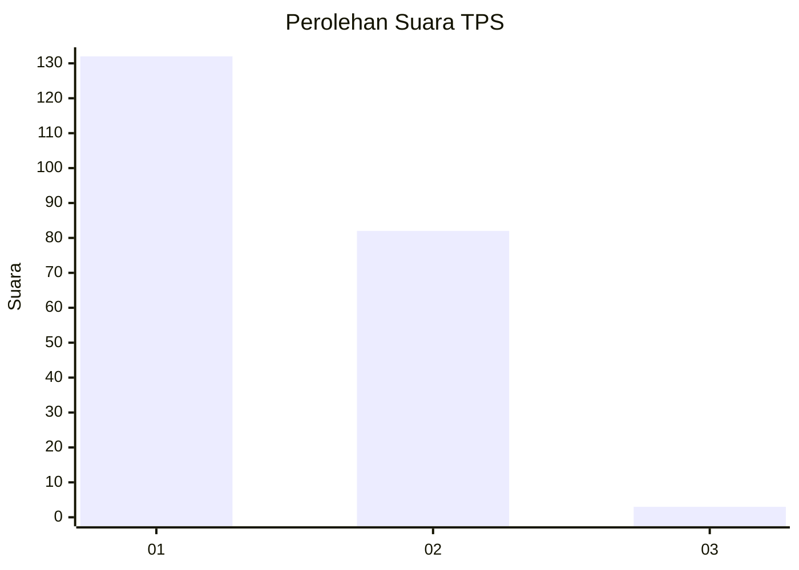
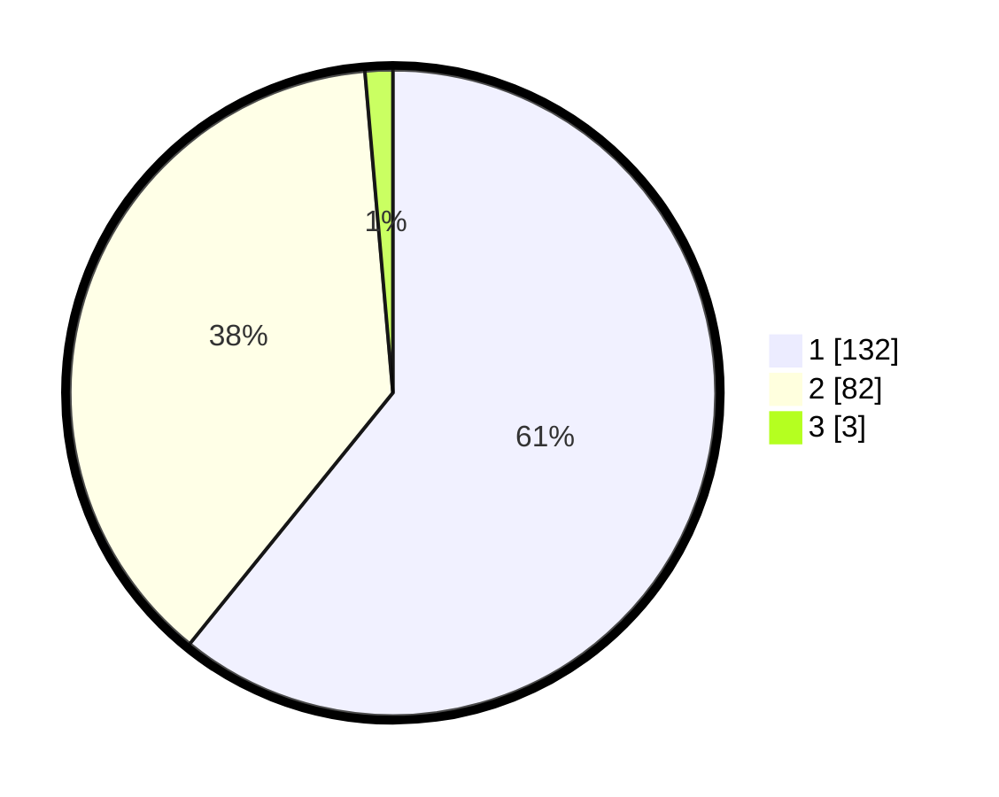

# Hasil

## Grafik

## Tabel

| No. | Nama Paslon    | Suara | Suara (raw) | Persentase |
|:--- |:-------------- | -----:| -----------:| ----------:|
| 1   | ANIES MUHAIMIN | 132   | [132][p-1]  | 60,83      |
| 2   | PRABOWO GIBRAN | 82    | [82][p-2]   | 37,79      |
| 3   | GANJAR MAHFUD  | 3     | [3][p-3]    | 1,38       |

[p-1]: https://github.com/gigit-pemilu/pemilu-2024-13-sumatera-barat/blob/main/pilpres/hitung-suara/sub/13-sumatera-barat/sub/12-pasaman-barat/sub/03-pasaman/sub/2014-sukomananti-aua-kuniang/sub/004-tps/sub/paslon-1.txt
[p-2]: https://github.com/gigit-pemilu/pemilu-2024-13-sumatera-barat/blob/main/pilpres/hitung-suara/sub/13-sumatera-barat/sub/12-pasaman-barat/sub/03-pasaman/sub/2014-sukomananti-aua-kuniang/sub/004-tps/sub/paslon-2.txt
[p-3]: https://github.com/gigit-pemilu/pemilu-2024-13-sumatera-barat/blob/main/pilpres/hitung-suara/sub/13-sumatera-barat/sub/12-pasaman-barat/sub/03-pasaman/sub/2014-sukomananti-aua-kuniang/sub/004-tps/sub/paslon-3.txt

## Foto C Plano

https://sirekap-obj-formc.kpu.go.id/42f7/pemilu/ppwp/13/12/03/20/14/1312032014004-20240215-003820--653f80af-79e1-46c8-82ce-be2dab605151.jpg

https://sirekap-obj-formc.kpu.go.id/42f7/pemilu/ppwp/13/12/03/20/14/1312032014004-20240215-003938--798443c5-3ff8-45f0-9fac-fc0dcaa7df26.jpg

https://sirekap-obj-formc.kpu.go.id/42f7/pemilu/ppwp/13/12/03/20/14/1312032014004-20240215-004050--866ba1c8-2af3-4cc9-b10e-f4f3ed27d9ae.jpg

## Metadata

| Key        | Value               |
| ---------- | ------------------- |
| Time Stamp | 2024-02-25 16:00:00 |

