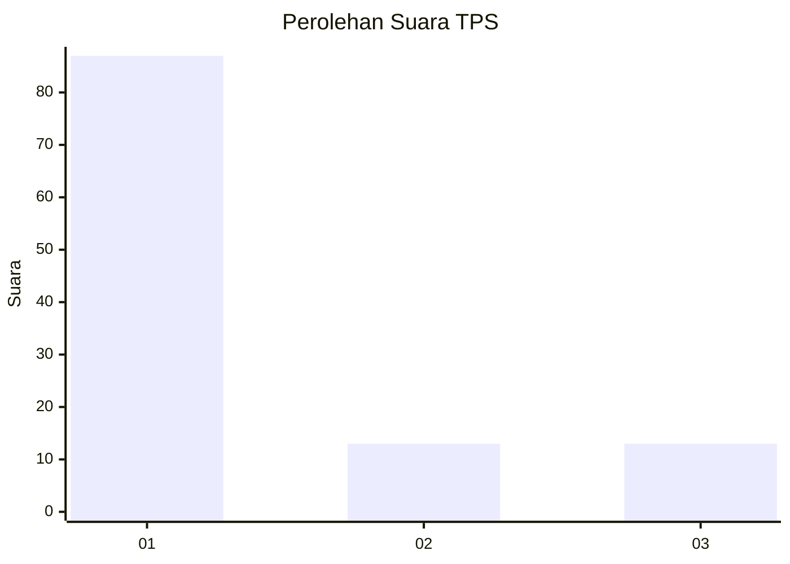
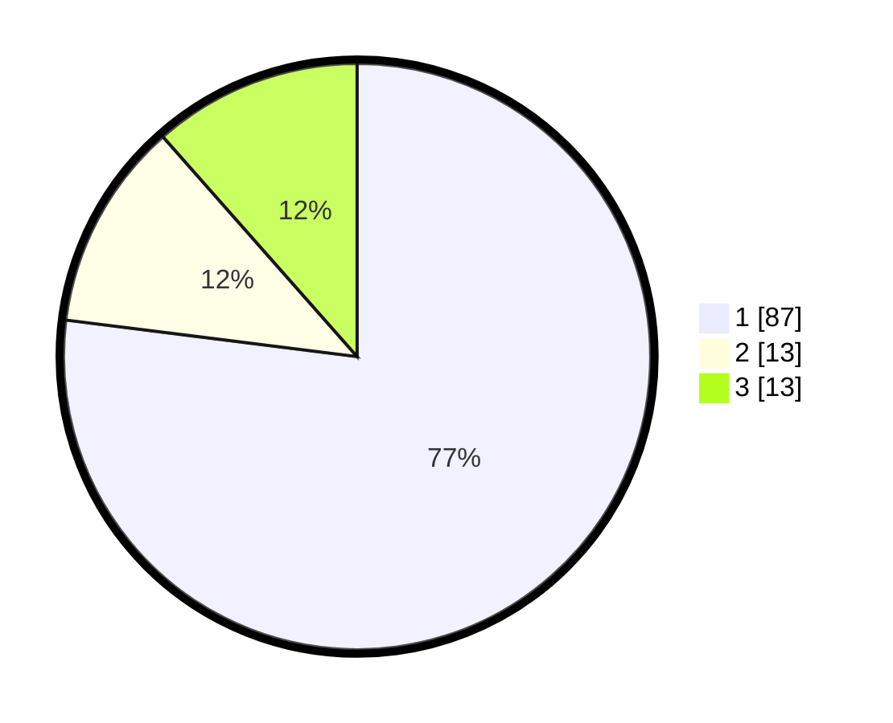

# Hasil

## Grafik

## Tabel

| No. | Nama Paslon    | Suara | Suara (raw) | Persentase |
|:--- |:-------------- | -----:| -----------:| ----------:|
| 1   | ANIES MUHAIMIN | 87    | [87][p-1]   | 76,99      |
| 2   | PRABOWO GIBRAN | 13    | [13][p-2]   | 11,50      |
| 3   | GANJAR MAHFUD  | 13    | [13][p-3]   | 11,50      |

[p-1]: https://github.com/gigit-pemilu/pemilu-2024-13-sumatera-barat/blob/main/pilpres/hitung-suara/sub/13-sumatera-barat/sub/12-pasaman-barat/sub/03-pasaman/sub/2018-lubuak-landua-aua-kuniang/sub/002-tps/sub/paslon-1.txt
[p-2]: https://github.com/gigit-pemilu/pemilu-2024-13-sumatera-barat/blob/main/pilpres/hitung-suara/sub/13-sumatera-barat/sub/12-pasaman-barat/sub/03-pasaman/sub/2018-lubuak-landua-aua-kuniang/sub/002-tps/sub/paslon-2.txt
[p-3]: https://github.com/gigit-pemilu/pemilu-2024-13-sumatera-barat/blob/main/pilpres/hitung-suara/sub/13-sumatera-barat/sub/12-pasaman-barat/sub/03-pasaman/sub/2018-lubuak-landua-aua-kuniang/sub/002-tps/sub/paslon-3.txt

## Foto C Plano

https://sirekap-obj-formc.kpu.go.id/eb2b/pemilu/ppwp/13/12/03/20/18/1312032018002-20240215-004917--53510b6c-5b4e-429a-8171-b6ff415f7924.jpg

https://sirekap-obj-formc.kpu.go.id/eb2b/pemilu/ppwp/13/12/03/20/18/1312032018002-20240215-010756--1fda7525-a527-4df3-8885-7d317915e331.jpg

https://sirekap-obj-formc.kpu.go.id/eb2b/pemilu/ppwp/13/12/03/20/18/1312032018002-20240215-011524--5f73f5e8-5208-4998-9c53-cab6340d7cad.jpg

## Metadata

| Key        | Value               |
| ---------- | ------------------- |
| Time Stamp | 2024-02-25 00:00:00 |

