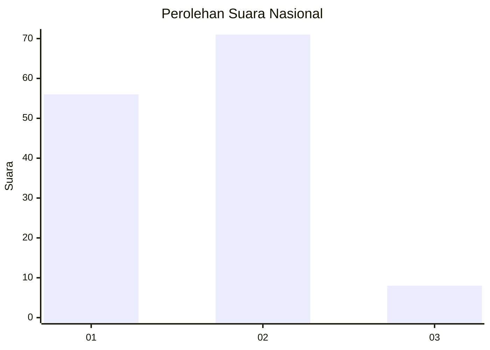
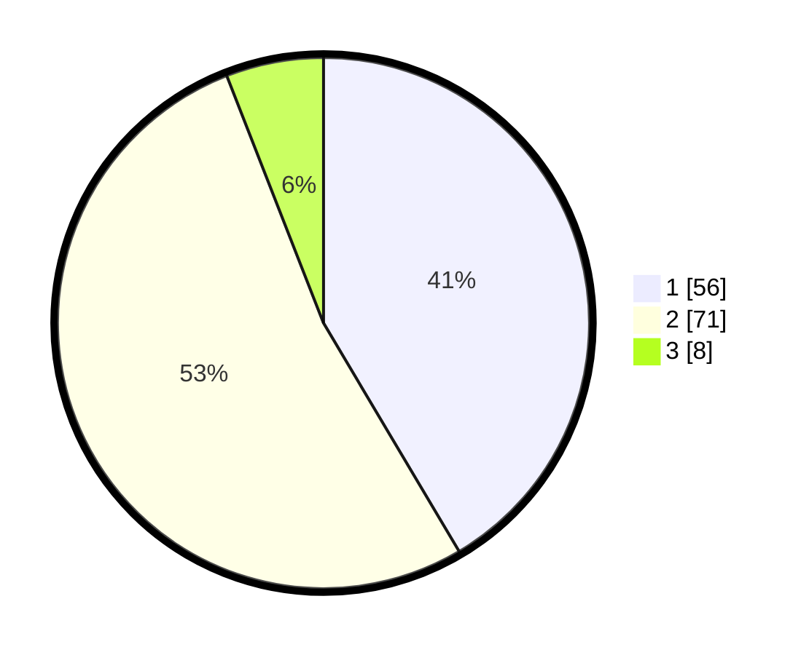

# Hasil

## Grafik

## Tabel

| No. | Nama Paslon    | Suara | Suara (raw) | Persentase |
|:--- |:-------------- | -----:| -----------:| ----------:|
| 1   | ANIES MUHAIMIN | 56    | [56][p-1]   | 41,48      |
| 2   | PRABOWO GIBRAN | 71    | [71][p-2]   | 52,59      |
| 3   | GANJAR MAHFUD  | 8     | [8][p-3]    | 5,93       |

[p-1]: https://github.com/gigit-pemilu/pemilu-2024/blob/main/pilpres/hitung-suara/sub/13-sumatera-barat/sub/12-pasaman-barat/sub/03-pasaman/sub/2018-lubuak-landua-aua-kuniang/sub/005-tps/sub/paslon-1.txt
[p-2]: https://github.com/gigit-pemilu/pemilu-2024/blob/main/pilpres/hitung-suara/sub/13-sumatera-barat/sub/12-pasaman-barat/sub/03-pasaman/sub/2018-lubuak-landua-aua-kuniang/sub/005-tps/sub/paslon-2.txt
[p-3]: https://github.com/gigit-pemilu/pemilu-2024/blob/main/pilpres/hitung-suara/sub/13-sumatera-barat/sub/12-pasaman-barat/sub/03-pasaman/sub/2018-lubuak-landua-aua-kuniang/sub/005-tps/sub/paslon-3.txt

## Foto C Plano

https://sirekap-obj-formc.kpu.go.id/0f03/pemilu/ppwp/13/12/03/20/18/1312032018005-20240215-085617--0e4ce0e6-25d7-4046-946d-91fef0ab8a11.jpg

https://sirekap-obj-formc.kpu.go.id/0f03/pemilu/ppwp/13/12/03/20/18/1312032018005-20240215-013414--d13790b3-cd43-41ad-a92f-7099780af06f.jpg

https://sirekap-obj-formc.kpu.go.id/0f03/pemilu/ppwp/13/12/03/20/18/1312032018005-20240215-013845--788a4018-53c8-475f-a546-547786d7e255.jpg

## Metadata

| Key        | Value               |
| ---------- | ------------------- |
| Time Stamp | 2024-02-25 13:00:00 |

