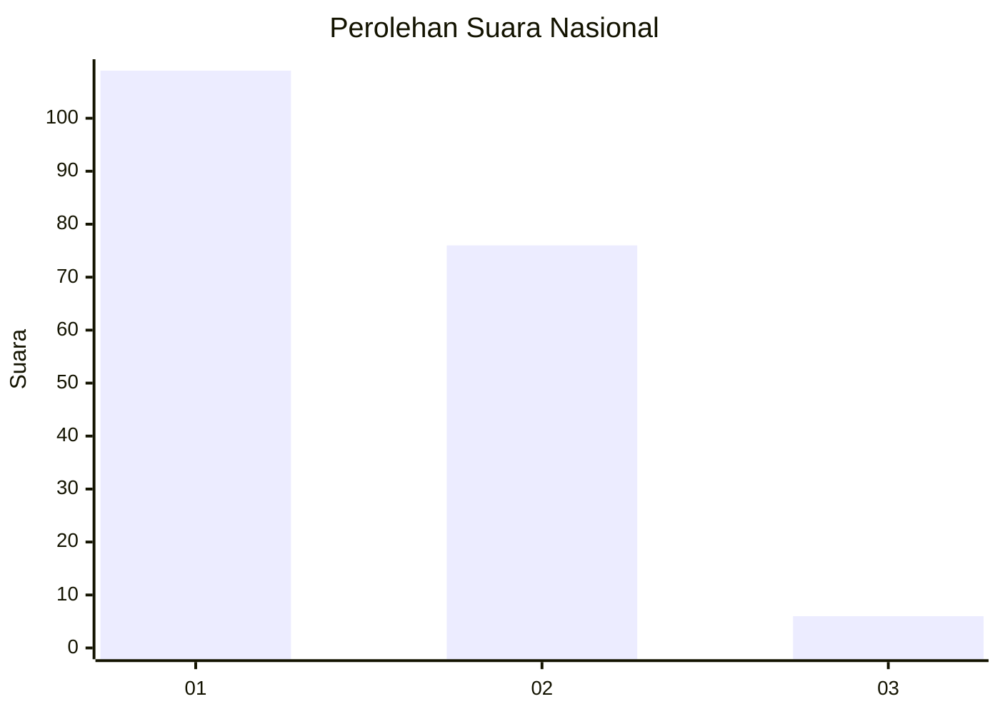
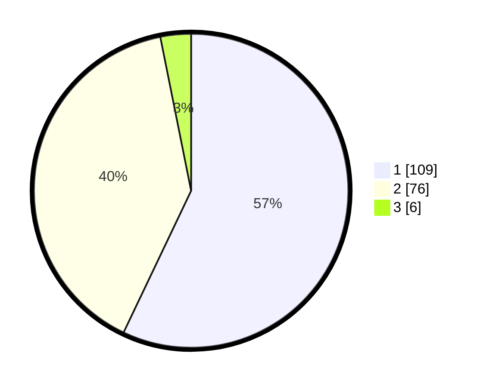

# Hasil

## Grafik

## Tabel

| No. | Nama Paslon    | Suara | Suara (raw) | Persentase |
|:--- |:-------------- | -----:| -----------:| ----------:|
| 1   | ANIES MUHAIMIN | 109   | [109][p-1]  | 57,07      |
| 2   | PRABOWO GIBRAN | 76    | [76][p-2]   | 39,79      |
| 3   | GANJAR MAHFUD  | 6     | [6][p-3]    | 3,14       |

[p-1]: https://github.com/gigit-pemilu/pemilu-2024/blob/main/pilpres/hitung-suara/sub/13-sumatera-barat/sub/12-pasaman-barat/sub/03-pasaman/sub/2019-lembah-binuang-aua-kuniang/sub/003-tps/sub/paslon-1.txt
[p-2]: https://github.com/gigit-pemilu/pemilu-2024/blob/main/pilpres/hitung-suara/sub/13-sumatera-barat/sub/12-pasaman-barat/sub/03-pasaman/sub/2019-lembah-binuang-aua-kuniang/sub/003-tps/sub/paslon-2.txt
[p-3]: https://github.com/gigit-pemilu/pemilu-2024/blob/main/pilpres/hitung-suara/sub/13-sumatera-barat/sub/12-pasaman-barat/sub/03-pasaman/sub/2019-lembah-binuang-aua-kuniang/sub/003-tps/sub/paslon-3.txt

## Foto C Plano

https://sirekap-obj-formc.kpu.go.id/41c4/pemilu/ppwp/13/12/03/20/19/1312032019003-20240215-030404--d9d16ca5-fbcd-4e25-8978-4d82706f01f2.jpg

https://sirekap-obj-formc.kpu.go.id/41c4/pemilu/ppwp/13/12/03/20/19/1312032019003-20240215-030607--8a650dbd-2c13-4776-9477-b03c36a0f83f.jpg

https://sirekap-obj-formc.kpu.go.id/41c4/pemilu/ppwp/13/12/03/20/19/1312032019003-20240215-030903--9f7029b6-0e64-41b1-aa5d-39c4fb1f5117.jpg

## Metadata

| Key        | Value               |
| ---------- | ------------------- |
| Time Stamp | 2024-02-25 16:00:00 |

