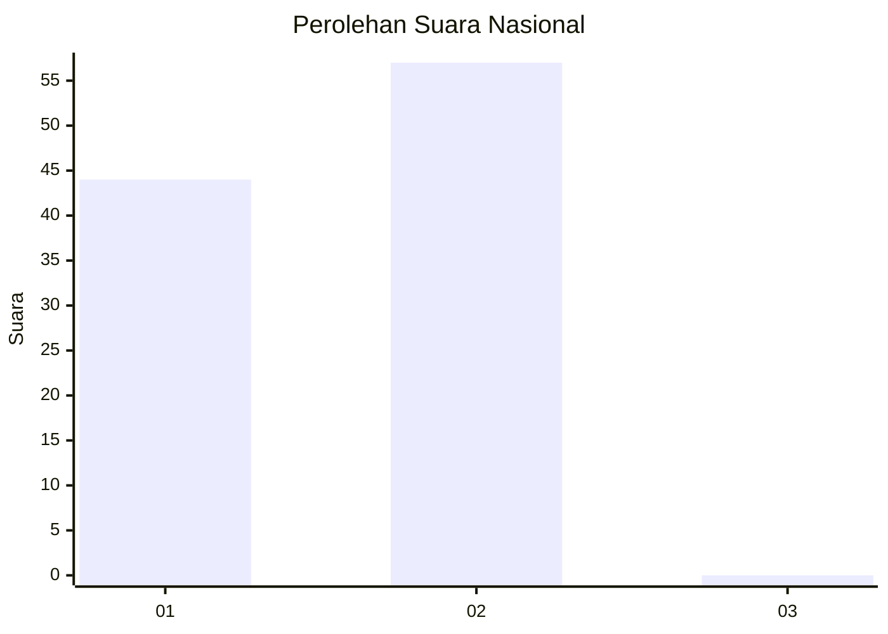
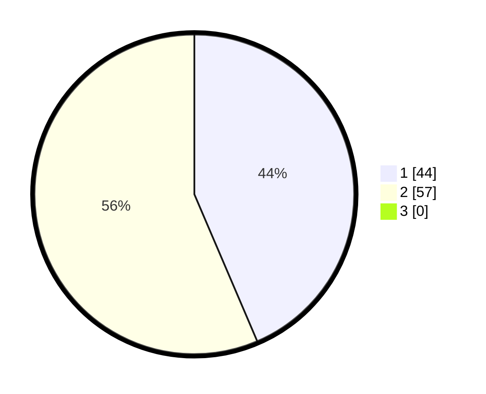

# Hasil

## Grafik

## Tabel

| No. | Nama Paslon    | Suara | Suara (raw) | Persentase |
|:--- |:-------------- | -----:| -----------:| ----------:|
| 1   | ANIES MUHAIMIN | 44    | [44][p-1]   | 43,56      |
| 2   | PRABOWO GIBRAN | 57    | [57][p-2]   | 56,44      |
| 3   | GANJAR MAHFUD  | 0     | [0][p-3]    | 0,00       |

[p-1]: https://github.com/gigit-pemilu/pemilu-2024/blob/main/pilpres/hitung-suara/sub/13-sumatera-barat/sub/12-pasaman-barat/sub/04-talamau/sub/2001-kajai/sub/007-tps/sub/paslon-1.txt
[p-2]: https://github.com/gigit-pemilu/pemilu-2024/blob/main/pilpres/hitung-suara/sub/13-sumatera-barat/sub/12-pasaman-barat/sub/04-talamau/sub/2001-kajai/sub/007-tps/sub/paslon-2.txt
[p-3]: https://github.com/gigit-pemilu/pemilu-2024/blob/main/pilpres/hitung-suara/sub/13-sumatera-barat/sub/12-pasaman-barat/sub/04-talamau/sub/2001-kajai/sub/007-tps/sub/paslon-3.txt

## Foto C Plano

https://sirekap-obj-formc.kpu.go.id/4807/pemilu/ppwp/13/12/04/20/01/1312042001007-20240215-021038--fdffe6c3-6f5d-479f-9e37-9584e24e06b1.jpg

https://sirekap-obj-formc.kpu.go.id/4807/pemilu/ppwp/13/12/04/20/01/1312042001007-20240215-021215--1b741965-dba7-48d3-8d69-316224c721ff.jpg

https://sirekap-obj-formc.kpu.go.id/4807/pemilu/ppwp/13/12/04/20/01/1312042001007-20240215-021456--4f4cc7a3-cb7a-467b-bdef-39bf9355373e.jpg

## Metadata

| Key        | Value               |
| ---------- | ------------------- |
| Time Stamp | 2024-02-25 16:00:00 |

