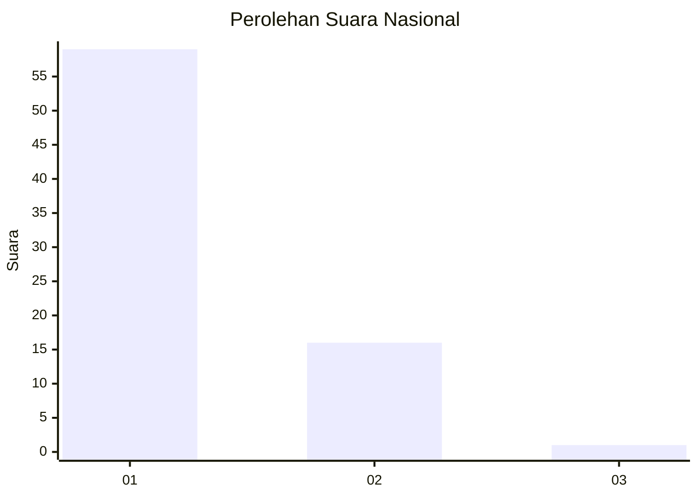
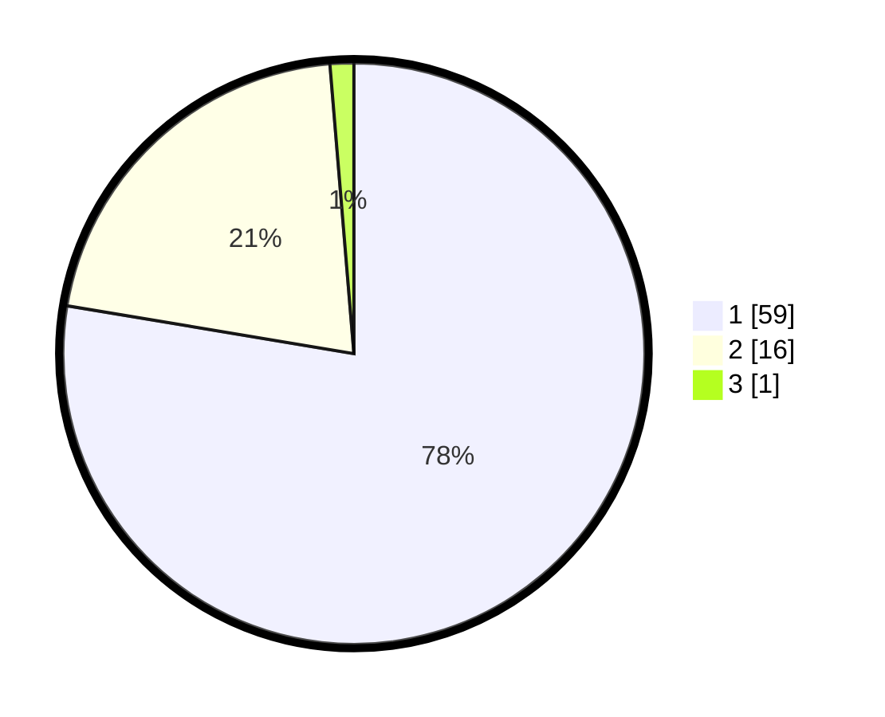

# Hasil

## Grafik

## Tabel

| No. | Nama Paslon    | Suara | Suara (raw) | Persentase |
|:--- |:-------------- | -----:| -----------:| ----------:|
| 1   | ANIES MUHAIMIN | 59    | [59][p-1]   | 77,63      |
| 2   | PRABOWO GIBRAN | 16    | [16][p-2]   | 21,05      |
| 3   | GANJAR MAHFUD  | 1     | [1][p-3]    | 1,32       |

[p-1]: https://github.com/gigit-pemilu/pemilu-2024/blob/main/pilpres/hitung-suara/sub/13-sumatera-barat/sub/12-pasaman-barat/sub/04-talamau/sub/2003-sinuruik/sub/003-tps/sub/paslon-1.txt
[p-2]: https://github.com/gigit-pemilu/pemilu-2024/blob/main/pilpres/hitung-suara/sub/13-sumatera-barat/sub/12-pasaman-barat/sub/04-talamau/sub/2003-sinuruik/sub/003-tps/sub/paslon-2.txt
[p-3]: https://github.com/gigit-pemilu/pemilu-2024/blob/main/pilpres/hitung-suara/sub/13-sumatera-barat/sub/12-pasaman-barat/sub/04-talamau/sub/2003-sinuruik/sub/003-tps/sub/paslon-3.txt

## Foto C Plano

https://sirekap-obj-formc.kpu.go.id/65e0/pemilu/ppwp/13/12/04/20/03/1312042003003-20240214-231450--c382c703-59bb-44c6-8f95-e2ac0f682656.jpg

https://sirekap-obj-formc.kpu.go.id/65e0/pemilu/ppwp/13/12/04/20/03/1312042003003-20240214-231601--13cf1e4c-f1a1-4de3-a514-aade8e6f7c00.jpg

https://sirekap-obj-formc.kpu.go.id/65e0/pemilu/ppwp/13/12/04/20/03/1312042003003-20240214-231642--cc7c81ff-607f-4fe0-951e-01393119a7a2.jpg

## Metadata

| Key        | Value               |
| ---------- | ------------------- |
| Time Stamp | 2024-02-24 22:31:28 |

