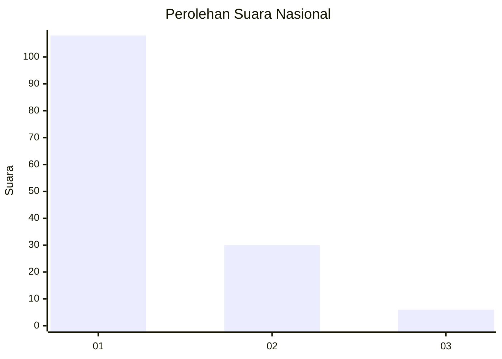
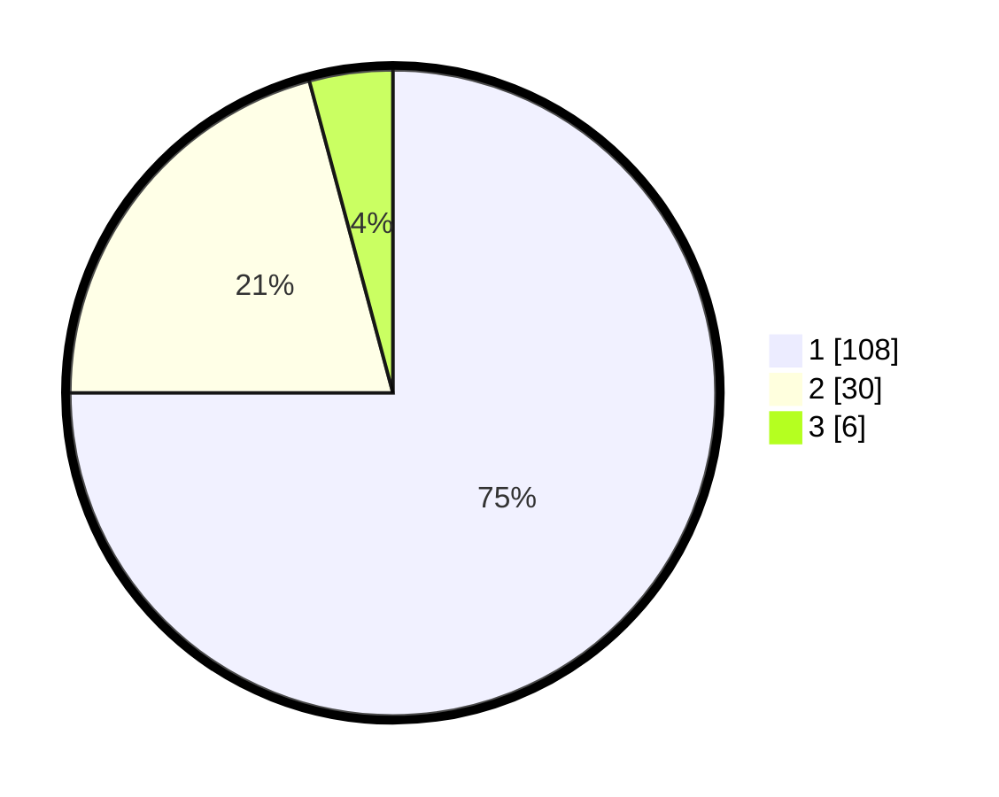

# Hasil

## Grafik

## Tabel

| No. | Nama Paslon    | Suara | Suara (raw) | Persentase |
|:--- |:-------------- | -----:| -----------:| ----------:|
| 1   | ANIES MUHAIMIN | 108   | [108][p-1]  | 75,00      |
| 2   | PRABOWO GIBRAN | 30    | [30][p-2]   | 20,83      |
| 3   | GANJAR MAHFUD  | 6     | [6][p-3]    | 4,17       |

[p-1]: https://github.com/gigit-pemilu/pemilu-2024/blob/main/pilpres/hitung-suara/sub/13-sumatera-barat/sub/12-pasaman-barat/sub/04-talamau/sub/2003-sinuruik/sub/004-tps/sub/paslon-1.txt
[p-2]: https://github.com/gigit-pemilu/pemilu-2024/blob/main/pilpres/hitung-suara/sub/13-sumatera-barat/sub/12-pasaman-barat/sub/04-talamau/sub/2003-sinuruik/sub/004-tps/sub/paslon-2.txt
[p-3]: https://github.com/gigit-pemilu/pemilu-2024/blob/main/pilpres/hitung-suara/sub/13-sumatera-barat/sub/12-pasaman-barat/sub/04-talamau/sub/2003-sinuruik/sub/004-tps/sub/paslon-3.txt

## Foto C Plano

https://sirekap-obj-formc.kpu.go.id/b663/pemilu/ppwp/13/12/04/20/03/1312042003004-20240215-012311--2521256f-5789-42ee-8b47-16a6c489e0b4.jpg

https://sirekap-obj-formc.kpu.go.id/b663/pemilu/ppwp/13/12/04/20/03/1312042003004-20240215-012516--b02fbc8d-c2af-4715-acd5-02eb3f2f13eb.jpg

https://sirekap-obj-formc.kpu.go.id/b663/pemilu/ppwp/13/12/04/20/03/1312042003004-20240215-012641--1d8aeb14-c8ec-4734-9133-91b333d7404d.jpg

## Metadata

| Key        | Value               |
| ---------- | ------------------- |
| Time Stamp | 2024-02-24 22:31:28 |

