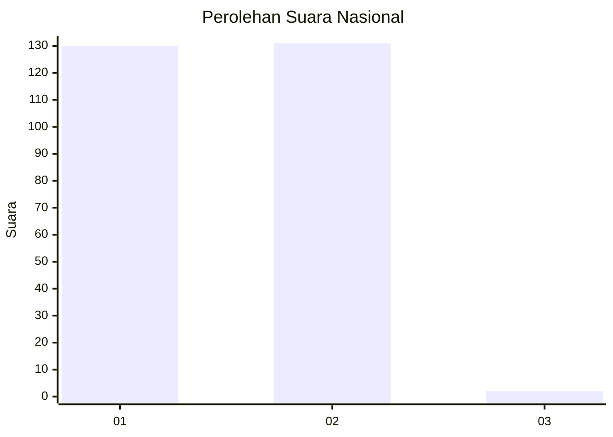
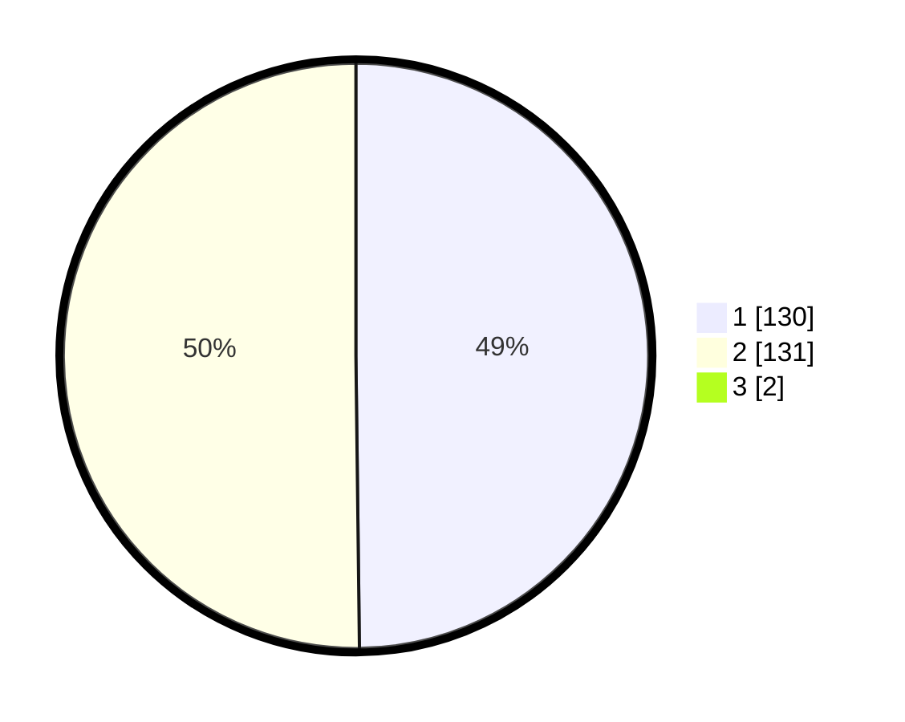

# Hasil

## Grafik

## Tabel

| No. | Nama Paslon    | Suara | Suara (raw) | Persentase |
|:--- |:-------------- | -----:| -----------:| ----------:|
| 1   | ANIES MUHAIMIN | 130   | [130][p-1]  | 49,43      |
| 2   | PRABOWO GIBRAN | 131   | [131][p-2]  | 49,81      |
| 3   | GANJAR MAHFUD  | 2     | [2][p-3]    | 0,76       |

[p-1]: https://github.com/gigit-pemilu/pemilu-2024/blob/main/pilpres/hitung-suara/sub/13-sumatera-barat/sub/12-pasaman-barat/sub/05-kinali/sub/2008-langgam-sepakat/sub/008-tps/sub/paslon-1.txt
[p-2]: https://github.com/gigit-pemilu/pemilu-2024/blob/main/pilpres/hitung-suara/sub/13-sumatera-barat/sub/12-pasaman-barat/sub/05-kinali/sub/2008-langgam-sepakat/sub/008-tps/sub/paslon-2.txt
[p-3]: https://github.com/gigit-pemilu/pemilu-2024/blob/main/pilpres/hitung-suara/sub/13-sumatera-barat/sub/12-pasaman-barat/sub/05-kinali/sub/2008-langgam-sepakat/sub/008-tps/sub/paslon-3.txt

## Foto C Plano

https://sirekap-obj-formc.kpu.go.id/76fe/pemilu/ppwp/13/12/05/20/08/1312052008008-20240215-003440--2adfb5de-b445-43b5-9ec7-a6aa071b5ed5.jpg

https://sirekap-obj-formc.kpu.go.id/76fe/pemilu/ppwp/13/12/05/20/08/1312052008008-20240215-004220--46d8f234-5691-4961-a99a-322bf024c08d.jpg

https://sirekap-obj-formc.kpu.go.id/76fe/pemilu/ppwp/13/12/05/20/08/1312052008008-20240215-002900--15ce7e49-4c46-4616-be45-2018576af46d.jpg

## Metadata

| Key        | Value               |
| ---------- | ------------------- |
| Time Stamp | 2024-02-17 16:36:25 |

