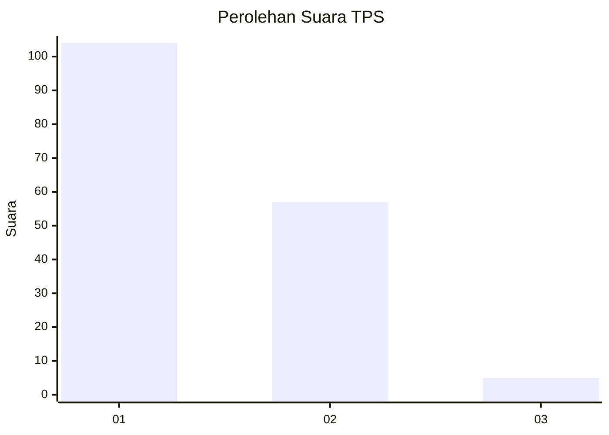
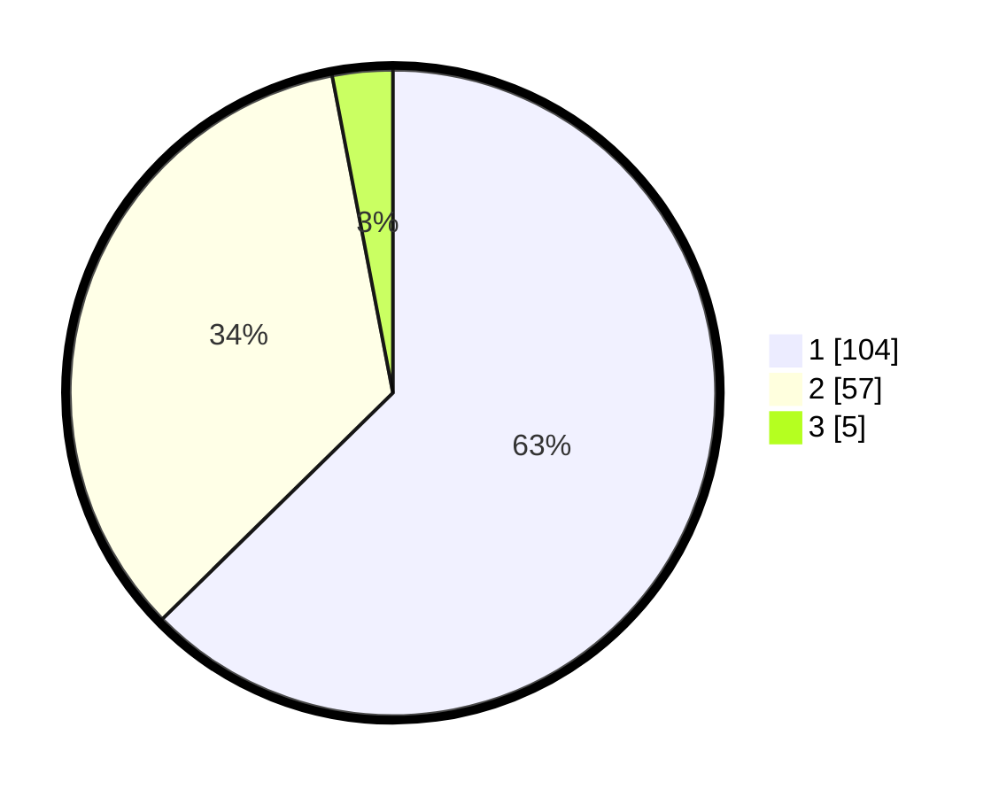

# Hasil

## Grafik

## Tabel

| No. | Nama Paslon    | Suara | Suara (raw) | Persentase |
|:--- |:-------------- | -----:| -----------:| ----------:|
| 1   | ANIES MUHAIMIN | 104   | [104][p-1]  | 62,65      |
| 2   | PRABOWO GIBRAN | 57    | [57][p-2]   | 34,34      |
| 3   | GANJAR MAHFUD  | 5     | [5][p-3]    | 3,01       |

[p-1]: https://github.com/gigit-pemilu/pemilu-2024-13-sumatera-barat/blob/main/pilpres/hitung-suara/sub/13-sumatera-barat/sub/12-pasaman-barat/sub/07-ranah-batahan/sub/2001-batahan/sub/002-tps/sub/paslon-1.txt
[p-2]: https://github.com/gigit-pemilu/pemilu-2024-13-sumatera-barat/blob/main/pilpres/hitung-suara/sub/13-sumatera-barat/sub/12-pasaman-barat/sub/07-ranah-batahan/sub/2001-batahan/sub/002-tps/sub/paslon-2.txt
[p-3]: https://github.com/gigit-pemilu/pemilu-2024-13-sumatera-barat/blob/main/pilpres/hitung-suara/sub/13-sumatera-barat/sub/12-pasaman-barat/sub/07-ranah-batahan/sub/2001-batahan/sub/002-tps/sub/paslon-3.txt

## Foto C Plano

https://sirekap-obj-formc.kpu.go.id/31cf/pemilu/ppwp/13/12/07/20/01/1312072001002-20240214-230415--807fd27a-4185-438c-86d8-ec6a9fec666a.jpg

https://sirekap-obj-formc.kpu.go.id/31cf/pemilu/ppwp/13/12/07/20/01/1312072001002-20240214-225930--9a1c0f53-8f8b-46b9-9b18-89e52c516b2f.jpg

https://sirekap-obj-formc.kpu.go.id/31cf/pemilu/ppwp/13/12/07/20/01/1312072001002-20240214-230243--87d99f8f-c3b2-4e44-8cb4-16ca49d2aa14.jpg

## Metadata

| Key        | Value               |
| ---------- | ------------------- |
| Time Stamp | 2024-02-24 22:31:28 |

