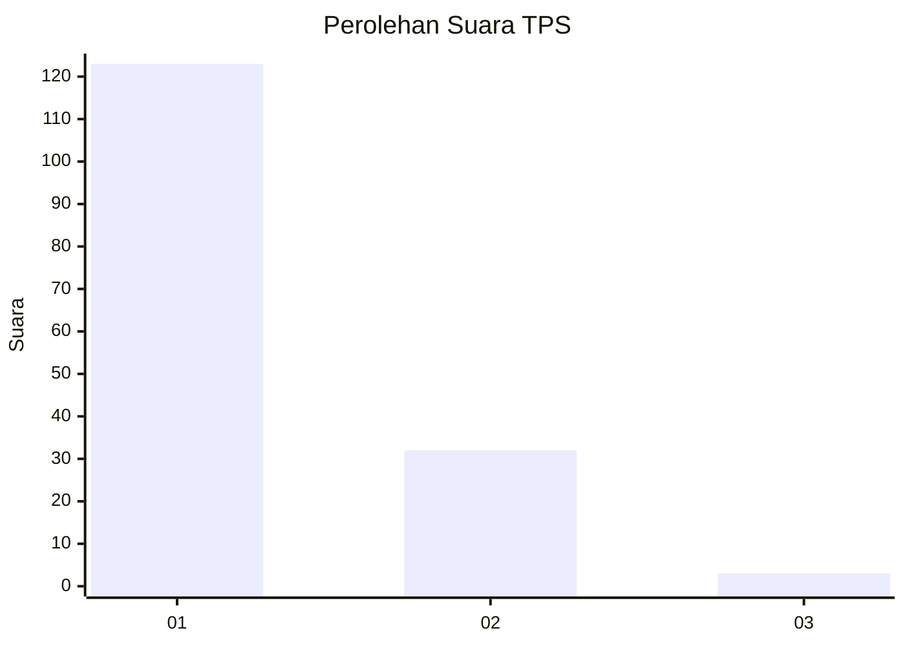
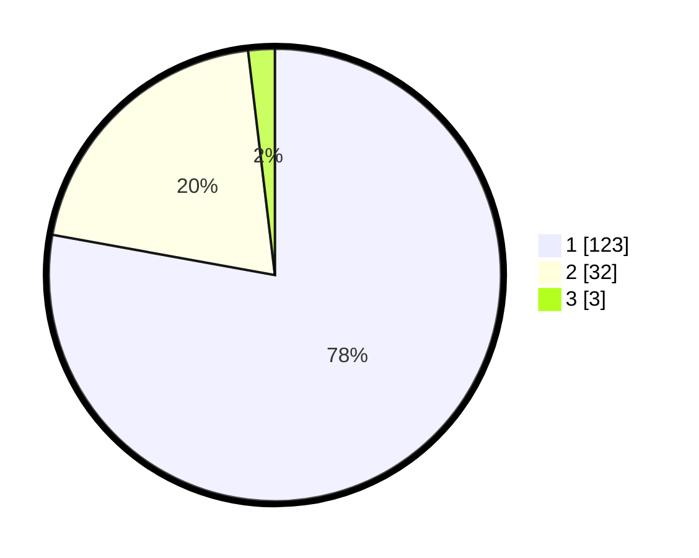

# Hasil

## Grafik

## Tabel

| No. | Nama Paslon    | Suara | Suara (raw) | Persentase |
|:--- |:-------------- | -----:| -----------:| ----------:|
| 1   | ANIES MUHAIMIN | 123   | [123][p-1]  | 77,85      |
| 2   | PRABOWO GIBRAN | 32    | [32][p-2]   | 20,25      |
| 3   | GANJAR MAHFUD  | 3     | [3][p-3]    | 1,90       |

[p-1]: https://github.com/gigit-pemilu/pemilu-2024-13-sumatera-barat/blob/main/pilpres/hitung-suara/sub/13-sumatera-barat/sub/12-pasaman-barat/sub/07-ranah-batahan/sub/2001-batahan/sub/010-tps/sub/paslon-1.txt
[p-2]: https://github.com/gigit-pemilu/pemilu-2024-13-sumatera-barat/blob/main/pilpres/hitung-suara/sub/13-sumatera-barat/sub/12-pasaman-barat/sub/07-ranah-batahan/sub/2001-batahan/sub/010-tps/sub/paslon-2.txt
[p-3]: https://github.com/gigit-pemilu/pemilu-2024-13-sumatera-barat/blob/main/pilpres/hitung-suara/sub/13-sumatera-barat/sub/12-pasaman-barat/sub/07-ranah-batahan/sub/2001-batahan/sub/010-tps/sub/paslon-3.txt

## Foto C Plano

https://sirekap-obj-formc.kpu.go.id/cd1a/pemilu/ppwp/13/12/07/20/01/1312072001010-20240215-005139--b61f90d8-214b-4fea-90ab-1edd00a943bf.jpg

https://sirekap-obj-formc.kpu.go.id/cd1a/pemilu/ppwp/13/12/07/20/01/1312072001010-20240215-005332--aaf0a1e0-57c8-4ff3-b5a7-1ec7682f9833.jpg

https://sirekap-obj-formc.kpu.go.id/cd1a/pemilu/ppwp/13/12/07/20/01/1312072001010-20240215-005501--24814e50-43ae-40b4-bd63-ed0d7766d60a.jpg

## Metadata

| Key        | Value               |
| ---------- | ------------------- |
| Time Stamp | 2024-02-25 19:00:00 |

