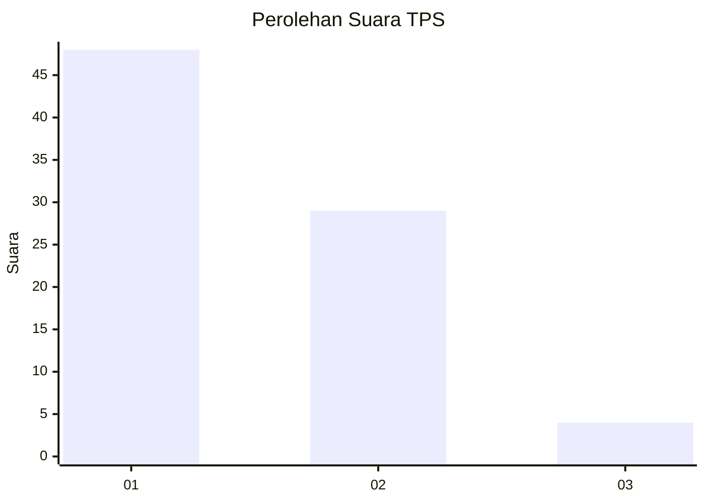
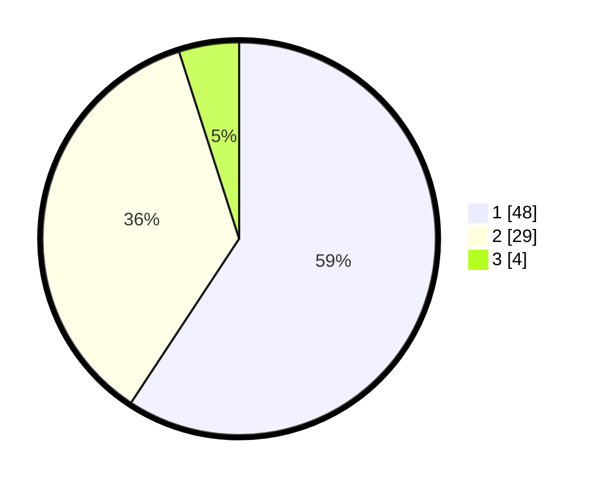

# Hasil

## Grafik

## Tabel

| No. | Nama Paslon    | Suara | Suara (raw) | Persentase |
|:--- |:-------------- | -----:| -----------:| ----------:|
| 1   | ANIES MUHAIMIN | 48    | [48][p-1]   | 59,26      |
| 2   | PRABOWO GIBRAN | 29    | [29][p-2]   | 35,80      |
| 3   | GANJAR MAHFUD  | 4     | [4][p-3]    | 4,94       |

[p-1]: https://github.com/gigit-pemilu/pemilu-2024-13-sumatera-barat/blob/main/pilpres/hitung-suara/sub/13-sumatera-barat/sub/12-pasaman-barat/sub/07-ranah-batahan/sub/2004-batahan-tengah/sub/015-tps/sub/paslon-1.txt
[p-2]: https://github.com/gigit-pemilu/pemilu-2024-13-sumatera-barat/blob/main/pilpres/hitung-suara/sub/13-sumatera-barat/sub/12-pasaman-barat/sub/07-ranah-batahan/sub/2004-batahan-tengah/sub/015-tps/sub/paslon-2.txt
[p-3]: https://github.com/gigit-pemilu/pemilu-2024-13-sumatera-barat/blob/main/pilpres/hitung-suara/sub/13-sumatera-barat/sub/12-pasaman-barat/sub/07-ranah-batahan/sub/2004-batahan-tengah/sub/015-tps/sub/paslon-3.txt

## Foto C Plano

https://sirekap-obj-formc.kpu.go.id/bc2f/pemilu/ppwp/13/12/07/20/04/1312072004015-20240215-011024--463eb97a-1791-462a-96e0-f91f6bf99d80.jpg

https://sirekap-obj-formc.kpu.go.id/bc2f/pemilu/ppwp/13/12/07/20/04/1312072004015-20240215-011230--db7ad162-51b3-4527-9956-75d3f6ed8952.jpg

https://sirekap-obj-formc.kpu.go.id/bc2f/pemilu/ppwp/13/12/07/20/04/1312072004015-20240215-011417--dd956edc-4cdb-4ea8-94c4-2e4bc06daeb8.jpg

## Metadata

| Key        | Value               |
| ---------- | ------------------- |
| Time Stamp | 2024-02-25 13:00:00 |

