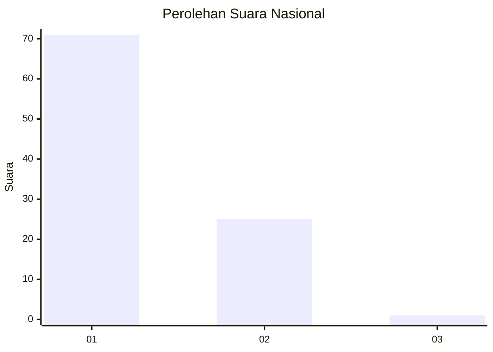
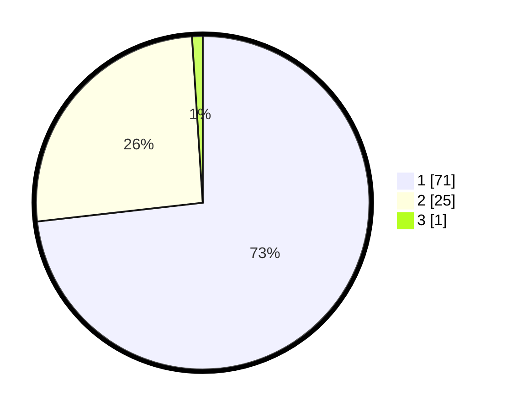

# Hasil

## Grafik

## Tabel

| No. | Nama Paslon    | Suara | Suara (raw) | Persentase |
|:--- |:-------------- | -----:| -----------:| ----------:|
| 1   | ANIES MUHAIMIN | 71    | [71][p-1]   | 73,20      |
| 2   | PRABOWO GIBRAN | 25    | [25][p-2]   | 25,77      |
| 3   | GANJAR MAHFUD  | 1     | [1][p-3]    | 1,03       |

[p-1]: https://github.com/gigit-pemilu/pemilu-2024/blob/main/pilpres/hitung-suara/sub/13-sumatera-barat/sub/12-pasaman-barat/sub/07-ranah-batahan/sub/2004-batahan-tengah/sub/017-tps/sub/paslon-1.txt
[p-2]: https://github.com/gigit-pemilu/pemilu-2024/blob/main/pilpres/hitung-suara/sub/13-sumatera-barat/sub/12-pasaman-barat/sub/07-ranah-batahan/sub/2004-batahan-tengah/sub/017-tps/sub/paslon-2.txt
[p-3]: https://github.com/gigit-pemilu/pemilu-2024/blob/main/pilpres/hitung-suara/sub/13-sumatera-barat/sub/12-pasaman-barat/sub/07-ranah-batahan/sub/2004-batahan-tengah/sub/017-tps/sub/paslon-3.txt

## Foto C Plano

https://sirekap-obj-formc.kpu.go.id/1469/pemilu/ppwp/13/12/07/20/04/1312072004017-20240215-001637--aae81ad3-5d61-4e66-aa15-8df0a4a98235.jpg

https://sirekap-obj-formc.kpu.go.id/1469/pemilu/ppwp/13/12/07/20/04/1312072004017-20240215-001808--86d47181-f9f1-4c2b-8e62-eb3ec72d7961.jpg

https://sirekap-obj-formc.kpu.go.id/1469/pemilu/ppwp/13/12/07/20/04/1312072004017-20240215-002113--ef3f44db-6f7d-4ad1-953a-509b865eb049.jpg

## Metadata

| Key        | Value               |
| ---------- | ------------------- |
| Time Stamp | 2024-02-25 22:00:00 |

