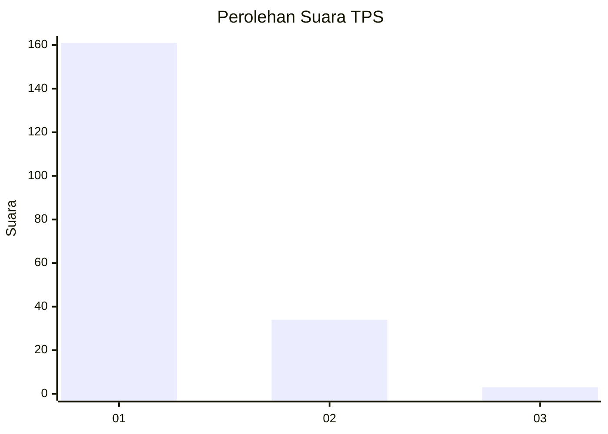
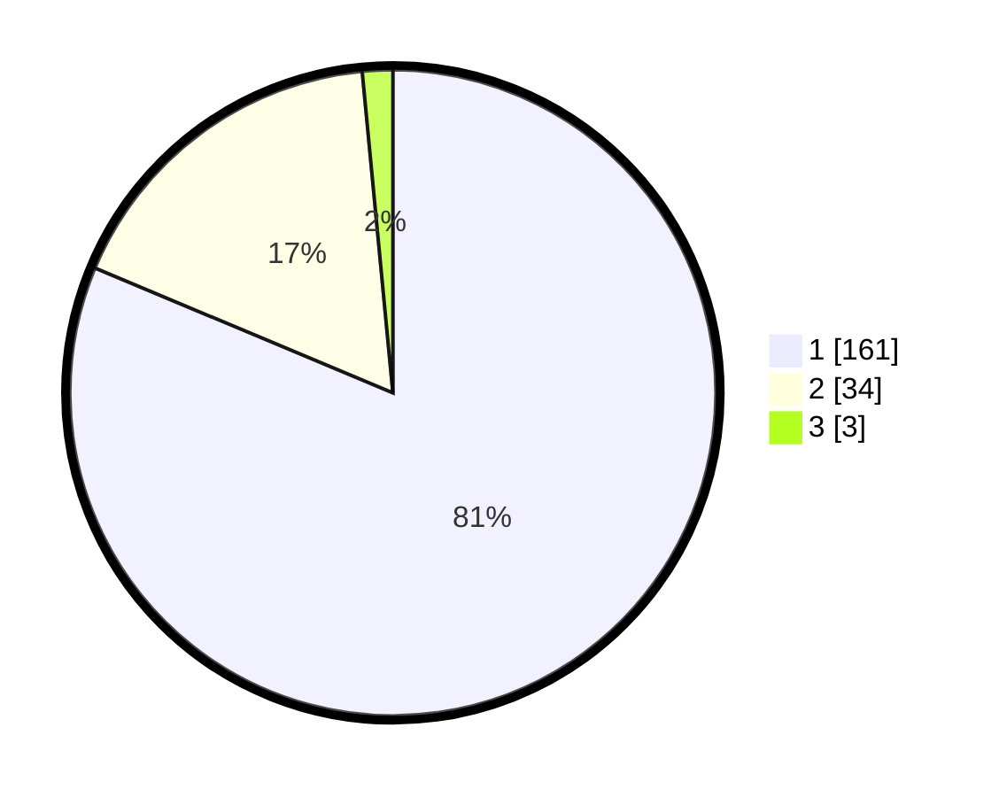

# Hasil

## Grafik

## Tabel

| No. | Nama Paslon    | Suara | Suara (raw) | Persentase |
|:--- |:-------------- | -----:| -----------:| ----------:|
| 1   | ANIES MUHAIMIN | 161   | [161][p-1]  | 81,31      |
| 2   | PRABOWO GIBRAN | 34    | [34][p-2]   | 17,17      |
| 3   | GANJAR MAHFUD  | 3     | [3][p-3]    | 1,52       |

[p-1]: https://github.com/gigit-pemilu/pemilu-2024-13-sumatera-barat/blob/main/pilpres/hitung-suara/sub/13-sumatera-barat/sub/12-pasaman-barat/sub/08-koto-balingka/sub/2006-ranah-koto-tinggi/sub/004-tps/sub/paslon-1.txt
[p-2]: https://github.com/gigit-pemilu/pemilu-2024-13-sumatera-barat/blob/main/pilpres/hitung-suara/sub/13-sumatera-barat/sub/12-pasaman-barat/sub/08-koto-balingka/sub/2006-ranah-koto-tinggi/sub/004-tps/sub/paslon-2.txt
[p-3]: https://github.com/gigit-pemilu/pemilu-2024-13-sumatera-barat/blob/main/pilpres/hitung-suara/sub/13-sumatera-barat/sub/12-pasaman-barat/sub/08-koto-balingka/sub/2006-ranah-koto-tinggi/sub/004-tps/sub/paslon-3.txt

## Foto C Plano

https://sirekap-obj-formc.kpu.go.id/0dbb/pemilu/ppwp/13/12/08/20/06/1312082006004-20240214-204637--439b9726-766f-4912-b9b4-9eaf16436259.jpg

https://sirekap-obj-formc.kpu.go.id/0dbb/pemilu/ppwp/13/12/08/20/06/1312082006004-20240217-203046--d812af69-0070-40b8-a418-4d5648c3096f.jpg

https://sirekap-obj-formc.kpu.go.id/0dbb/pemilu/ppwp/13/12/08/20/06/1312082006004-20240217-203249--c01726bb-966a-44dc-b6c7-efb5bed0af44.jpg

## Metadata

| Key        | Value               |
| ---------- | ------------------- |
| Time Stamp | 2024-02-21 12:00:00 |

