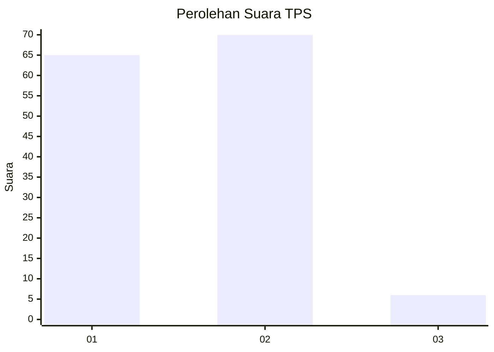
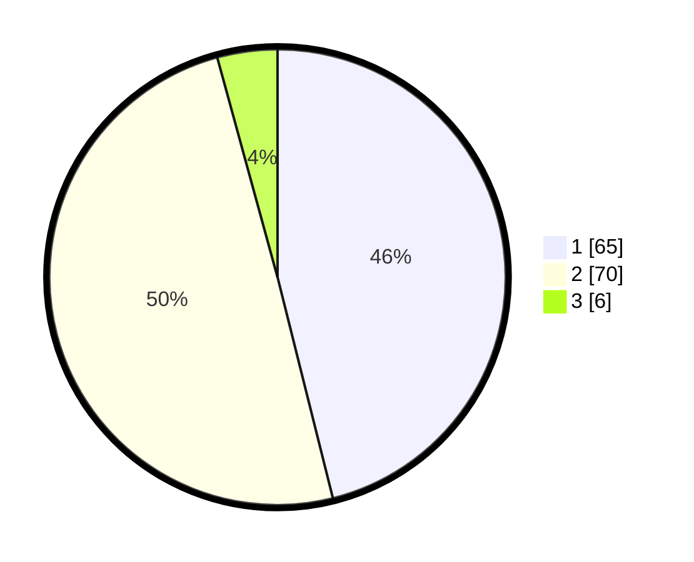

# Hasil

## Grafik

## Tabel

| No. | Nama Paslon    | Suara | Suara (raw) | Persentase |
|:--- |:-------------- | -----:| -----------:| ----------:|
| 1   | ANIES MUHAIMIN | 65    | [65][p-1]   | 46,10      |
| 2   | PRABOWO GIBRAN | 70    | [70][p-2]   | 49,65      |
| 3   | GANJAR MAHFUD  | 6     | [6][p-3]    | 4,26       |

[p-1]: https://github.com/gigit-pemilu/pemilu-2024-13-sumatera-barat/blob/main/pilpres/hitung-suara/sub/13-sumatera-barat/sub/12-pasaman-barat/sub/09-sungai-aur/sub/2001-sungai-aua/sub/001-tps/sub/paslon-1.txt
[p-2]: https://github.com/gigit-pemilu/pemilu-2024-13-sumatera-barat/blob/main/pilpres/hitung-suara/sub/13-sumatera-barat/sub/12-pasaman-barat/sub/09-sungai-aur/sub/2001-sungai-aua/sub/001-tps/sub/paslon-2.txt
[p-3]: https://github.com/gigit-pemilu/pemilu-2024-13-sumatera-barat/blob/main/pilpres/hitung-suara/sub/13-sumatera-barat/sub/12-pasaman-barat/sub/09-sungai-aur/sub/2001-sungai-aua/sub/001-tps/sub/paslon-3.txt

## Foto C Plano

https://sirekap-obj-formc.kpu.go.id/0f33/pemilu/ppwp/13/12/09/20/01/1312092001001-20240217-214253--451d675e-32b0-45d7-965b-abf431c295b9.jpg

https://sirekap-obj-formc.kpu.go.id/0f33/pemilu/ppwp/13/12/09/20/01/1312092001001-20240215-002516--db2afc3a-7524-41e5-8fe0-09774aee8ee9.jpg

https://sirekap-obj-formc.kpu.go.id/0f33/pemilu/ppwp/13/12/09/20/01/1312092001001-20240222-171742--49a048ed-011e-42db-a4b5-7ecb37f1fed1.jpg

## Metadata

| Key        | Value               |
| ---------- | ------------------- |
| Time Stamp | 2024-02-22 18:00:00 |

