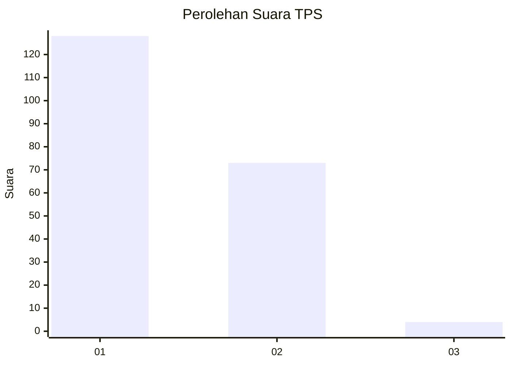
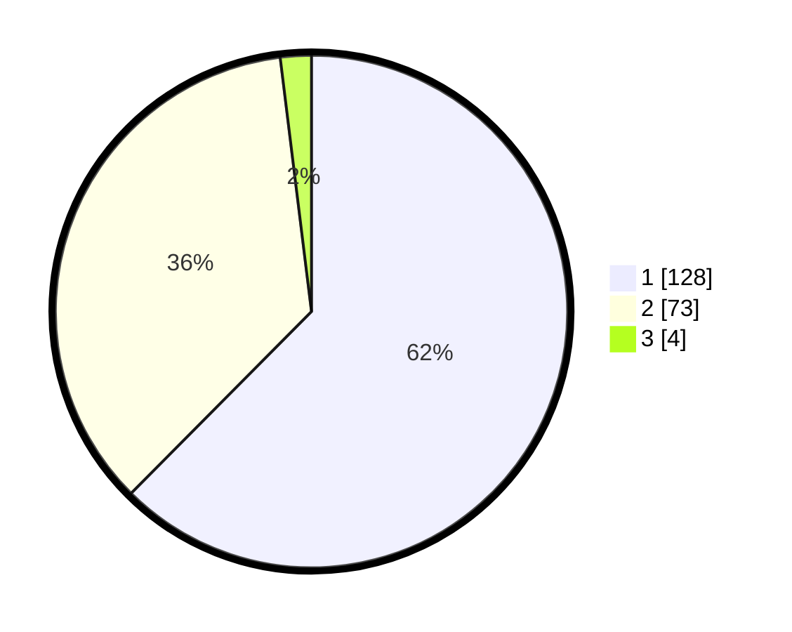

# Hasil

## Grafik

## Tabel

| No. | Nama Paslon    | Suara | Suara (raw) | Persentase |
|:--- |:-------------- | -----:| -----------:| ----------:|
| 1   | ANIES MUHAIMIN | 128   | [128][p-1]  | 62,44      |
| 2   | PRABOWO GIBRAN | 73    | [73][p-2]   | 35,61      |
| 3   | GANJAR MAHFUD  | 4     | [4][p-3]    | 1,95       |

[p-1]: https://github.com/gigit-pemilu/pemilu-2024-13-sumatera-barat/blob/main/pilpres/hitung-suara/sub/13-sumatera-barat/sub/12-pasaman-barat/sub/09-sungai-aur/sub/2001-sungai-aua/sub/004-tps/sub/paslon-1.txt
[p-2]: https://github.com/gigit-pemilu/pemilu-2024-13-sumatera-barat/blob/main/pilpres/hitung-suara/sub/13-sumatera-barat/sub/12-pasaman-barat/sub/09-sungai-aur/sub/2001-sungai-aua/sub/004-tps/sub/paslon-2.txt
[p-3]: https://github.com/gigit-pemilu/pemilu-2024-13-sumatera-barat/blob/main/pilpres/hitung-suara/sub/13-sumatera-barat/sub/12-pasaman-barat/sub/09-sungai-aur/sub/2001-sungai-aua/sub/004-tps/sub/paslon-3.txt

## Foto C Plano

https://sirekap-obj-formc.kpu.go.id/b872/pemilu/ppwp/13/12/09/20/01/1312092001004-20240222-164414--4938ac6a-f16b-453d-8a6e-854af33dde12.jpg

https://sirekap-obj-formc.kpu.go.id/b872/pemilu/ppwp/13/12/09/20/01/1312092001004-20240222-165023--cb37d627-4b42-4645-8be3-08b9b7fbc70f.jpg

https://sirekap-obj-formc.kpu.go.id/b872/pemilu/ppwp/13/12/09/20/01/1312092001004-20240222-165303--158fd045-6c85-4ac6-aba4-5eb6fba0a38d.jpg

## Metadata

| Key        | Value               |
| ---------- | ------------------- |
| Time Stamp | 2024-02-24 22:31:28 |

