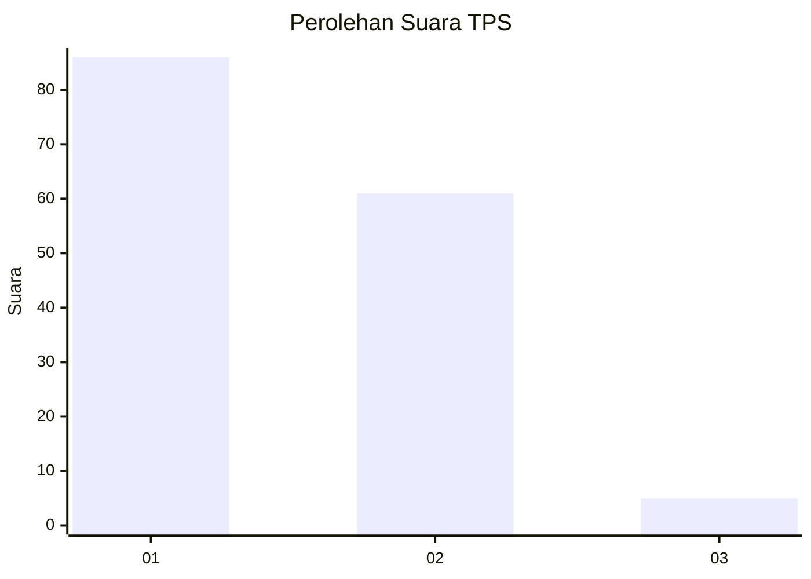
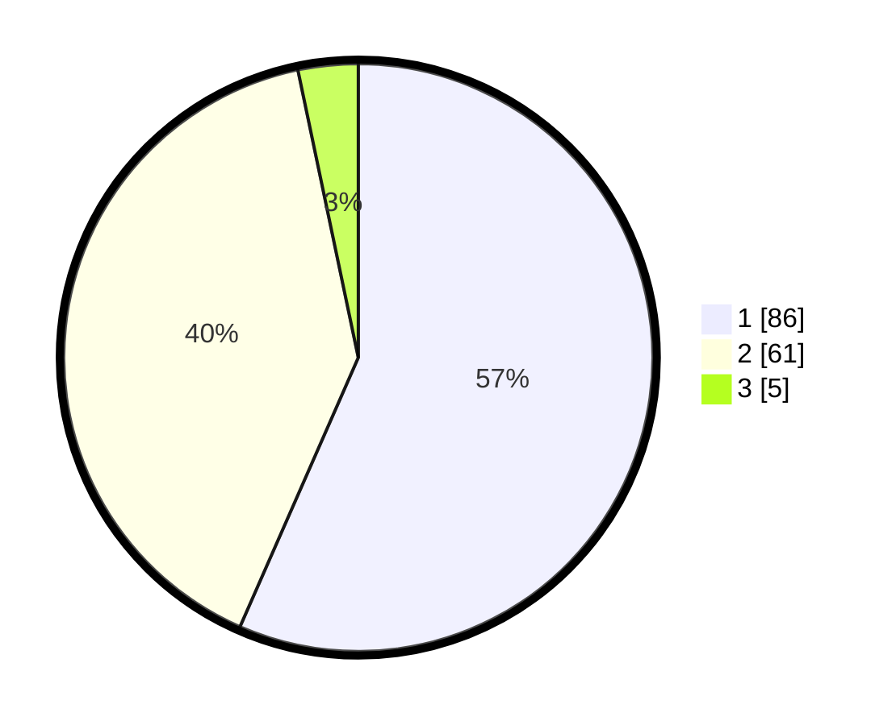

# Hasil

## Grafik

## Tabel

| No. | Nama Paslon    | Suara | Suara (raw) | Persentase |
|:--- |:-------------- | -----:| -----------:| ----------:|
| 1   | ANIES MUHAIMIN | 86    | [86][p-1]   | 56,58      |
| 2   | PRABOWO GIBRAN | 61    | [61][p-2]   | 40,13      |
| 3   | GANJAR MAHFUD  | 5     | [5][p-3]    | 3,29       |

[p-1]: https://github.com/gigit-pemilu/pemilu-2024-13-sumatera-barat/blob/main/pilpres/hitung-suara/sub/13-sumatera-barat/sub/12-pasaman-barat/sub/09-sungai-aur/sub/2001-sungai-aua/sub/005-tps/sub/paslon-1.txt
[p-2]: https://github.com/gigit-pemilu/pemilu-2024-13-sumatera-barat/blob/main/pilpres/hitung-suara/sub/13-sumatera-barat/sub/12-pasaman-barat/sub/09-sungai-aur/sub/2001-sungai-aua/sub/005-tps/sub/paslon-2.txt
[p-3]: https://github.com/gigit-pemilu/pemilu-2024-13-sumatera-barat/blob/main/pilpres/hitung-suara/sub/13-sumatera-barat/sub/12-pasaman-barat/sub/09-sungai-aur/sub/2001-sungai-aua/sub/005-tps/sub/paslon-3.txt

## Foto C Plano

https://sirekap-obj-formc.kpu.go.id/d87f/pemilu/ppwp/13/12/09/20/01/1312092001005-20240215-013327--49bce1ad-1515-47f7-acf9-5f13291a9bed.jpg

https://sirekap-obj-formc.kpu.go.id/d87f/pemilu/ppwp/13/12/09/20/01/1312092001005-20240215-013623--3f8bced8-64bd-4b7e-b1fc-847eeec74681.jpg

https://sirekap-obj-formc.kpu.go.id/d87f/pemilu/ppwp/13/12/09/20/01/1312092001005-20240215-013739--b0630cd1-8de0-4253-af06-3dfa22cd7808.jpg

## Metadata

| Key        | Value               |
| ---------- | ------------------- |
| Time Stamp | 2024-02-25 21:00:00 |

