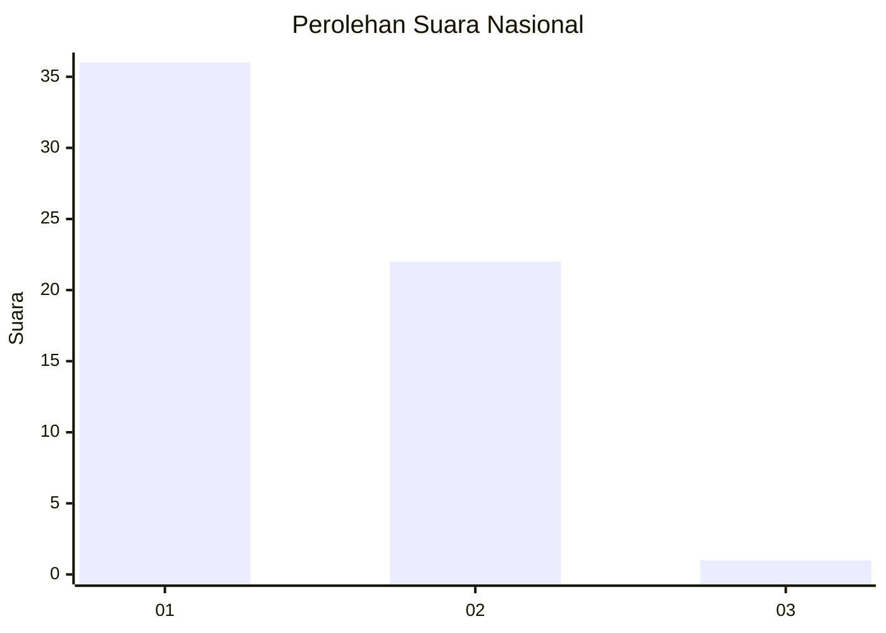
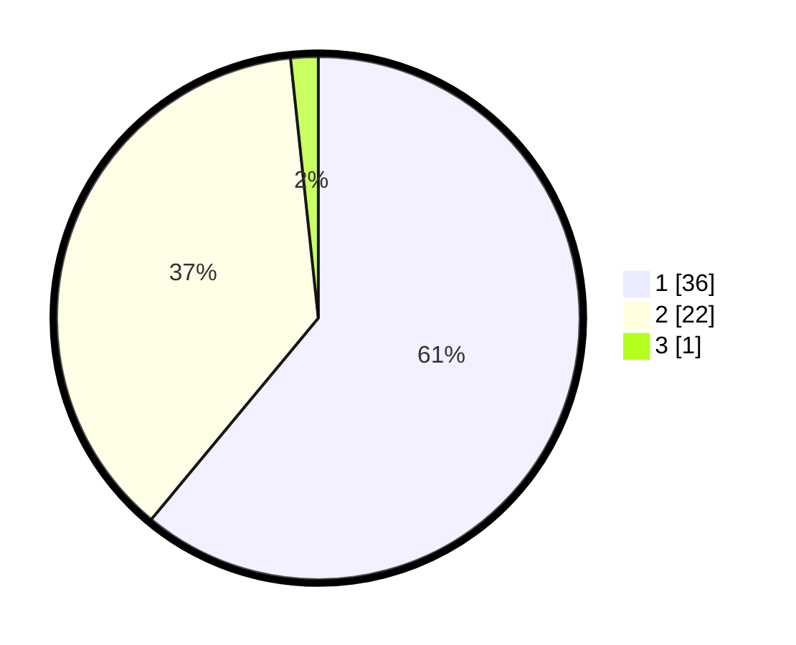

# Hasil

## Grafik

## Tabel

| No. | Nama Paslon    | Suara | Suara (raw) | Persentase |
|:--- |:-------------- | -----:| -----------:| ----------:|
| 1   | ANIES MUHAIMIN | 36    | [36][p-1]   | 61,02      |
| 2   | PRABOWO GIBRAN | 22    | [22][p-2]   | 37,29      |
| 3   | GANJAR MAHFUD  | 1     | [1][p-3]    | 1,69       |

[p-1]: https://github.com/gigit-pemilu/pemilu-2024/blob/main/pilpres/hitung-suara/sub/13-sumatera-barat/sub/12-pasaman-barat/sub/09-sungai-aur/sub/2001-sungai-aua/sub/015-tps/sub/paslon-1.txt
[p-2]: https://github.com/gigit-pemilu/pemilu-2024/blob/main/pilpres/hitung-suara/sub/13-sumatera-barat/sub/12-pasaman-barat/sub/09-sungai-aur/sub/2001-sungai-aua/sub/015-tps/sub/paslon-2.txt
[p-3]: https://github.com/gigit-pemilu/pemilu-2024/blob/main/pilpres/hitung-suara/sub/13-sumatera-barat/sub/12-pasaman-barat/sub/09-sungai-aur/sub/2001-sungai-aua/sub/015-tps/sub/paslon-3.txt

## Foto C Plano

https://sirekap-obj-formc.kpu.go.id/d5e1/pemilu/ppwp/13/12/09/20/01/1312092001015-20240215-010028--172e33a4-dc9c-4e03-8d81-2db9a6d37532.jpg

https://sirekap-obj-formc.kpu.go.id/d5e1/pemilu/ppwp/13/12/09/20/01/1312092001015-20240215-011107--2c0d131a-baaa-44a9-a2ca-23b9e67f3beb.jpg

https://sirekap-obj-formc.kpu.go.id/d5e1/pemilu/ppwp/13/12/09/20/01/1312092001015-20240215-011408--2245e9eb-b290-4d34-815d-8ff292254fa3.jpg

## Metadata

| Key        | Value               |
| ---------- | ------------------- |
| Time Stamp | 2024-02-24 22:31:28 |

