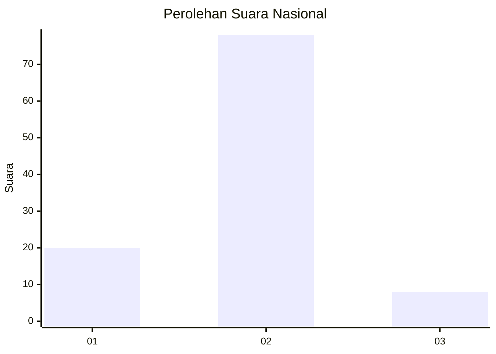
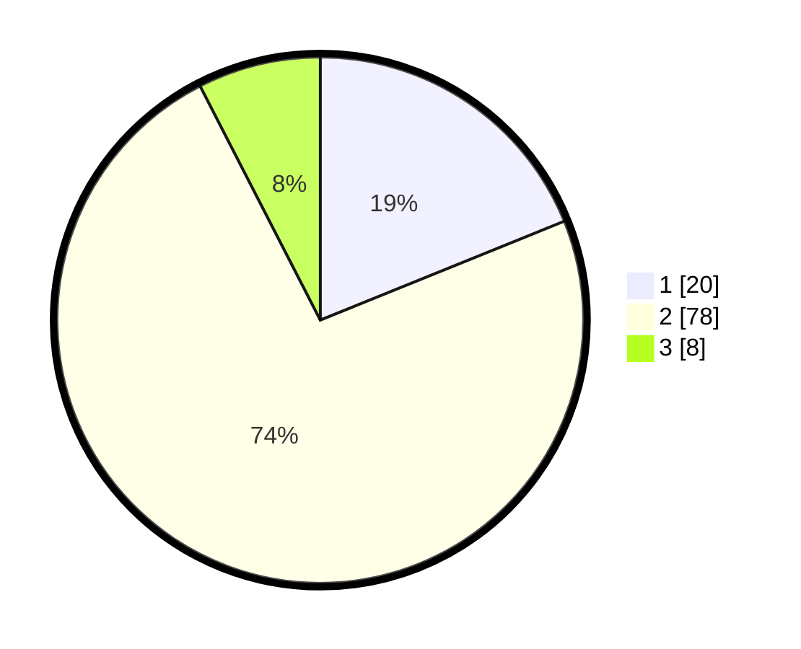

# Hasil

## Grafik

## Tabel

| No. | Nama Paslon    | Suara | Suara (raw) | Persentase |
|:--- |:-------------- | -----:| -----------:| ----------:|
| 1   | ANIES MUHAIMIN | 20    | [20][p-1]   | 18,87      |
| 2   | PRABOWO GIBRAN | 78    | [78][p-2]   | 73,58      |
| 3   | GANJAR MAHFUD  | 8     | [8][p-3]    | 7,55       |

[p-1]: https://github.com/gigit-pemilu/pemilu-2024/blob/main/pilpres/hitung-suara/sub/13-sumatera-barat/sub/12-pasaman-barat/sub/09-sungai-aur/sub/2001-sungai-aua/sub/017-tps/sub/paslon-1.txt
[p-2]: https://github.com/gigit-pemilu/pemilu-2024/blob/main/pilpres/hitung-suara/sub/13-sumatera-barat/sub/12-pasaman-barat/sub/09-sungai-aur/sub/2001-sungai-aua/sub/017-tps/sub/paslon-2.txt
[p-3]: https://github.com/gigit-pemilu/pemilu-2024/blob/main/pilpres/hitung-suara/sub/13-sumatera-barat/sub/12-pasaman-barat/sub/09-sungai-aur/sub/2001-sungai-aua/sub/017-tps/sub/paslon-3.txt

## Foto C Plano

https://sirekap-obj-formc.kpu.go.id/9934/pemilu/ppwp/13/12/09/20/01/1312092001017-20240214-210842--80341ef8-cbf0-4689-9fa9-72a4a975e508.jpg

https://sirekap-obj-formc.kpu.go.id/9934/pemilu/ppwp/13/12/09/20/01/1312092001017-20240214-210942--e82e46f4-4034-4e3d-b3a8-99baf44df32f.jpg

https://sirekap-obj-formc.kpu.go.id/9934/pemilu/ppwp/13/12/09/20/01/1312092001017-20240214-211046--988d66ba-70a7-42ef-9d06-fd6375966045.jpg

## Metadata

| Key        | Value               |
| ---------- | ------------------- |
| Time Stamp | 2024-02-24 22:31:28 |

