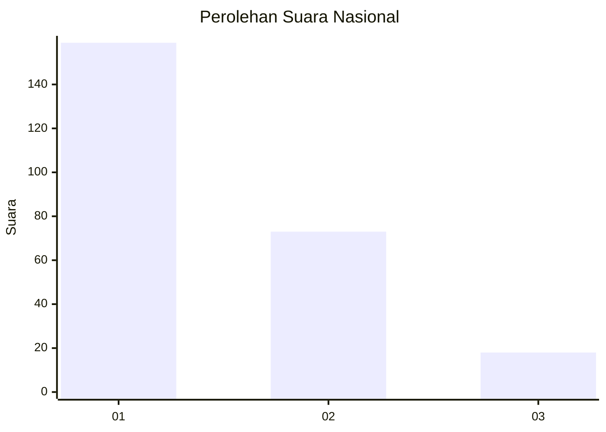
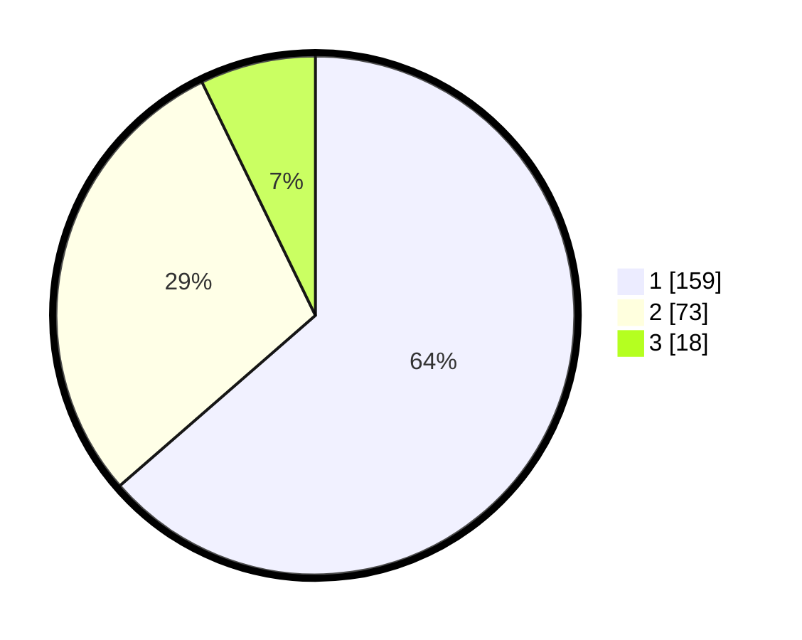

# Hasil

## Grafik

## Tabel

| No. | Nama Paslon    | Suara | Suara (raw) | Persentase |
|:--- |:-------------- | -----:| -----------:| ----------:|
| 1   | ANIES MUHAIMIN | 159   | [159][p-1]  | 63,60      |
| 2   | PRABOWO GIBRAN | 73    | [73][p-2]   | 29,20      |
| 3   | GANJAR MAHFUD  | 18    | [18][p-3]   | 7,20       |

[p-1]: https://github.com/gigit-pemilu/pemilu-2024/blob/main/pilpres/hitung-suara/sub/13-sumatera-barat/sub/12-pasaman-barat/sub/09-sungai-aur/sub/2002-salingka-muaro/sub/004-tps/sub/paslon-1.txt
[p-2]: https://github.com/gigit-pemilu/pemilu-2024/blob/main/pilpres/hitung-suara/sub/13-sumatera-barat/sub/12-pasaman-barat/sub/09-sungai-aur/sub/2002-salingka-muaro/sub/004-tps/sub/paslon-2.txt
[p-3]: https://github.com/gigit-pemilu/pemilu-2024/blob/main/pilpres/hitung-suara/sub/13-sumatera-barat/sub/12-pasaman-barat/sub/09-sungai-aur/sub/2002-salingka-muaro/sub/004-tps/sub/paslon-3.txt

## Foto C Plano

https://sirekap-obj-formc.kpu.go.id/f0cb/pemilu/ppwp/13/12/09/20/02/1312092002004-20240214-222910--7b49b50b-feae-4c69-94b6-faf26715d40b.jpg

https://sirekap-obj-formc.kpu.go.id/f0cb/pemilu/ppwp/13/12/09/20/02/1312092002004-20240214-223437--f0ccd611-9afa-4fe5-aa0a-49b6c33e948b.jpg

https://sirekap-obj-formc.kpu.go.id/f0cb/pemilu/ppwp/13/12/09/20/02/1312092002004-20240214-223833--57fa848a-7375-4ea7-be2a-7459f78c2ccb.jpg

## Metadata

| Key        | Value               |
| ---------- | ------------------- |
| Time Stamp | 2024-02-25 11:00:00 |

