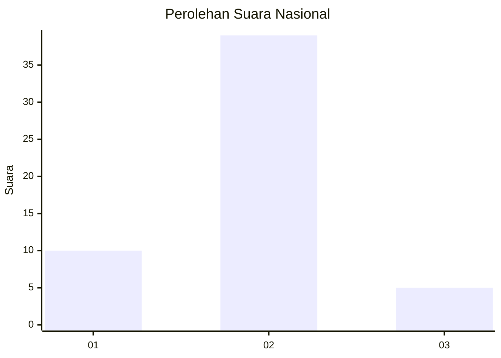
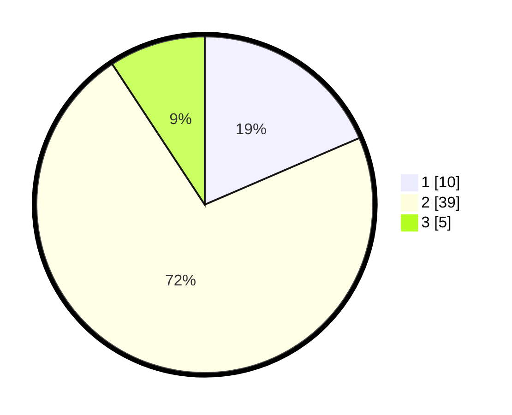

# Hasil

## Grafik

## Tabel

| No. | Nama Paslon    | Suara | Suara (raw) | Persentase |
|:--- |:-------------- | -----:| -----------:| ----------:|
| 1   | ANIES MUHAIMIN | 10    | [10][p-1]   | 18,52      |
| 2   | PRABOWO GIBRAN | 39    | [39][p-2]   | 72,22      |
| 3   | GANJAR MAHFUD  | 5     | [5][p-3]    | 9,26       |

[p-1]: https://github.com/gigit-pemilu/pemilu-2024/blob/main/pilpres/hitung-suara/sub/13-sumatera-barat/sub/12-pasaman-barat/sub/09-sungai-aur/sub/2003-ranah-malintang/sub/012-tps/sub/paslon-1.txt
[p-2]: https://github.com/gigit-pemilu/pemilu-2024/blob/main/pilpres/hitung-suara/sub/13-sumatera-barat/sub/12-pasaman-barat/sub/09-sungai-aur/sub/2003-ranah-malintang/sub/012-tps/sub/paslon-2.txt
[p-3]: https://github.com/gigit-pemilu/pemilu-2024/blob/main/pilpres/hitung-suara/sub/13-sumatera-barat/sub/12-pasaman-barat/sub/09-sungai-aur/sub/2003-ranah-malintang/sub/012-tps/sub/paslon-3.txt

## Foto C Plano

https://sirekap-obj-formc.kpu.go.id/e4ae/pemilu/ppwp/13/12/09/20/03/1312092003012-20240214-234636--b0cfd42e-3863-4489-bd27-df52a81f4702.jpg

https://sirekap-obj-formc.kpu.go.id/e4ae/pemilu/ppwp/13/12/09/20/03/1312092003012-20240215-065151--290ad46b-3c62-471f-a7ad-e6e173d97996.jpg

https://sirekap-obj-formc.kpu.go.id/e4ae/pemilu/ppwp/13/12/09/20/03/1312092003012-20240215-065309--25200f96-ae48-4750-82ad-f169f9a81d41.jpg

## Metadata

| Key        | Value               |
| ---------- | ------------------- |
| Time Stamp | 2024-02-25 12:00:00 |

