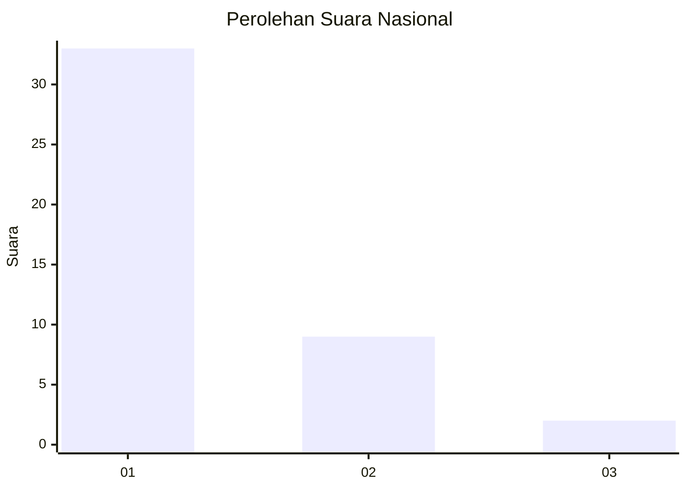
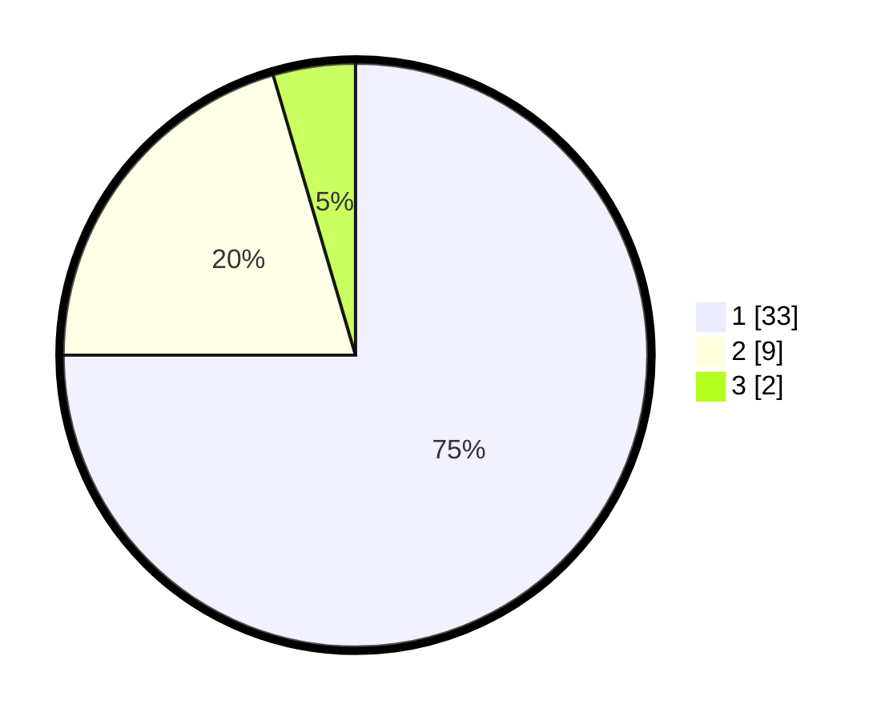

# Hasil

## Grafik

## Tabel

| No. | Nama Paslon    | Suara | Suara (raw) | Persentase |
|:--- |:-------------- | -----:| -----------:| ----------:|
| 1   | ANIES MUHAIMIN | 33    | [33][p-1]   | 75,00      |
| 2   | PRABOWO GIBRAN | 9     | [9][p-2]    | 20,45      |
| 3   | GANJAR MAHFUD  | 2     | [2][p-3]    | 4,55       |

[p-1]: https://github.com/gigit-pemilu/pemilu-2024/blob/main/pilpres/hitung-suara/sub/13-sumatera-barat/sub/12-pasaman-barat/sub/09-sungai-aur/sub/2007-sikilang-sungai-aur-selatan/sub/008-tps/sub/paslon-1.txt
[p-2]: https://github.com/gigit-pemilu/pemilu-2024/blob/main/pilpres/hitung-suara/sub/13-sumatera-barat/sub/12-pasaman-barat/sub/09-sungai-aur/sub/2007-sikilang-sungai-aur-selatan/sub/008-tps/sub/paslon-2.txt
[p-3]: https://github.com/gigit-pemilu/pemilu-2024/blob/main/pilpres/hitung-suara/sub/13-sumatera-barat/sub/12-pasaman-barat/sub/09-sungai-aur/sub/2007-sikilang-sungai-aur-selatan/sub/008-tps/sub/paslon-3.txt

## Foto C Plano

https://sirekap-obj-formc.kpu.go.id/8669/pemilu/ppwp/13/12/09/20/07/1312092007008-20240215-103604--f587cbf9-80e5-4058-bde3-f16ab3cf0020.jpg

https://sirekap-obj-formc.kpu.go.id/8669/pemilu/ppwp/13/12/09/20/07/1312092007008-20240215-103659--1f465ae6-1f2b-4949-997a-246e9e36c36d.jpg

https://sirekap-obj-formc.kpu.go.id/8669/pemilu/ppwp/13/12/09/20/07/1312092007008-20240218-210015--27a2d777-affe-4b74-9c21-27affaa91146.jpg

## Metadata

| Key        | Value               |
| ---------- | ------------------- |
| Time Stamp | 2024-02-26 11:00:00 |

