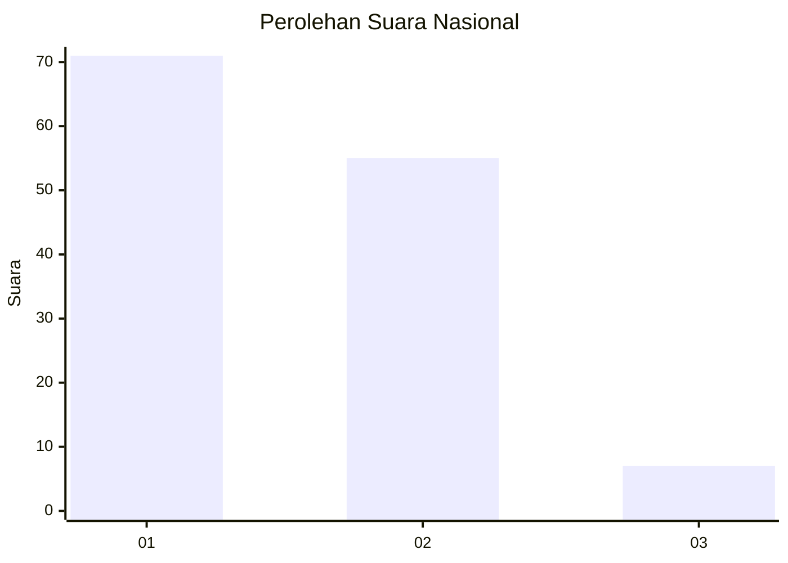
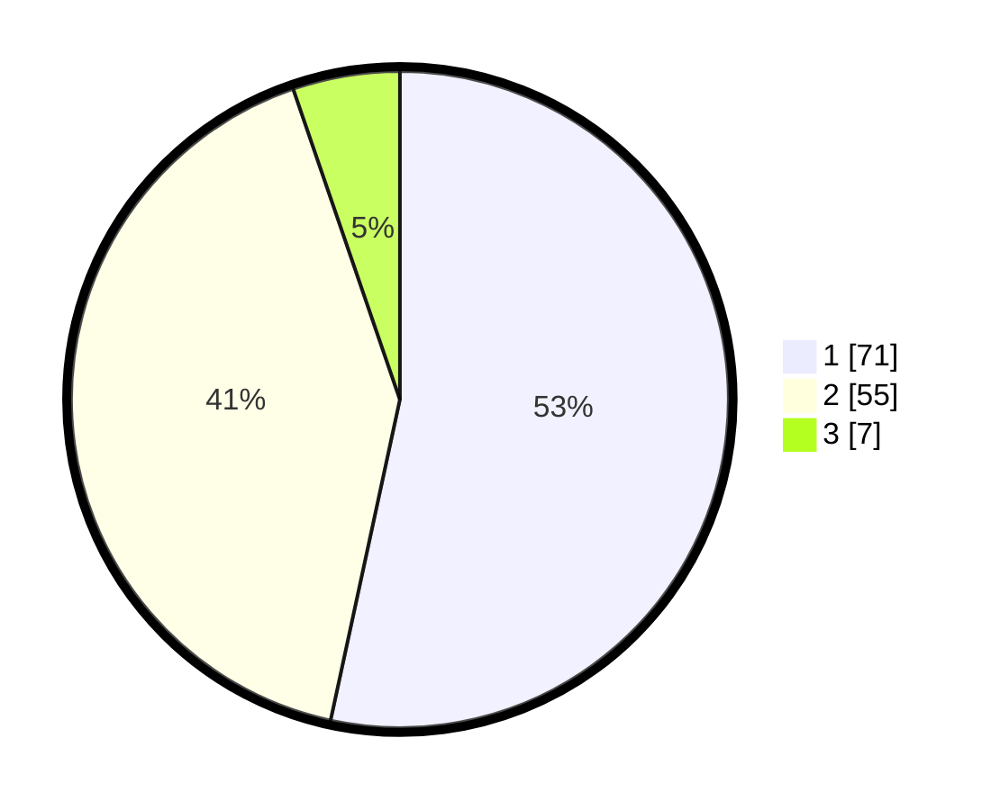

# Hasil

## Grafik

## Tabel

| No. | Nama Paslon    | Suara | Suara (raw) | Persentase |
|:--- |:-------------- | -----:| -----------:| ----------:|
| 1   | ANIES MUHAIMIN | 71    | [71][p-1]   | 53,38      |
| 2   | PRABOWO GIBRAN | 55    | [55][p-2]   | 41,35      |
| 3   | GANJAR MAHFUD  | 7     | [7][p-3]    | 5,26       |

[p-1]: https://github.com/gigit-pemilu/pemilu-2024/blob/main/pilpres/hitung-suara/sub/13-sumatera-barat/sub/12-pasaman-barat/sub/10-luhak-nan-duo/sub/2001-koto-baru/sub/002-tps/sub/paslon-1.txt
[p-2]: https://github.com/gigit-pemilu/pemilu-2024/blob/main/pilpres/hitung-suara/sub/13-sumatera-barat/sub/12-pasaman-barat/sub/10-luhak-nan-duo/sub/2001-koto-baru/sub/002-tps/sub/paslon-2.txt
[p-3]: https://github.com/gigit-pemilu/pemilu-2024/blob/main/pilpres/hitung-suara/sub/13-sumatera-barat/sub/12-pasaman-barat/sub/10-luhak-nan-duo/sub/2001-koto-baru/sub/002-tps/sub/paslon-3.txt

## Foto C Plano

https://sirekap-obj-formc.kpu.go.id/3fa9/pemilu/ppwp/13/12/10/20/01/1312102001002-20240219-112944--84da1590-b916-40e3-b6b8-b0974c27ab8f.jpg

https://sirekap-obj-formc.kpu.go.id/3fa9/pemilu/ppwp/13/12/10/20/01/1312102001002-20240219-110823--420583ec-4e91-4e69-8bdc-08bdc737bdff.jpg

https://sirekap-obj-formc.kpu.go.id/3fa9/pemilu/ppwp/13/12/10/20/01/1312102001002-20240219-112328--caac7eae-2627-42c9-8312-177de5129d6b.jpg

## Metadata

| Key        | Value               |
| ---------- | ------------------- |
| Time Stamp | 2024-02-25 22:00:00 |

