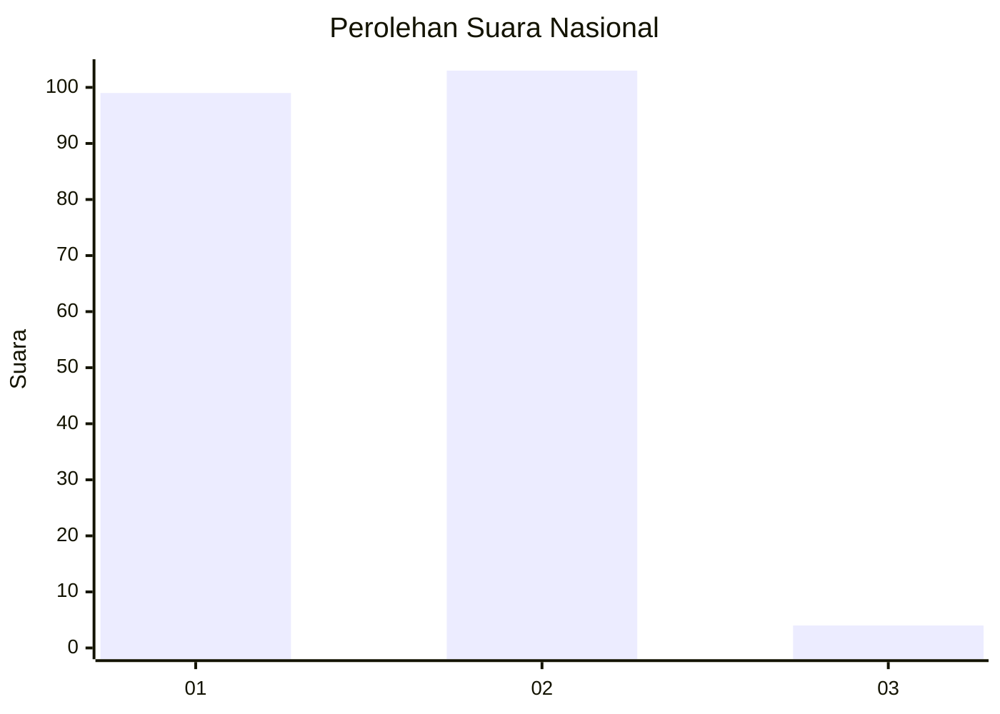
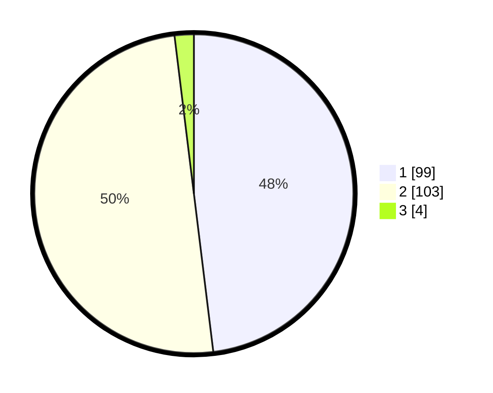

# Hasil

## Grafik

## Tabel

| No. | Nama Paslon    | Suara | Suara (raw) | Persentase |
|:--- |:-------------- | -----:| -----------:| ----------:|
| 1   | ANIES MUHAIMIN | 99    | [99][p-1]   | 48,06      |
| 2   | PRABOWO GIBRAN | 103   | [103][p-2]  | 50,00      |
| 3   | GANJAR MAHFUD  | 4     | [4][p-3]    | 1,94       |

[p-1]: https://github.com/gigit-pemilu/pemilu-2024/blob/main/pilpres/hitung-suara/sub/13-sumatera-barat/sub/12-pasaman-barat/sub/10-luhak-nan-duo/sub/2001-koto-baru/sub/005-tps/sub/paslon-1.txt
[p-2]: https://github.com/gigit-pemilu/pemilu-2024/blob/main/pilpres/hitung-suara/sub/13-sumatera-barat/sub/12-pasaman-barat/sub/10-luhak-nan-duo/sub/2001-koto-baru/sub/005-tps/sub/paslon-2.txt
[p-3]: https://github.com/gigit-pemilu/pemilu-2024/blob/main/pilpres/hitung-suara/sub/13-sumatera-barat/sub/12-pasaman-barat/sub/10-luhak-nan-duo/sub/2001-koto-baru/sub/005-tps/sub/paslon-3.txt

## Foto C Plano

https://sirekap-obj-formc.kpu.go.id/7b40/pemilu/ppwp/13/12/10/20/01/1312102001005-20240215-022855--de099a27-4b25-4efd-8127-2690d6bc02cc.jpg

https://sirekap-obj-formc.kpu.go.id/7b40/pemilu/ppwp/13/12/10/20/01/1312102001005-20240215-022955--38d4b8e3-8fc5-45bf-bcdb-a8121ee36f6b.jpg

https://sirekap-obj-formc.kpu.go.id/7b40/pemilu/ppwp/13/12/10/20/01/1312102001005-20240215-023057--555a901b-0824-4973-bbc8-e9c458cd122b.jpg

## Metadata

| Key        | Value               |
| ---------- | ------------------- |
| Time Stamp | 2024-02-25 21:00:00 |

