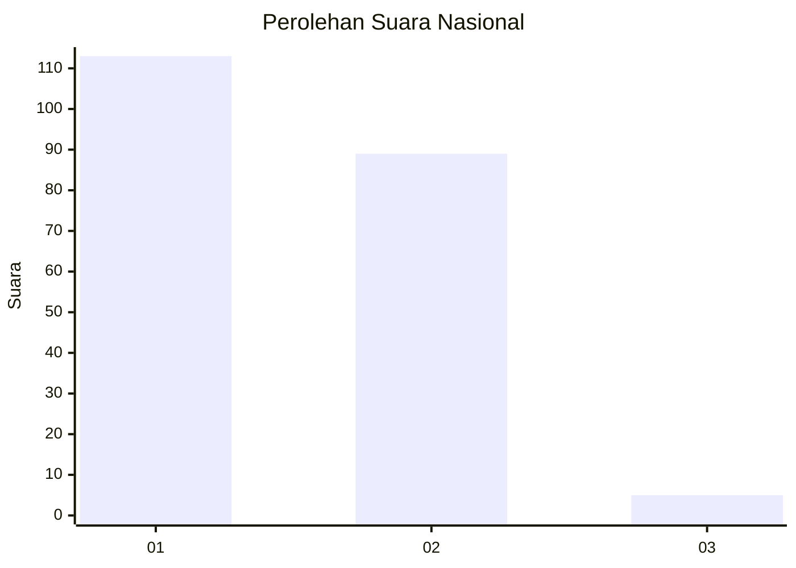
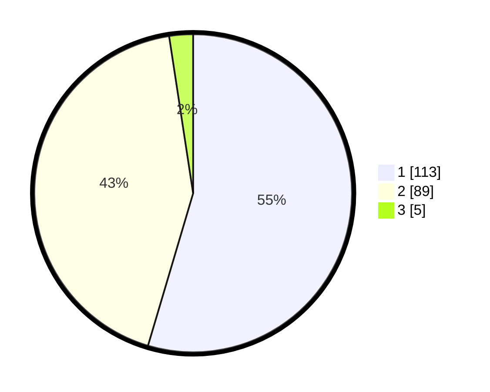

# Hasil

## Grafik

## Tabel

| No. | Nama Paslon    | Suara | Suara (raw) | Persentase |
|:--- |:-------------- | -----:| -----------:| ----------:|
| 1   | ANIES MUHAIMIN | 113   | [113][p-1]  | 54,59      |
| 2   | PRABOWO GIBRAN | 89    | [89][p-2]   | 43,00      |
| 3   | GANJAR MAHFUD  | 5     | [5][p-3]    | 2,42       |

[p-1]: https://github.com/gigit-pemilu/pemilu-2024/blob/main/pilpres/hitung-suara/sub/13-sumatera-barat/sub/12-pasaman-barat/sub/10-luhak-nan-duo/sub/2001-koto-baru/sub/006-tps/sub/paslon-1.txt
[p-2]: https://github.com/gigit-pemilu/pemilu-2024/blob/main/pilpres/hitung-suara/sub/13-sumatera-barat/sub/12-pasaman-barat/sub/10-luhak-nan-duo/sub/2001-koto-baru/sub/006-tps/sub/paslon-2.txt
[p-3]: https://github.com/gigit-pemilu/pemilu-2024/blob/main/pilpres/hitung-suara/sub/13-sumatera-barat/sub/12-pasaman-barat/sub/10-luhak-nan-duo/sub/2001-koto-baru/sub/006-tps/sub/paslon-3.txt

## Foto C Plano

https://sirekap-obj-formc.kpu.go.id/133a/pemilu/ppwp/13/12/10/20/01/1312102001006-20240215-013125--7bf778ec-a5f6-4c36-a489-fdebdbfdaa09.jpg

https://sirekap-obj-formc.kpu.go.id/133a/pemilu/ppwp/13/12/10/20/01/1312102001006-20240215-013428--3e8598c5-4b7a-4c36-942b-0e35f04e7930.jpg

https://sirekap-obj-formc.kpu.go.id/133a/pemilu/ppwp/13/12/10/20/01/1312102001006-20240215-013549--f48112c9-456d-495d-a716-2bb137724973.jpg

## Metadata

| Key        | Value               |
| ---------- | ------------------- |
| Time Stamp | 2024-02-25 13:00:00 |

