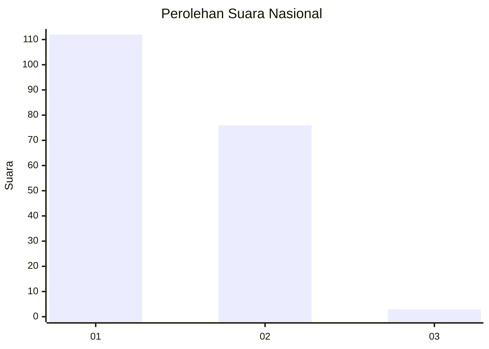
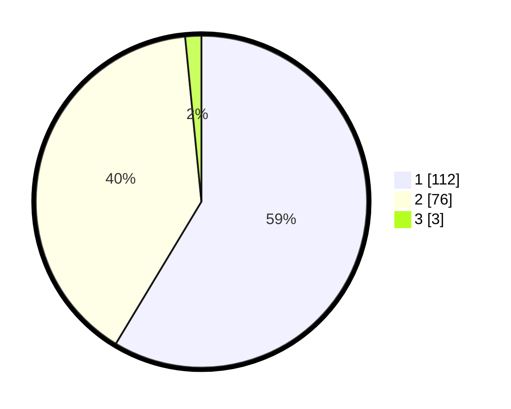

# Hasil

## Grafik

## Tabel

| No. | Nama Paslon    | Suara | Suara (raw) | Persentase |
|:--- |:-------------- | -----:| -----------:| ----------:|
| 1   | ANIES MUHAIMIN | 112   | [112][p-1]  | 58,64      |
| 2   | PRABOWO GIBRAN | 76    | [76][p-2]   | 39,79      |
| 3   | GANJAR MAHFUD  | 3     | [3][p-3]    | 1,57       |

[p-1]: https://github.com/gigit-pemilu/pemilu-2024/blob/main/pilpres/hitung-suara/sub/13-sumatera-barat/sub/12-pasaman-barat/sub/10-luhak-nan-duo/sub/2001-koto-baru/sub/007-tps/sub/paslon-1.txt
[p-2]: https://github.com/gigit-pemilu/pemilu-2024/blob/main/pilpres/hitung-suara/sub/13-sumatera-barat/sub/12-pasaman-barat/sub/10-luhak-nan-duo/sub/2001-koto-baru/sub/007-tps/sub/paslon-2.txt
[p-3]: https://github.com/gigit-pemilu/pemilu-2024/blob/main/pilpres/hitung-suara/sub/13-sumatera-barat/sub/12-pasaman-barat/sub/10-luhak-nan-duo/sub/2001-koto-baru/sub/007-tps/sub/paslon-3.txt

## Foto C Plano

https://sirekap-obj-formc.kpu.go.id/d556/pemilu/ppwp/13/12/10/20/01/1312102001007-20240214-224939--b2a59a84-00cf-403f-81c3-3badbcf1b592.jpg

https://sirekap-obj-formc.kpu.go.id/d556/pemilu/ppwp/13/12/10/20/01/1312102001007-20240214-192232--c31b0b16-adb2-44ef-b80f-266ca08034af.jpg

https://sirekap-obj-formc.kpu.go.id/d556/pemilu/ppwp/13/12/10/20/01/1312102001007-20240214-225159--20ddc5ec-0ce9-4bea-8009-b94525c41aa3.jpg

## Metadata

| Key        | Value               |
| ---------- | ------------------- |
| Time Stamp | 2024-02-24 22:31:28 |

