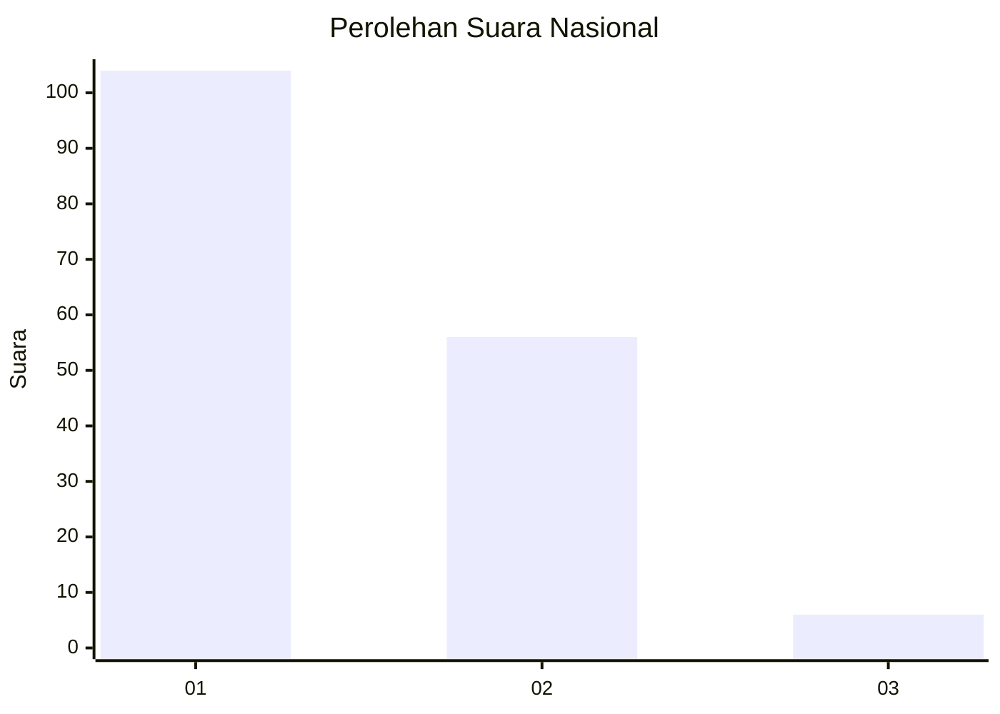
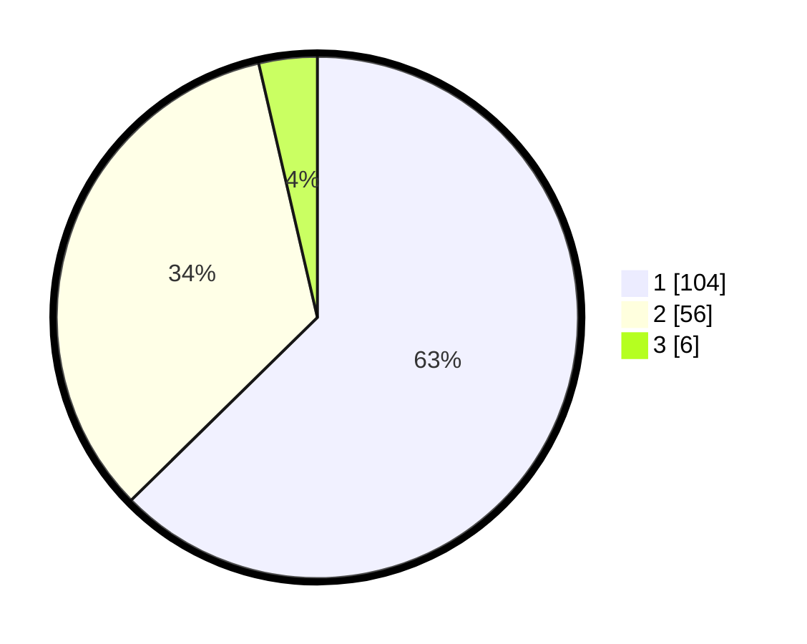

# Hasil

## Grafik

## Tabel

| No. | Nama Paslon    | Suara | Suara (raw) | Persentase |
|:--- |:-------------- | -----:| -----------:| ----------:|
| 1   | ANIES MUHAIMIN | 104   | [104][p-1]  | 62,65      |
| 2   | PRABOWO GIBRAN | 56    | [56][p-2]   | 33,73      |
| 3   | GANJAR MAHFUD  | 6     | [6][p-3]    | 3,61       |

[p-1]: https://github.com/gigit-pemilu/pemilu-2024/blob/main/pilpres/hitung-suara/sub/13-sumatera-barat/sub/12-pasaman-barat/sub/11-sasak-ranah-pasisie/sub/2001-sasak/sub/003-tps/sub/paslon-1.txt
[p-2]: https://github.com/gigit-pemilu/pemilu-2024/blob/main/pilpres/hitung-suara/sub/13-sumatera-barat/sub/12-pasaman-barat/sub/11-sasak-ranah-pasisie/sub/2001-sasak/sub/003-tps/sub/paslon-2.txt
[p-3]: https://github.com/gigit-pemilu/pemilu-2024/blob/main/pilpres/hitung-suara/sub/13-sumatera-barat/sub/12-pasaman-barat/sub/11-sasak-ranah-pasisie/sub/2001-sasak/sub/003-tps/sub/paslon-3.txt

## Foto C Plano

https://sirekap-obj-formc.kpu.go.id/b64b/pemilu/ppwp/13/12/11/20/01/1312112001003-20240215-053918--3743bf4f-e936-42cb-80b0-9887e13cf7f5.jpg

https://sirekap-obj-formc.kpu.go.id/b64b/pemilu/ppwp/13/12/11/20/01/1312112001003-20240222-194015--cdec166f-7cdf-45d1-9128-90fb0ae98559.jpg

https://sirekap-obj-formc.kpu.go.id/b64b/pemilu/ppwp/13/12/11/20/01/1312112001003-20240222-194313--7cc7a08b-e4e0-4b67-89c0-85cce7f5c51a.jpg

## Metadata

| Key        | Value               |
| ---------- | ------------------- |
| Time Stamp | 2024-02-22 20:00:00 |

