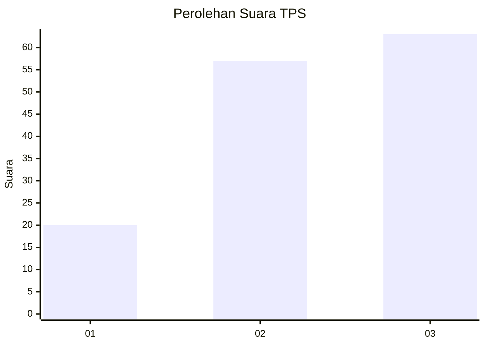
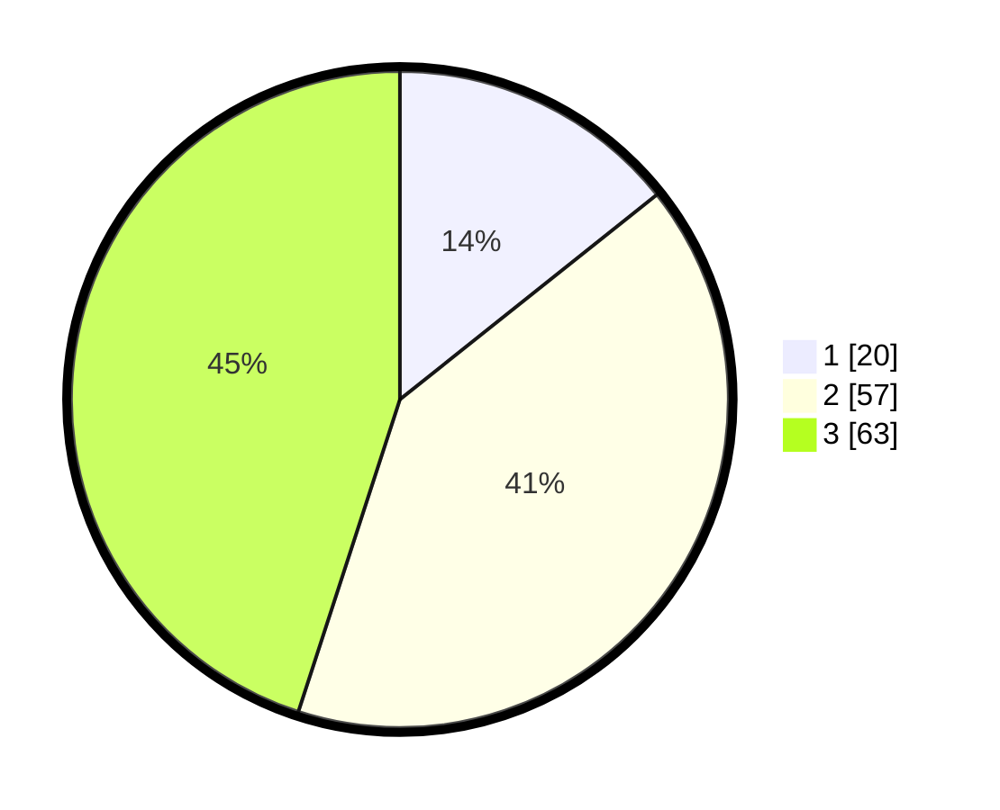

# Hasil

## Grafik

## Tabel

| No. | Nama Paslon    | Suara | Suara (raw) | Persentase |
|:--- |:-------------- | -----:| -----------:| ----------:|
| 1   | ANIES MUHAIMIN | 20    | [20][p-1]   | 14,29      |
| 2   | PRABOWO GIBRAN | 57    | [57][p-2]   | 40,71      |
| 3   | GANJAR MAHFUD  | 63    | [63][p-3]   | 45,00      |

[p-1]: https://github.com/gigit-pemilu/pemilu-2024-13-sumatera-barat/blob/main/pilpres/hitung-suara/sub/13-sumatera-barat/sub/71-kota-padang/sub/01-padang-selatan/sub/1001-belakang-pondok/sub/001-tps/sub/paslon-1.txt
[p-2]: https://github.com/gigit-pemilu/pemilu-2024-13-sumatera-barat/blob/main/pilpres/hitung-suara/sub/13-sumatera-barat/sub/71-kota-padang/sub/01-padang-selatan/sub/1001-belakang-pondok/sub/001-tps/sub/paslon-2.txt
[p-3]: https://github.com/gigit-pemilu/pemilu-2024-13-sumatera-barat/blob/main/pilpres/hitung-suara/sub/13-sumatera-barat/sub/71-kota-padang/sub/01-padang-selatan/sub/1001-belakang-pondok/sub/001-tps/sub/paslon-3.txt

## Foto C Plano

https://sirekap-obj-formc.kpu.go.id/66d2/pemilu/ppwp/13/71/01/10/01/1371011001001-20240214-204448--ddf816d0-c2d1-455e-868f-7932216d0111.jpg

https://sirekap-obj-formc.kpu.go.id/66d2/pemilu/ppwp/13/71/01/10/01/1371011001001-20240214-214459--86135c19-ea1e-41cc-ae8e-f0b4706eb799.jpg

https://sirekap-obj-formc.kpu.go.id/66d2/pemilu/ppwp/13/71/01/10/01/1371011001001-20240214-201746--04c2a3f5-0652-4c27-afe0-c6180f5db984.jpg

## Metadata

| Key        | Value               |
| ---------- | ------------------- |
| Time Stamp | 2024-02-15 22:40:13 |

