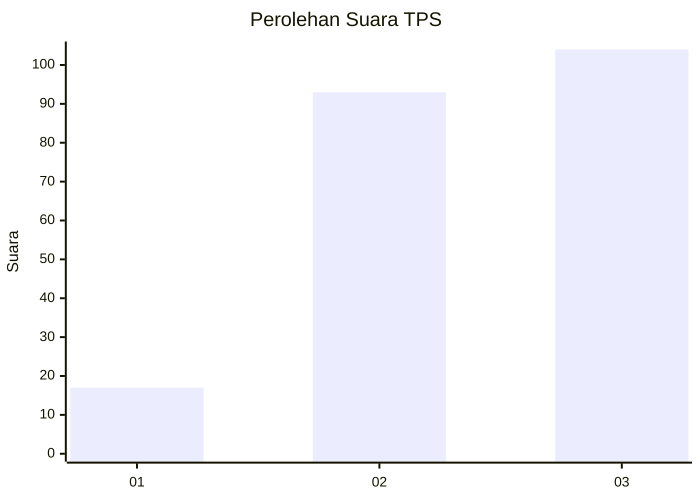
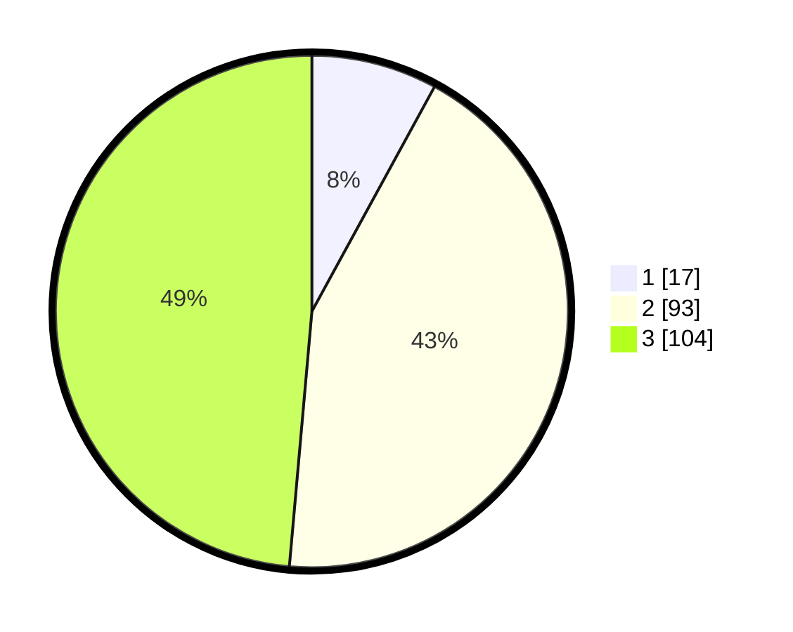

# Hasil

## Grafik

## Tabel

| No. | Nama Paslon    | Suara | Suara (raw) | Persentase |
|:--- |:-------------- | -----:| -----------:| ----------:|
| 1   | ANIES MUHAIMIN | 17    | [17][p-1]   | 7,94       |
| 2   | PRABOWO GIBRAN | 93    | [93][p-2]   | 43,46      |
| 3   | GANJAR MAHFUD  | 104   | [104][p-3]  | 48,60      |

[p-1]: https://github.com/gigit-pemilu/pemilu-2024-13-sumatera-barat/blob/main/pilpres/hitung-suara/sub/13-sumatera-barat/sub/71-kota-padang/sub/01-padang-selatan/sub/1001-belakang-pondok/sub/004-tps/sub/paslon-1.txt
[p-2]: https://github.com/gigit-pemilu/pemilu-2024-13-sumatera-barat/blob/main/pilpres/hitung-suara/sub/13-sumatera-barat/sub/71-kota-padang/sub/01-padang-selatan/sub/1001-belakang-pondok/sub/004-tps/sub/paslon-2.txt
[p-3]: https://github.com/gigit-pemilu/pemilu-2024-13-sumatera-barat/blob/main/pilpres/hitung-suara/sub/13-sumatera-barat/sub/71-kota-padang/sub/01-padang-selatan/sub/1001-belakang-pondok/sub/004-tps/sub/paslon-3.txt

## Foto C Plano

https://sirekap-obj-formc.kpu.go.id/0512/pemilu/ppwp/13/71/01/10/01/1371011001004-20240215-013054--92338c79-a3a5-4187-9538-1ef7cf75e89c.jpg

https://sirekap-obj-formc.kpu.go.id/0512/pemilu/ppwp/13/71/01/10/01/1371011001004-20240215-013455--a930f320-0416-4e69-8d8f-7cc71e756bb1.jpg

https://sirekap-obj-formc.kpu.go.id/0512/pemilu/ppwp/13/71/01/10/01/1371011001004-20240215-052734--cc54be0a-2a99-41a7-bfb9-d70a3595ada1.jpg

## Metadata

| Key        | Value               |
| ---------- | ------------------- |
| Time Stamp | 2024-02-15 15:00:29 |

