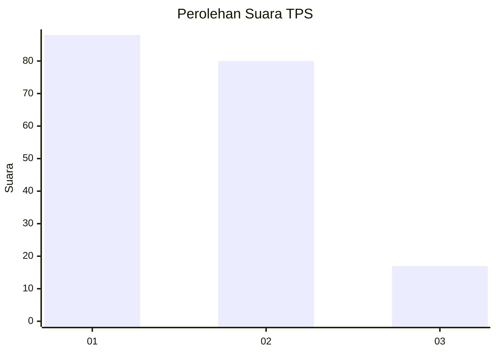
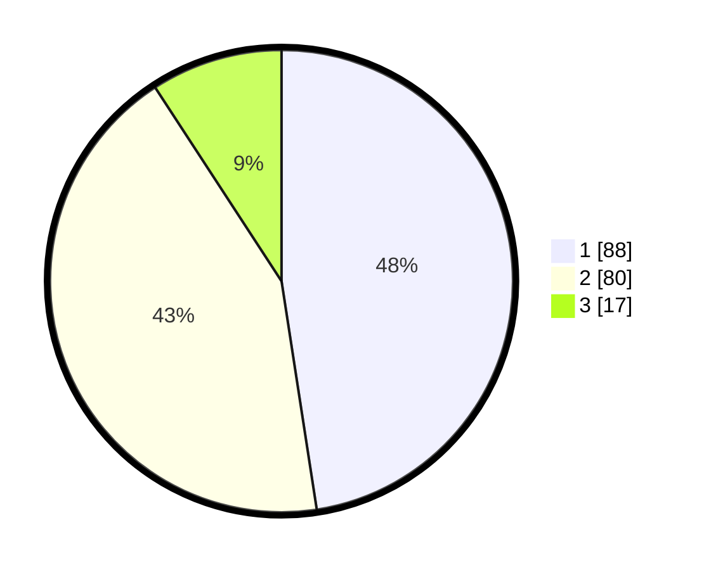

# Hasil

## Grafik

## Tabel

| No. | Nama Paslon    | Suara | Suara (raw) | Persentase |
|:--- |:-------------- | -----:| -----------:| ----------:|
| 1   | ANIES MUHAIMIN | 88    | [88][p-1]   | 47,57      |
| 2   | PRABOWO GIBRAN | 80    | [80][p-2]   | 43,24      |
| 3   | GANJAR MAHFUD  | 17    | [17][p-3]   | 9,19       |

[p-1]: https://github.com/gigit-pemilu/pemilu-2024-13-sumatera-barat/blob/main/pilpres/hitung-suara/sub/13-sumatera-barat/sub/71-kota-padang/sub/01-padang-selatan/sub/1002-alang-laweh/sub/001-tps/sub/paslon-1.txt
[p-2]: https://github.com/gigit-pemilu/pemilu-2024-13-sumatera-barat/blob/main/pilpres/hitung-suara/sub/13-sumatera-barat/sub/71-kota-padang/sub/01-padang-selatan/sub/1002-alang-laweh/sub/001-tps/sub/paslon-2.txt
[p-3]: https://github.com/gigit-pemilu/pemilu-2024-13-sumatera-barat/blob/main/pilpres/hitung-suara/sub/13-sumatera-barat/sub/71-kota-padang/sub/01-padang-selatan/sub/1002-alang-laweh/sub/001-tps/sub/paslon-3.txt

## Foto C Plano

https://sirekap-obj-formc.kpu.go.id/efc4/pemilu/ppwp/13/71/01/10/02/1371011002001-20240214-155659--caeb3897-8543-4f43-9ed7-a69997250670.jpg

https://sirekap-obj-formc.kpu.go.id/efc4/pemilu/ppwp/13/71/01/10/02/1371011002001-20240214-155703--a46cfd2f-6ab9-4408-ae53-e92645266a2f.jpg

https://sirekap-obj-formc.kpu.go.id/efc4/pemilu/ppwp/13/71/01/10/02/1371011002001-20240214-200708--5bf81642-91ac-4c95-9642-1cc6d5e7b944.jpg

## Metadata

| Key        | Value               |
| ---------- | ------------------- |
| Time Stamp | 2024-02-15 22:30:27 |

