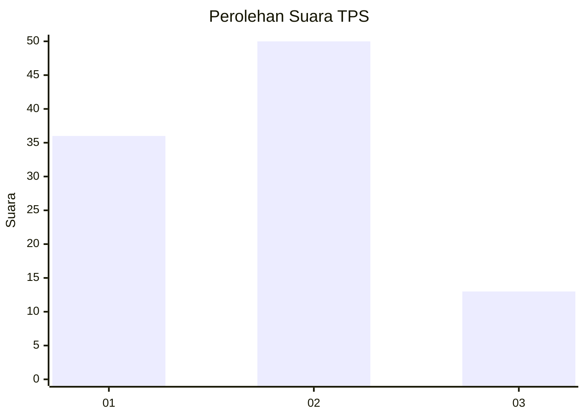
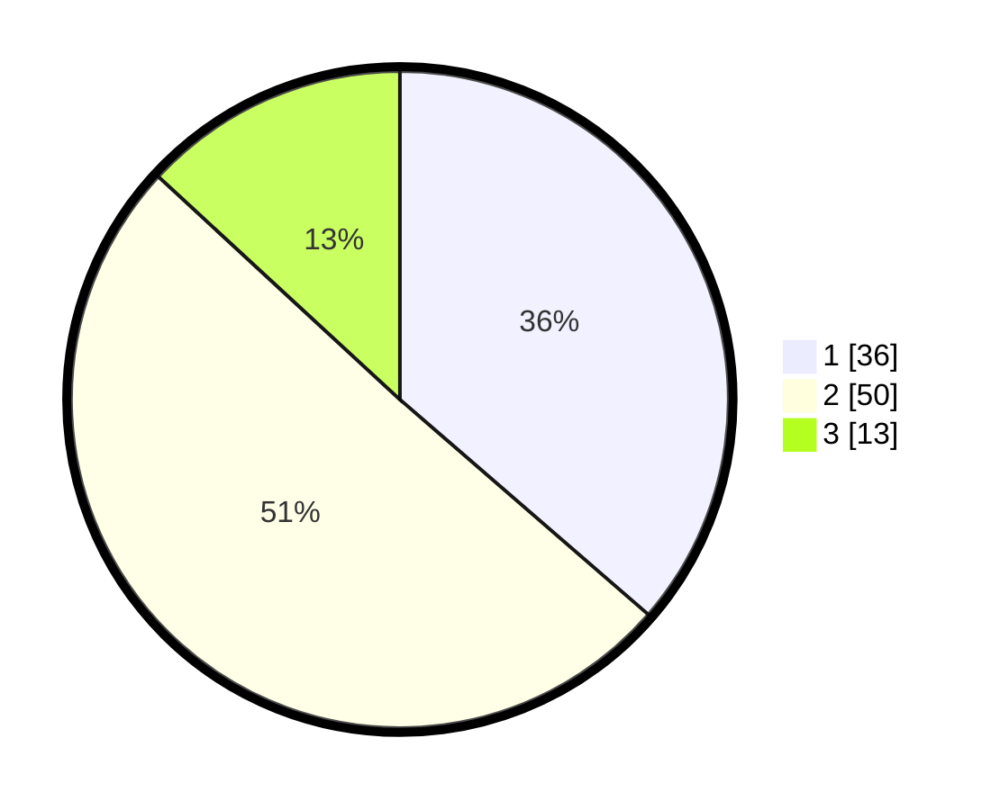

# Hasil

## Grafik

## Tabel

| No. | Nama Paslon    | Suara | Suara (raw) | Persentase |
|:--- |:-------------- | -----:| -----------:| ----------:|
| 1   | ANIES MUHAIMIN | 36    | [36][p-1]   | 36,36      |
| 2   | PRABOWO GIBRAN | 50    | [50][p-2]   | 50,51      |
| 3   | GANJAR MAHFUD  | 13    | [13][p-3]   | 13,13      |

[p-1]: https://github.com/gigit-pemilu/pemilu-2024-13-sumatera-barat/blob/main/pilpres/hitung-suara/sub/13-sumatera-barat/sub/71-kota-padang/sub/01-padang-selatan/sub/1003-ranah-parak-rumbio/sub/004-tps/sub/paslon-1.txt
[p-2]: https://github.com/gigit-pemilu/pemilu-2024-13-sumatera-barat/blob/main/pilpres/hitung-suara/sub/13-sumatera-barat/sub/71-kota-padang/sub/01-padang-selatan/sub/1003-ranah-parak-rumbio/sub/004-tps/sub/paslon-2.txt
[p-3]: https://github.com/gigit-pemilu/pemilu-2024-13-sumatera-barat/blob/main/pilpres/hitung-suara/sub/13-sumatera-barat/sub/71-kota-padang/sub/01-padang-selatan/sub/1003-ranah-parak-rumbio/sub/004-tps/sub/paslon-3.txt

## Foto C Plano

https://sirekap-obj-formc.kpu.go.id/74aa/pemilu/ppwp/13/71/01/10/03/1371011003004-20240214-224819--afc22a13-649a-4cbf-9f9e-d4f8bfddf93c.jpg

https://sirekap-obj-formc.kpu.go.id/74aa/pemilu/ppwp/13/71/01/10/03/1371011003004-20240214-224932--0866db9f-605b-49a2-88f1-b0d1415b694e.jpg

https://sirekap-obj-formc.kpu.go.id/74aa/pemilu/ppwp/13/71/01/10/03/1371011003004-20240214-225107--9d646067-6050-4966-9649-14553d2b3491.jpg

## Metadata

| Key        | Value               |
| ---------- | ------------------- |
| Time Stamp | 2024-02-15 20:30:46 |

