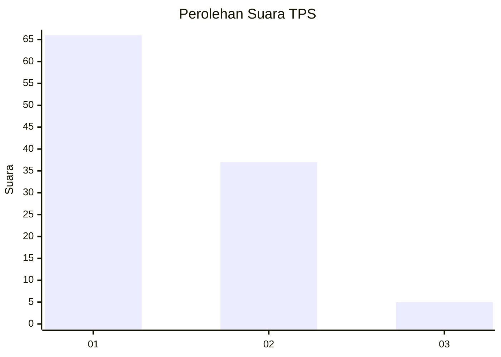
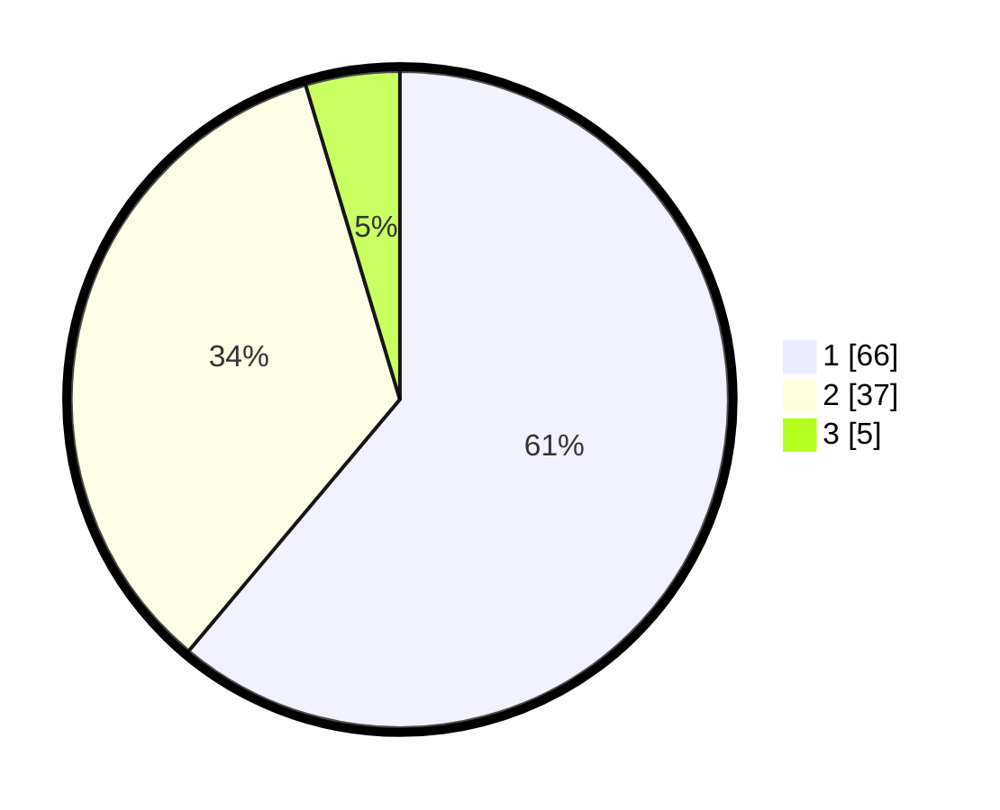

# Hasil

## Grafik

## Tabel

| No. | Nama Paslon    | Suara | Suara (raw) | Persentase |
|:--- |:-------------- | -----:| -----------:| ----------:|
| 1   | ANIES MUHAIMIN | 66    | [66][p-1]   | 61,11      |
| 2   | PRABOWO GIBRAN | 37    | [37][p-2]   | 34,26      |
| 3   | GANJAR MAHFUD  | 5     | [5][p-3]    | 4,63       |

[p-1]: https://github.com/gigit-pemilu/pemilu-2024-13-sumatera-barat/blob/main/pilpres/hitung-suara/sub/13-sumatera-barat/sub/71-kota-padang/sub/01-padang-selatan/sub/1009-rawang/sub/006-tps/sub/paslon-1.txt
[p-2]: https://github.com/gigit-pemilu/pemilu-2024-13-sumatera-barat/blob/main/pilpres/hitung-suara/sub/13-sumatera-barat/sub/71-kota-padang/sub/01-padang-selatan/sub/1009-rawang/sub/006-tps/sub/paslon-2.txt
[p-3]: https://github.com/gigit-pemilu/pemilu-2024-13-sumatera-barat/blob/main/pilpres/hitung-suara/sub/13-sumatera-barat/sub/71-kota-padang/sub/01-padang-selatan/sub/1009-rawang/sub/006-tps/sub/paslon-3.txt

## Foto C Plano

https://sirekap-obj-formc.kpu.go.id/273f/pemilu/ppwp/13/71/01/10/09/1371011009006-20240215-052435--8144b70d-9af7-4d42-b030-574f7aa01c5a.jpg

https://sirekap-obj-formc.kpu.go.id/273f/pemilu/ppwp/13/71/01/10/09/1371011009006-20240215-052638--1c504b55-e3a4-46ab-bc80-88eab0d0bb03.jpg

https://sirekap-obj-formc.kpu.go.id/273f/pemilu/ppwp/13/71/01/10/09/1371011009006-20240216-161223--99a48846-28e7-4aee-ae68-8edfe98f97f5.jpg

## Metadata

| Key        | Value               |
| ---------- | ------------------- |
| Time Stamp | 2024-02-16 16:25:10 |

