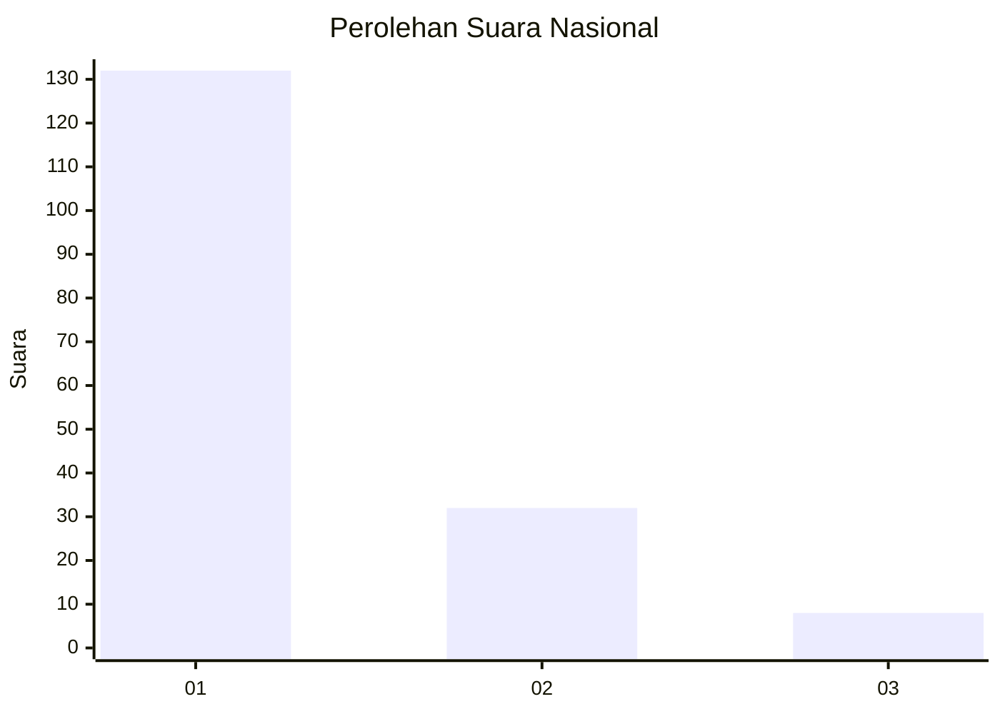
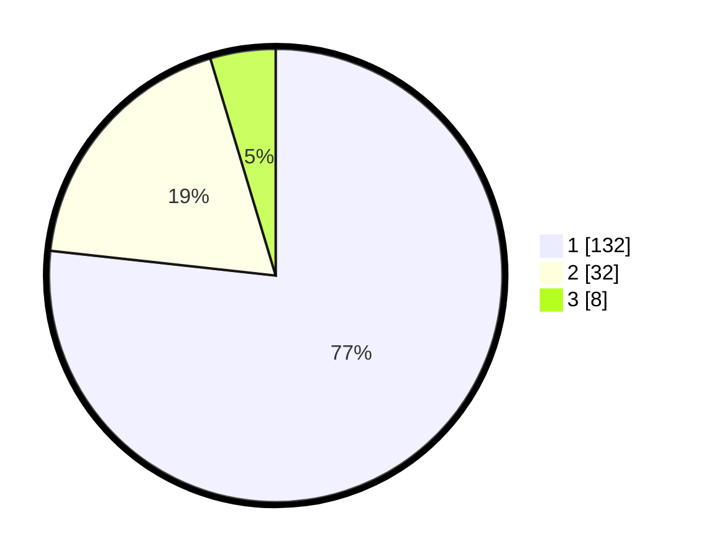

# Hasil

## Grafik

## Tabel

| No. | Nama Paslon    | Suara | Suara (raw) | Persentase |
|:--- |:-------------- | -----:| -----------:| ----------:|
| 1   | ANIES MUHAIMIN | 132   | [132][p-1]  | 76,74      |
| 2   | PRABOWO GIBRAN | 32    | [32][p-2]   | 18,60      |
| 3   | GANJAR MAHFUD  | 8     | [8][p-3]    | 4,65       |

[p-1]: https://github.com/gigit-pemilu/pemilu-2024/blob/main/pilpres/hitung-suara/sub/13-sumatera-barat/sub/71-kota-padang/sub/02-padang-timur/sub/1002-jati-baru/sub/005-tps/sub/paslon-1.txt
[p-2]: https://github.com/gigit-pemilu/pemilu-2024/blob/main/pilpres/hitung-suara/sub/13-sumatera-barat/sub/71-kota-padang/sub/02-padang-timur/sub/1002-jati-baru/sub/005-tps/sub/paslon-2.txt
[p-3]: https://github.com/gigit-pemilu/pemilu-2024/blob/main/pilpres/hitung-suara/sub/13-sumatera-barat/sub/71-kota-padang/sub/02-padang-timur/sub/1002-jati-baru/sub/005-tps/sub/paslon-3.txt

## Foto C Plano

https://sirekap-obj-formc.kpu.go.id/253b/pemilu/ppwp/13/71/02/10/02/1371021002005-20240215-020041--5a83b4e5-ecc6-45ac-87d0-fcc1b1c7374b.jpg

https://sirekap-obj-formc.kpu.go.id/253b/pemilu/ppwp/13/71/02/10/02/1371021002005-20240215-020754--144bb34f-9615-45e9-aa96-4ab1363276da.jpg

https://sirekap-obj-formc.kpu.go.id/253b/pemilu/ppwp/13/71/02/10/02/1371021002005-20240215-020858--98ce2e23-b88c-4ff7-9f52-f602ccdfb422.jpg

## Metadata

| Key        | Value               |
| ---------- | ------------------- |
| Time Stamp | 2024-02-15 20:00:44 |

