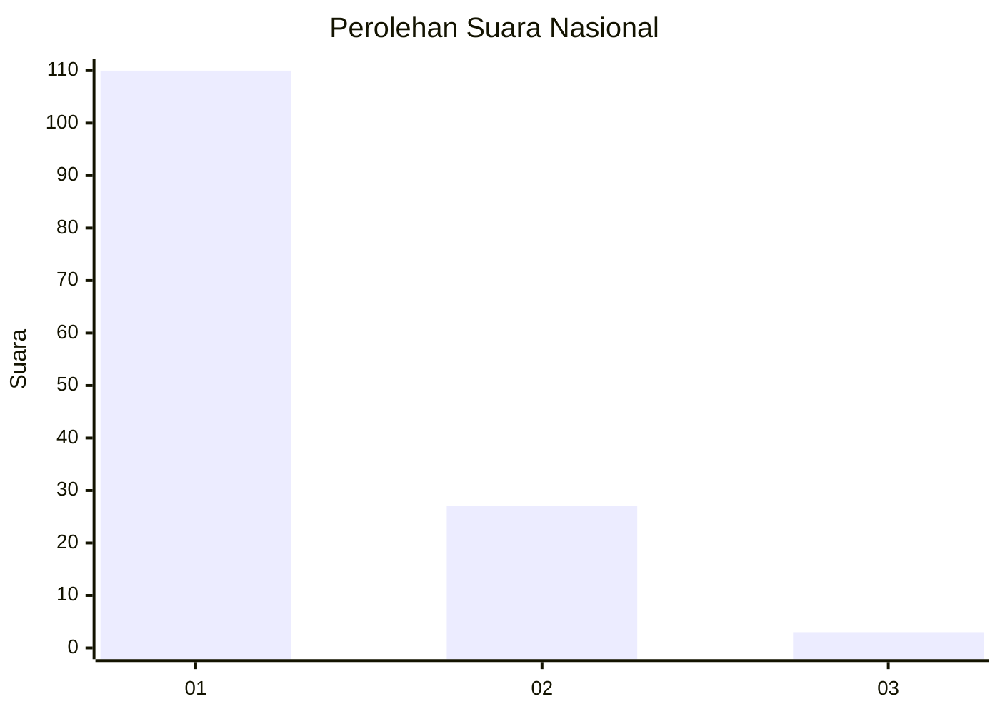
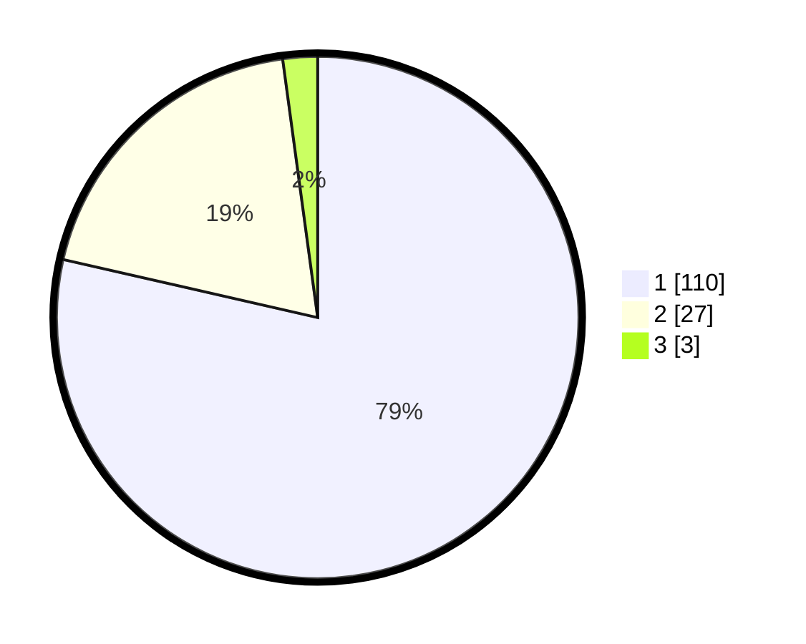

# Hasil

## Grafik

## Tabel

| No. | Nama Paslon    | Suara | Suara (raw) | Persentase |
|:--- |:-------------- | -----:| -----------:| ----------:|
| 1   | ANIES MUHAIMIN | 110   | [110][p-1]  | 78,57      |
| 2   | PRABOWO GIBRAN | 27    | [27][p-2]   | 19,29      |
| 3   | GANJAR MAHFUD  | 3     | [3][p-3]    | 2,14       |

[p-1]: https://github.com/gigit-pemilu/pemilu-2024/blob/main/pilpres/hitung-suara/sub/13-sumatera-barat/sub/71-kota-padang/sub/02-padang-timur/sub/1002-jati-baru/sub/014-tps/sub/paslon-1.txt
[p-2]: https://github.com/gigit-pemilu/pemilu-2024/blob/main/pilpres/hitung-suara/sub/13-sumatera-barat/sub/71-kota-padang/sub/02-padang-timur/sub/1002-jati-baru/sub/014-tps/sub/paslon-2.txt
[p-3]: https://github.com/gigit-pemilu/pemilu-2024/blob/main/pilpres/hitung-suara/sub/13-sumatera-barat/sub/71-kota-padang/sub/02-padang-timur/sub/1002-jati-baru/sub/014-tps/sub/paslon-3.txt

## Foto C Plano

https://sirekap-obj-formc.kpu.go.id/51a8/pemilu/ppwp/13/71/02/10/02/1371021002014-20240215-030759--66040ee1-3a32-4e38-8c1c-c41df4465f4a.jpg

https://sirekap-obj-formc.kpu.go.id/51a8/pemilu/ppwp/13/71/02/10/02/1371021002014-20240214-225831--69e88a9a-ada1-4892-9e1b-94a39ff94896.jpg

https://sirekap-obj-formc.kpu.go.id/51a8/pemilu/ppwp/13/71/02/10/02/1371021002014-20240215-031152--2bfde30a-78bd-451c-86b1-a81ae7a783a8.jpg

## Metadata

| Key        | Value               |
| ---------- | ------------------- |
| Time Stamp | 2024-02-16 11:00:29 |

