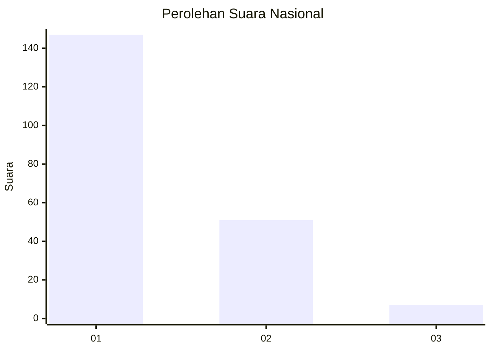
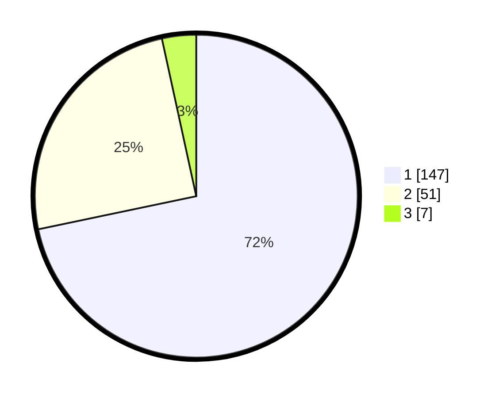

# Hasil

## Grafik

## Tabel

| No. | Nama Paslon    | Suara | Suara (raw) | Persentase |
|:--- |:-------------- | -----:| -----------:| ----------:|
| 1   | ANIES MUHAIMIN | 147   | [147][p-1]  | 71,71      |
| 2   | PRABOWO GIBRAN | 51    | [51][p-2]   | 24,88      |
| 3   | GANJAR MAHFUD  | 7     | [7][p-3]    | 3,41       |

[p-1]: https://github.com/gigit-pemilu/pemilu-2024/blob/main/pilpres/hitung-suara/sub/13-sumatera-barat/sub/71-kota-padang/sub/02-padang-timur/sub/1007-andalas/sub/014-tps/sub/paslon-1.txt
[p-2]: https://github.com/gigit-pemilu/pemilu-2024/blob/main/pilpres/hitung-suara/sub/13-sumatera-barat/sub/71-kota-padang/sub/02-padang-timur/sub/1007-andalas/sub/014-tps/sub/paslon-2.txt
[p-3]: https://github.com/gigit-pemilu/pemilu-2024/blob/main/pilpres/hitung-suara/sub/13-sumatera-barat/sub/71-kota-padang/sub/02-padang-timur/sub/1007-andalas/sub/014-tps/sub/paslon-3.txt

## Foto C Plano

https://sirekap-obj-formc.kpu.go.id/da39/pemilu/ppwp/13/71/02/10/07/1371021007014-20240214-155622--5120e402-dd1c-49db-b774-6b882b0a3703.jpg

https://sirekap-obj-formc.kpu.go.id/da39/pemilu/ppwp/13/71/02/10/07/1371021007014-20240214-155733--da2bb231-93da-4536-9c35-2f211ae28b89.jpg

https://sirekap-obj-formc.kpu.go.id/da39/pemilu/ppwp/13/71/02/10/07/1371021007014-20240214-155839--9ea2d014-d6bd-4630-9730-d298645c6790.jpg

## Metadata

| Key        | Value               |
| ---------- | ------------------- |
| Time Stamp | 2024-02-15 21:30:27 |

