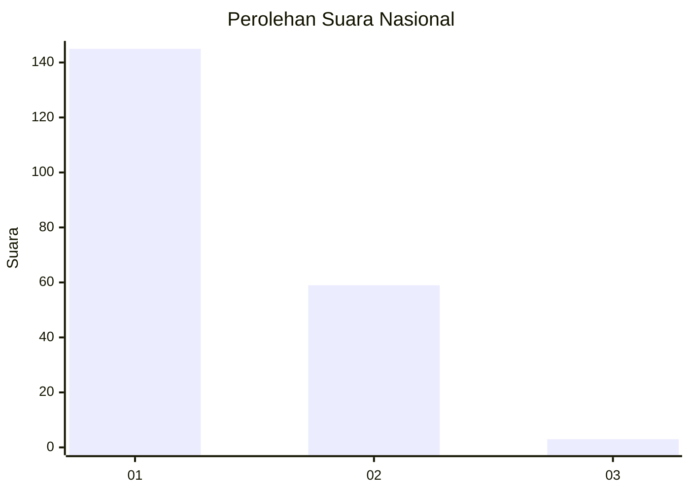
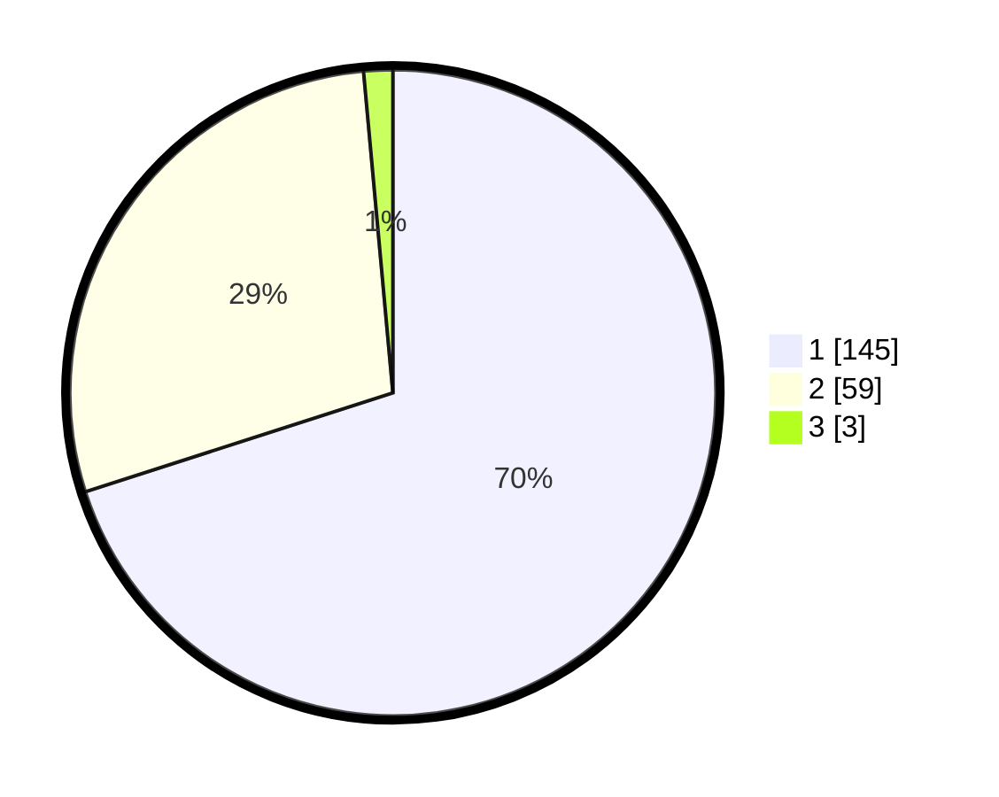

# Hasil

## Grafik

## Tabel

| No. | Nama Paslon    | Suara | Suara (raw) | Persentase |
|:--- |:-------------- | -----:| -----------:| ----------:|
| 1   | ANIES MUHAIMIN | 145   | [145][p-1]  | 70,05      |
| 2   | PRABOWO GIBRAN | 59    | [59][p-2]   | 28,50      |
| 3   | GANJAR MAHFUD  | 3     | [3][p-3]    | 1,45       |

[p-1]: https://github.com/gigit-pemilu/pemilu-2024/blob/main/pilpres/hitung-suara/sub/13-sumatera-barat/sub/71-kota-padang/sub/02-padang-timur/sub/1008-kubu-dalam-parak-karakah/sub/005-tps/sub/paslon-1.txt
[p-2]: https://github.com/gigit-pemilu/pemilu-2024/blob/main/pilpres/hitung-suara/sub/13-sumatera-barat/sub/71-kota-padang/sub/02-padang-timur/sub/1008-kubu-dalam-parak-karakah/sub/005-tps/sub/paslon-2.txt
[p-3]: https://github.com/gigit-pemilu/pemilu-2024/blob/main/pilpres/hitung-suara/sub/13-sumatera-barat/sub/71-kota-padang/sub/02-padang-timur/sub/1008-kubu-dalam-parak-karakah/sub/005-tps/sub/paslon-3.txt

## Foto C Plano

https://sirekap-obj-formc.kpu.go.id/89ee/pemilu/ppwp/13/71/02/10/08/1371021008005-20240215-110601--e77de9e5-b237-4fe2-b582-cbbc4a6db816.jpg

https://sirekap-obj-formc.kpu.go.id/89ee/pemilu/ppwp/13/71/02/10/08/1371021008005-20240215-110717--0a3983d4-4f47-4c4d-8b15-03847ed127be.jpg

https://sirekap-obj-formc.kpu.go.id/89ee/pemilu/ppwp/13/71/02/10/08/1371021008005-20240215-110846--d07aa3ec-7d6d-48c4-9366-eb1232f67cae.jpg

## Metadata

| Key        | Value               |
| ---------- | ------------------- |
| Time Stamp | 2024-02-15 22:00:27 |

