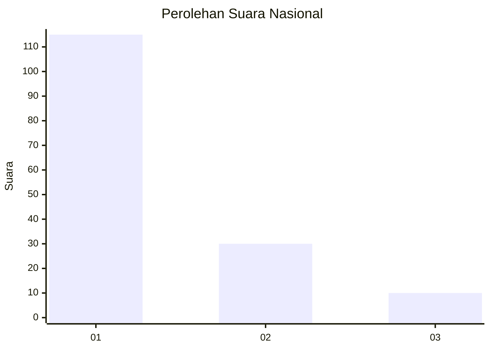
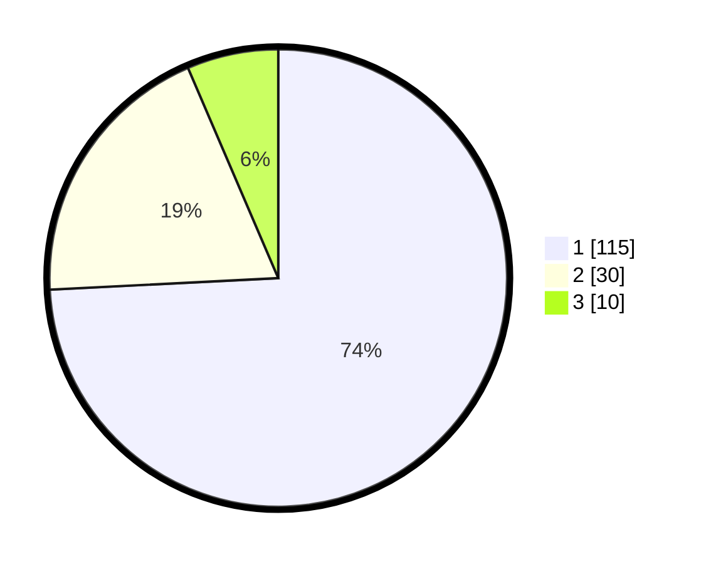

# Hasil

## Grafik

## Tabel

| No. | Nama Paslon    | Suara | Suara (raw) | Persentase |
|:--- |:-------------- | -----:| -----------:| ----------:|
| 1   | ANIES MUHAIMIN | 115   | [115][p-1]  | 74,19      |
| 2   | PRABOWO GIBRAN | 30    | [30][p-2]   | 19,35      |
| 3   | GANJAR MAHFUD  | 10    | [10][p-3]   | 6,45       |

[p-1]: https://github.com/gigit-pemilu/pemilu-2024/blob/main/pilpres/hitung-suara/sub/13-sumatera-barat/sub/71-kota-padang/sub/02-padang-timur/sub/1008-kubu-dalam-parak-karakah/sub/026-tps/sub/paslon-1.txt
[p-2]: https://github.com/gigit-pemilu/pemilu-2024/blob/main/pilpres/hitung-suara/sub/13-sumatera-barat/sub/71-kota-padang/sub/02-padang-timur/sub/1008-kubu-dalam-parak-karakah/sub/026-tps/sub/paslon-2.txt
[p-3]: https://github.com/gigit-pemilu/pemilu-2024/blob/main/pilpres/hitung-suara/sub/13-sumatera-barat/sub/71-kota-padang/sub/02-padang-timur/sub/1008-kubu-dalam-parak-karakah/sub/026-tps/sub/paslon-3.txt

## Foto C Plano

https://sirekap-obj-formc.kpu.go.id/6820/pemilu/ppwp/13/71/02/10/08/1371021008026-20240215-071346--494a0733-2c8f-45a9-817e-fa57d69296bc.jpg

https://sirekap-obj-formc.kpu.go.id/6820/pemilu/ppwp/13/71/02/10/08/1371021008026-20240215-071425--3efbab65-1736-4cbe-b3c0-24d1e07d9f6f.jpg

https://sirekap-obj-formc.kpu.go.id/6820/pemilu/ppwp/13/71/02/10/08/1371021008026-20240215-071524--2ab5c72c-eb06-496f-bcb2-29181e363872.jpg

## Metadata

| Key        | Value               |
| ---------- | ------------------- |
| Time Stamp | 2024-02-16 01:00:27 |

